# Airwallex Sentinel - Alert系统技术设计文档

**作者：** Boyi Wang
**日期：** 2025年11月19日
**版本：** 1.0

---

## 1. 概述

### 1.1 文档目的
本文档描述Airwallex Sentinel系统中Alert（警报）模块的技术设计，包括系统架构、数据流程、实体模型和API接口定义。

### 1.2 系统简介
Alert系统是Sentinel的核心模块之一，负责接收外部风险检测系统的指标数据（Metrics），通过AI Agent生成智能化的警报摘要，并通过多种渠道（Slack、Webapp、SMS）通知商户。系统支持灵活的频率控制和触发条件配置。

### 1.3 核心功能
- **智能警报生成**：基于外部Metrics通过AI Agent生成人类可读的警报摘要
- **多渠道通知**：支持Slack、Webapp、SMS三种通知渠道
- **频率控制**：支持商户维度和时间维度的频率限制配置
- **灵活触发条件**：基于外部Metrics的可配置触发规则
- **警报管理**：提供Alert List和Alert Detail页面供商户查看和管理

---

## 2. 系统架构

### 2.1 整体架构图

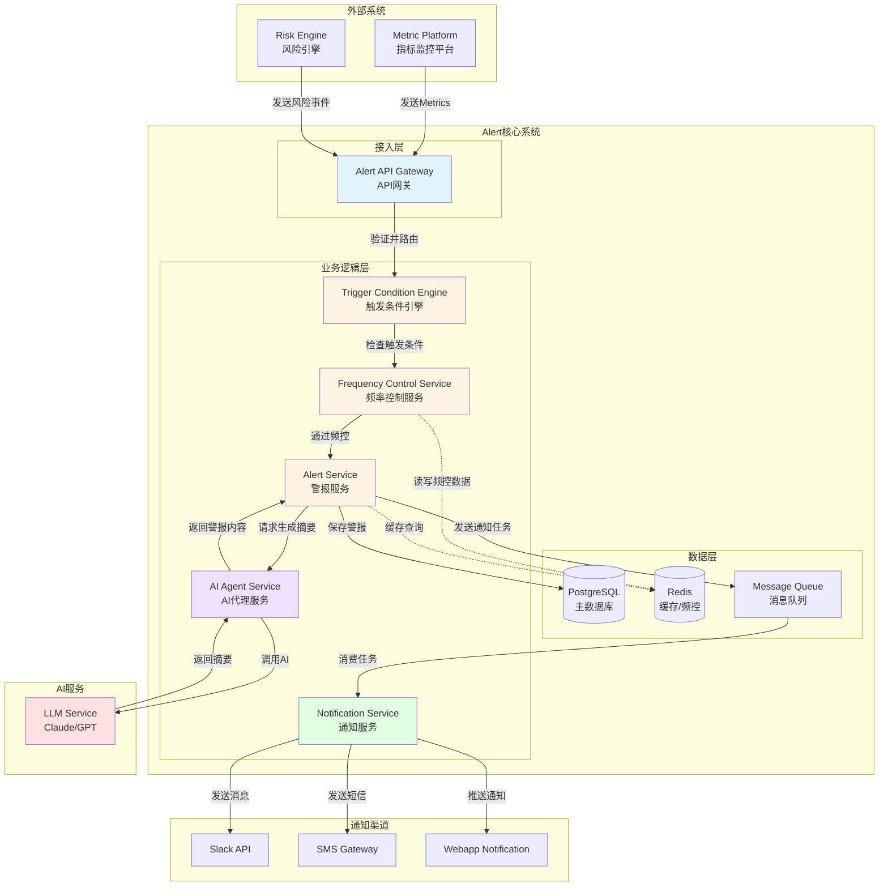

### 2.2 架构说明

#### 2.2.1 接入层
- **Alert API Gateway**：统一的API入口，负责请求验证、路由和限流

#### 2.2.2 业务逻辑层
- **Trigger Condition Engine**：评估外部Metrics是否满足警报触发条件
- **Frequency Control Service**：基于商户和时间维度的频率控制
- **AI Agent Service**：调用LLM生成警报摘要，管理Prompt模板
- **Alert Service**：核心警报业务逻辑，管理警报生命周期
- **Notification Service**：多渠道通知发送服务

#### 2.2.3 数据层
- **PostgreSQL**：存储警报、配置、历史记录等持久化数据
- **Redis**：缓存热数据，存储频率控制计数器
- **Message Queue (Kafka/RabbitMQ)**：异步处理通知任务

---

## 3. 核心流程

### 3.1 警报生成与通知流程

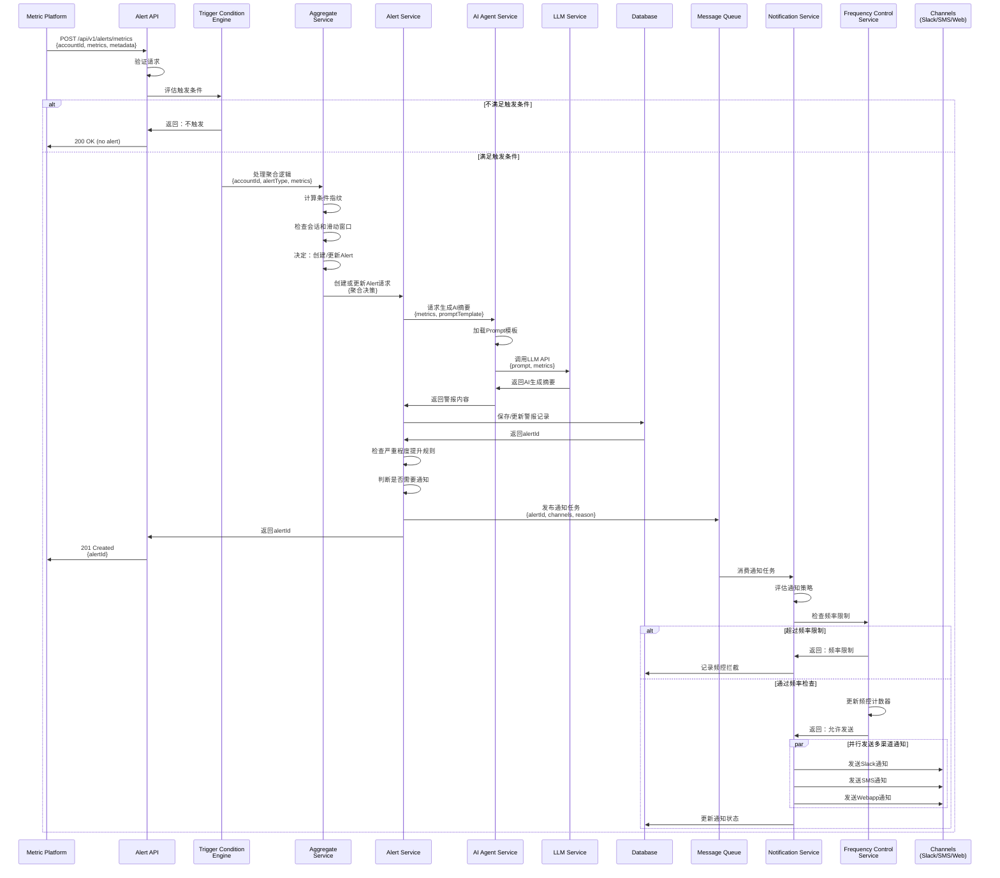

### 3.2 AI摘要生成流程

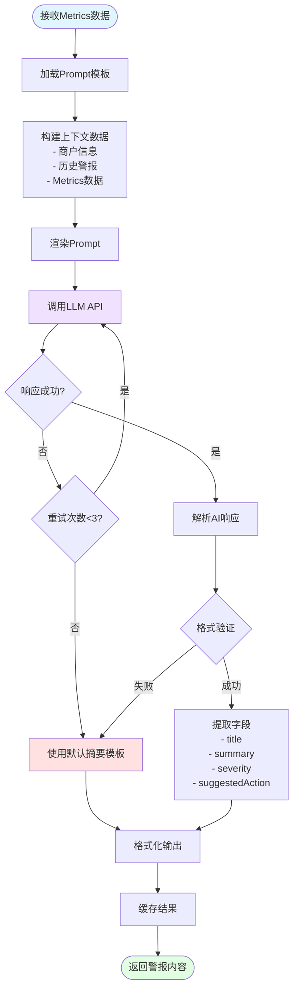

### 3.3 频率控制流程

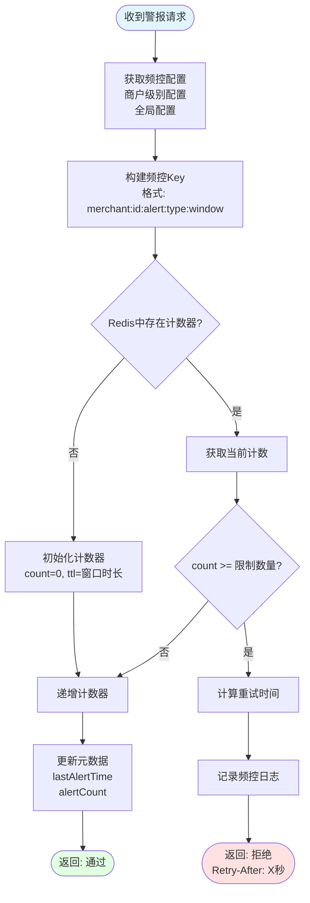

### 3.4 用户侧交互流程

```mermaid
flowchart TD
    Start([攻击发生]) --> SystemDetect[系统检测到异常指标]
    SystemDetect --> AlertGen[系统生成警报]

    AlertGen --> Notify{用户接收通知}

    Notify -->|Slack| SlackMsg[Slack消息<br/>包含摘要和链接]
    Notify -->|SMS| SMSMsg[短信通知<br/>简短摘要+链接]
    Notify -->|Webapp| WebMsg[Web应用推送<br/>实时通知]

    SlackMsg --> UserSee[用户看到通知]
    SMSMsg --> UserSee
    WebMsg --> UserSee

    UserSee --> Decision1{用户选择}

    Decision1 -->|点击通知| OpenDetail[打开Alert详情页]
    Decision1 -->|稍后查看| GoToList[进入Alert列表页]
    Decision1 -->|忽略通知| End1([暂不处理])

    GoToList --> FilterSort[筛选和排序<br/>- 按类型筛选<br/>- 按严重程度<br/>- 按时间范围]
    FilterSort --> SelectAlert[选择特定警报]
    SelectAlert --> OpenDetail

    OpenDetail --> ViewDetails[查看详细信息<br/>- AI生成摘要<br/>- 攻击指标数据<br/>- 建议操作]

    ViewDetails --> Decision2{用户决策}

    Decision2 -->|同意建议| DeployRule[一键部署规则]
    Decision2 -->|需要更多信息| ViewMetrics[查看原始数据]
    Decision2 -->|误报| DismissAlert[忽略警报]
    Decision2 -->|自定义方案| ManualAction[手动创建规则]
    Decision2 -->|添加备注| AddComment[添加用户备注]

    AddComment --> FillComment[填写备注内容<br/>- 观察到的情况<br/>- 分析结论<br/>- 后续计划]
    FillComment --> NotifyTeam{通知团队成员?}

    NotifyTeam -->|是| SendCommentNotif[发送备注通知<br/>@提及相关人员]
    NotifyTeam -->|否| SaveComment[保存备注]

    SendCommentNotif --> SaveComment
    SaveComment --> BackToDetail[返回详情页<br/>显示新增备注]
    BackToDetail --> ViewDetails

    ViewMetrics --> Decision3{重新评估}
    Decision3 -->|确认攻击| DeployRule
    Decision3 -->|误报| DismissAlert

    DeployRule --> ConfirmModal[确认模态框<br/>显示规则影响]
    ConfirmModal --> Decision4{确认?}

    Decision4 -->|是| RuleDeployed[规则部署成功]
    Decision4 -->|否| ViewDetails

    RuleDeployed --> MarkResolved[自动标记为已解决]
    ManualAction --> MarkResolved

    MarkResolved --> ViewSuccess[查看成功反馈<br/>- 规则详情<br/>- 预计影响<br/>- 后续建议]

    ViewSuccess --> Decision5{继续操作?}
    Decision5 -->|查看其他警报| GoToList
    Decision5 -->|完成| Enjoy["读本书，享受美景"<br/>系统继续监控]

    DismissAlert --> AddReason[添加忽略原因<br/>- 误报<br/>- 正常业务<br/>- 其他]
    AddReason --> FeedbackSubmit[提交反馈<br/>帮助AI学习]
    FeedbackSubmit --> GoToList

    Enjoy --> MonitorContinue[系统持续监控]
    MonitorContinue --> NewAlert{检测到新攻击?}
    NewAlert -->|是| AlertGen
    NewAlert -->|否| MonitorContinue

    style Start fill:#ffe1e1
    style UserSee fill:#e1f5ff
    style DeployRule fill:#f0e1ff
    style RuleDeployed fill:#e1ffe1
    style MarkResolved fill:#e1ffe1
    style Enjoy fill:#e1ffe1
    style DismissAlert fill:#fff4e1
```

### 3.5 触发条件评估流程

```mermaid
flowchart TD
    Start([接收Metrics数据]) --> ExtractInfo[提取信息<br/>merchantId, alertType, metrics]
    ExtractInfo --> LoadConfig[加载触发条件配置<br/>从数据库获取]

    LoadConfig --> CheckConfigExists{配置存在且启用?}
    CheckConfigExists -->|否| NoTrigger1([返回: 不触发])
    CheckConfigExists -->|是| SortByPriority[按priority排序条件]

    SortByPriority --> InitEval[初始化评估结果列表]
    InitEval --> LoopConditions[遍历每个条件]

    LoopConditions --> GetCondition[获取条件<br/>metric_name, operator, threshold]
    GetCondition --> FindMetric[查找对应的Metric数据]

    FindMetric --> MetricFound{找到指标?}
    MetricFound -->|否| RecordNotMet[记录: 条件不满足<br/>原因: 指标缺失]
    MetricFound -->|是| EvalOperator[评估操作符<br/>支持: >, >=, <, <=, ==, !=]

    EvalOperator -->|满足| RecordMet[记录: 条件满足<br/>actual_value, threshold]
    EvalOperator -->|不满足| RecordNotMet

    RecordMet --> NextCondition{还有更多条件?}
    RecordNotMet --> NextCondition

    NextCondition -->|是| LoopConditions
    NextCondition -->|否| ApplyLogic[应用组合逻辑]

    ApplyLogic --> LogicType{逻辑类型?}

    LogicType -->|AND| CheckAND{所有条件都满足?}
    LogicType -->|OR| CheckOR{任一条件满足?}

    CheckAND -->|是| TriggerAlert[触发警报]
    CheckAND -->|否| NoTrigger2[不触发]

    CheckOR -->|是| TriggerAlert
    CheckOR -->|否| NoTrigger2

    TriggerAlert --> LogResult[记录评估日志<br/>条件详情、指标值]
    NoTrigger2 --> LogResult

    LogResult --> FinalDecision{最终决定?}
    FinalDecision -->|触发| ReturnTrigger([返回: 触发<br/>传递到频率控制])
    FinalDecision -->|不触发| ReturnNoTrigger([返回: 不触发<br/>附带评估详情])

    style Start fill:#e1f5ff
    style TriggerAlert fill:#e1ffe1
    style ReturnTrigger fill:#e1ffe1
    style NoTrigger2 fill:#ffe1e1
    style NoTrigger1 fill:#fff4e1
    style ReturnNoTrigger fill:#fff4e1
    style RecordMet fill:#d4edda
    style RecordNotMet fill:#f8d7da
```

### 3.6 Alert聚合流程

Alert系统采用**混合聚合策略**，结合会话式聚合、滑动窗口和严重程度递进，以更智能地处理欺诈攻击告警。

#### 3.6.1 聚合策略说明

**1. 会话式聚合（Session-based Aggregation）**
- **核心思想**：基于攻击活跃度动态判断是否属于同一次攻击
- **策略**：如果两次触发间隔 < session_timeout_minutes（默认15分钟）→ 认为是同一次攻击会话
- **优点**：更符合真实攻击场景（攻击通常是突发式的），自动区分多轮攻击

**2. 滑动窗口（Sliding Window）**
- **核心思想**：在固定时长内（如24小时）查找相同fingerprint的Alert
- **作用**：作为兜底机制，避免创建过多Alert
- **优点**：避免固定窗口的边界问题，提供更平滑的聚合效果

**3. 严重程度递进（Severity Escalation）**
- **核心思想**：同一攻击持续时间越长/次数越多，自动提升严重程度
- **策略**：
  - 触发次数达到10次 → 提升至P2
  - 触发次数达到50次 → 提升至P1
  - 持续时间超过2小时 → 提升至P1
- **优点**：自动识别严重攻击，提升响应优先级

#### 3.6.2 Alert聚合逻辑流程

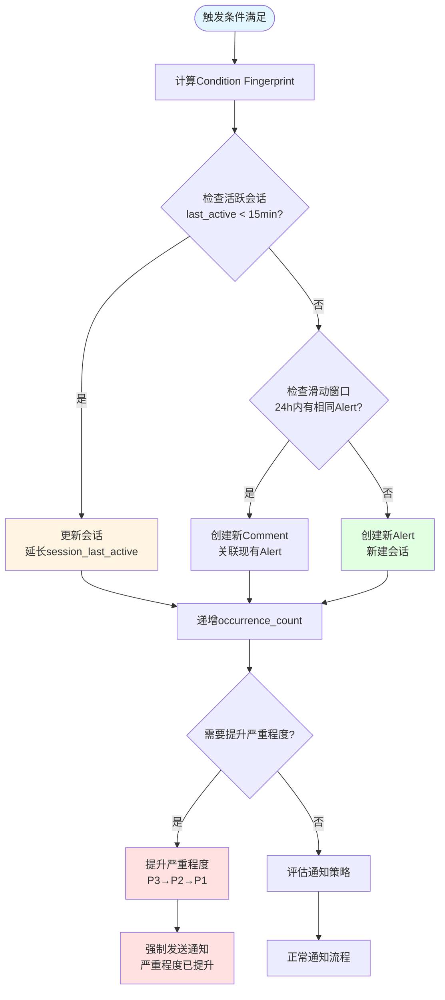

#### 3.6.3 通知发送与频控流程

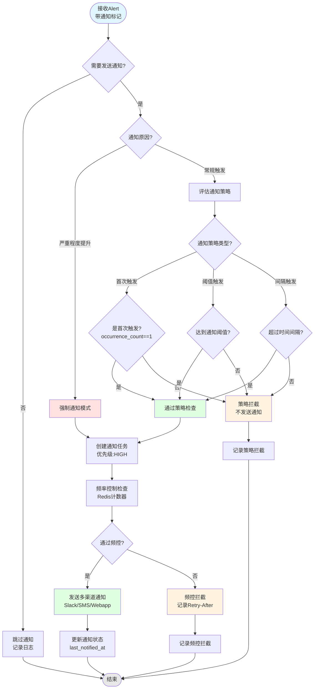

#### 3.6.4 严重程度递进规则

系统会根据以下规则自动提升Alert的严重程度：

| 触发条件 | 提升至 | 说明 |
|---------|-------|------|
| occurrence_count >= 10 | P2 | 中等强度攻击 |
| occurrence_count >= 50 | P1 | 高强度攻击 |
| 持续时长 >= 2小时 | P1 | 持续性攻击 |
| 持续时长 >= 6小时 | P0 | 严重持续攻击 |

**Escalation History示例**：
```json
{
  "escalations": [
    {
      "from_severity": "P3",
      "to_severity": "P2",
      "reason": "occurrence_count_threshold",
      "occurrence_count": 10,
      "escalated_at": "2025-11-19T10:45:00Z"
    },
    {
      "from_severity": "P2",
      "to_severity": "P1",
      "reason": "occurrence_count_threshold",
      "occurrence_count": 50,
      "escalated_at": "2025-11-19T11:30:00Z"
    }
  ]
}
```

#### 3.6.5 会话管理

**会话状态流转**：
```
ACTIVE → EXPIRED (超时后自动过期)
ACTIVE → RESOLVED (用户手动解决)
```

**会话超时配置**：
- 默认超时时间：15分钟
- 可按Alert类型配置不同的超时时间
- 例如：卡测试攻击建议15分钟，速率攻击建议30分钟

**会话过期后的处理**：
- 会话过期（EXPIRED）后，如果在滑动窗口（24小时）内再次触发相同条件：
  - 直接使用现有Alert（不创建新会话）
  - 在该Alert上创建新的Comment记录本次触发
  - 递增occurrence_count，更新last_triggered_at
  - 保持session_status=EXPIRED（不重新激活会话）
- 这样设计的好处：
  - 一个Alert记录完整的攻击历史
  - 用户更容易理解，避免"会话重新激活"的复杂概念
  - Comment清晰记录每次触发的时间和指标

### 3.7 Trigger Condition Engine 技术方案对比

Alert 系统的触发条件评估是核心功能之一。我们对比两种实现方案：**复用现有 Rule Engine** vs **独立实现 Condition Flow**。

#### 3.7.1 方案对比概览

| 对比维度 | 方案A: 复用 Rule Engine | 方案B: 独立 Condition Flow | 推荐 |
|---------|------------------------|---------------------------|------|
| **开发时间** | 2-3周 | 1-2周 | ✅ 方案B |
| **维护成本** | 高（依赖外部团队） | 低（团队自主可控） | ✅ 方案B |
| **系统复杂度** | 高（引入重度依赖） | 低（轻量级实现） | ✅ 方案B |
| **性能** | 过度优化（实时交易级） | 满足需求（批处理级） | ✅ 方案B |
| **扩展性** | 强（支持复杂DSL） | 适中（满足当前需求） | ⚖️ 看需求 |
| **团队熟悉度** | 需要学习 Rule Engine | 简单直观 | ✅ 方案B |

#### 3.7.2 详细对比分析

##### **1. 开发时间成本**

**方案A: 复用 Rule Engine**
```
Week 1-2: 学习 Rule Engine
  - 理解 RuleDefinition 数据模型
  - 学习 DSL/Spring EL 语法
  - 熟悉 VariableEvaluator 机制
  - 对接 risk-rule-management-service API

Week 2-3: 适配集成
  - 设计 Metrics 到 RuleVariable 的转换层
  - 实现触发条件到 Rule Expression 的映射
  - 处理 Rule Engine 返回结果的适配
  - 测试和调试集成问题

总计: 2-3周
风险: 依赖 Rule Engine 团队支持，可能有阻塞
```

**方案B: 独立 Condition Flow**
```
Week 1: 核心实现
  - Day 1-2: 设计 TriggerCondition 数据模型
  - Day 3-4: 实现条件评估引擎（简单比较逻辑）
  - Day 5: 实现 AND/OR 组合逻辑

Week 2: 测试和优化
  - Day 1-2: 单元测试
  - Day 3: 集成测试
  - Day 4-5: 性能测试和优化

总计: 1-2周
风险: 低，团队完全自主控制
```

##### **2. 维护成本对比**

**方案A: 复用 Rule Engine**

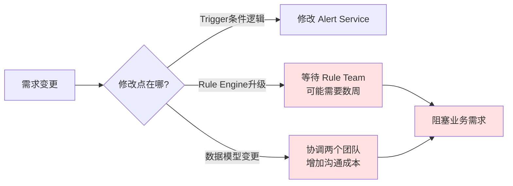

**维护痛点**：
- ❌ **依赖外部团队**：Rule Engine 由另一个团队维护，Bug修复、功能升级需要跨团队协调
- ❌ **版本兼容性**：Rule Engine 升级可能破坏兼容性，需要额外适配工作
- ❌ **调试困难**：问题定位需要深入 Rule Engine 内部逻辑，增加调试成本
- ❌ **文档依赖**：需要持续关注 Rule Engine 的文档更新和API变更

**年度维护成本估算**：
- 版本升级适配：2-3次/年 × 3天 = 6-9天
- Bug修复协调：4-5次/年 × 2天 = 8-10天
- 知识传承：新成员学习曲线 5-7天
- **总计：约 20-26 人天/年**

---

**方案B: 独立 Condition Flow**

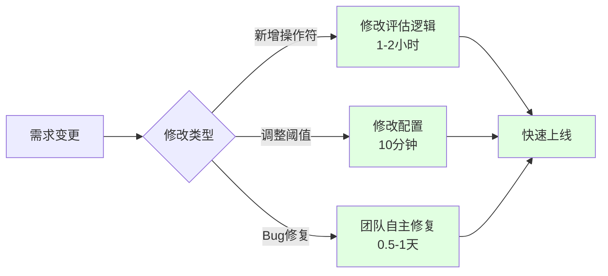

**维护优势**：
- ✅ **团队自主可控**：所有代码在团队仓库，随时修改
- ✅ **快速响应**：Bug修复和功能迭代无需跨团队协调
- ✅ **简单直观**：逻辑简单，新成员快速上手
- ✅ **无外部依赖**：不受外部系统升级影响

**年度维护成本估算**：
- Bug修复：2-3次/年 × 0.5天 = 1-1.5天
- 功能增强：2-3次/年 × 1天 = 2-3天
- 知识传承：新成员学习 1-2天
- **总计：约 4-6.5 人天/年**

**维护成本对比**: 方案B 节省 **75%** 的维护时间

##### **3. 系统复杂度对比**

**方案A: 复用 Rule Engine - 重度依赖架构**

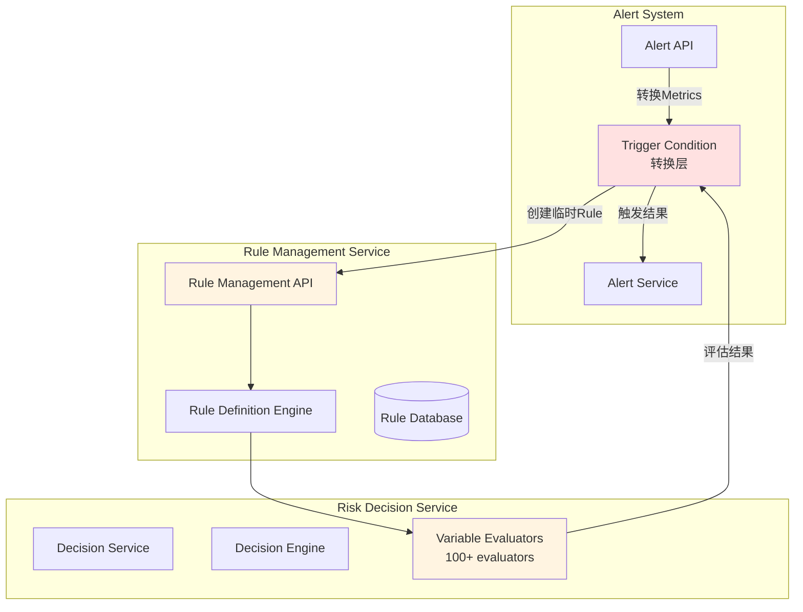

**复杂度问题**：
1. **依赖链路长**：Alert → Rule Management → Decision Engine → Evaluators
2. **数据转换多**：Metrics → RuleVariable → Expression → Result
3. **服务调用多**：每次评估需要 2-3 次 RPC 调用
4. **故障点多**：任何一个服务故障都会影响 Alert 系统

---

**方案B: 独立 Condition Flow - 轻量级架构**

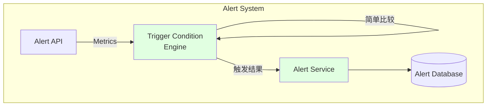

**简洁优势**：
1. **无外部依赖**：所有逻辑在 Alert Service 内部
2. **调用链短**：API → Engine → Service，单进程内调用
3. **故障隔离**：Alert 系统独立运行，不受其他服务影响
4. **易于测试**：纯函数逻辑，单元测试覆盖简单

##### **4. 性能对比**

**测试场景**：评估 1000 个 Account 的 Metrics，每个 2 个条件

| 性能指标 | 方案A: Rule Engine | 方案B: Condition Flow |
|---------|-------------------|---------------------|
| **单次评估延迟** | 50-100ms (RPC调用) | 1-5ms (内存计算) |
| **QPS** | ~100 (受限于RPC) | ~5000 (受限于CPU) |
| **资源消耗** | 高（多次序列化/反序列化） | 低（纯内存计算） |
| **扩展性** | 需要扩展 Rule Engine | 单机即可满足 |

**性能差异原因**：
- Rule Engine 设计用于**实时交易决策**（微秒级响应）
- Alert 场景是**批处理模式**（分钟级检查）
- Rule Engine 的高性能优化在 Alert 场景下是**过度设计**

##### **5. 功能需求适配度**

**Alert 触发条件的实际需求**：
```python
# 99% 的触发条件都是简单的阈值比较
conditions = [
    "block_rate > 0.3",           # ✅ 简单比较
    "failed_auth_rate > 0.5",     # ✅ 简单比较
    "transaction_count > 1000",   # ✅ 简单比较
]

# AND/OR 组合
logic = "block_rate > 0.3 AND failed_auth_rate > 0.5"  # ✅ 简单组合
```

**Rule Engine 支持的复杂能力（Alert 不需要）**：
```java
// ❌ Alert 不需要这些复杂能力
- DSL 脚本语言
- Spring EL 表达式
- 100+ VariableEvaluator
- 嵌套规则
- 动态变量计算
- 规则优先级调度
- 复杂的业务逻辑
```

**结论**：Alert 只需要 Rule Engine **5%** 的能力，却要承担 **100%** 的复杂度。

##### **6. 代码实现对比**

**方案A: 复用 Rule Engine（需要适配层）**

```kotlin
// 需要将 Metrics 转换为 Rule
class MetricsToRuleAdapter {
    fun convertToRule(metrics: List<Metric>, conditions: List<TriggerCondition>): RuleDefinition {
        // 1. 构建 Variables
        val variables = metrics.map { metric ->
            RuleVariable(
                tenant = "sentinel",
                namespace = "alert",
                name = metric.name,
                type = "DOUBLE",
                value = metric.value.toString()
            )
        }

        // 2. 构建 DSL Expression
        val expression = buildDSLExpression(conditions)  // 复杂的字符串拼接

        // 3. 调用 Rule Management Service
        return ruleManagementClient.createTemporaryRule(
            RuleDefinition(
                tenant = "sentinel",
                namespace = "alert",
                type = "DSL",
                value = expression,
                variables = variables,
                evaluationStrategies = listOf(
                    EvaluationStrategy(type = "IMMEDIATE")
                )
            )
        )
    }

    // 4. 调用 Decision Service 评估
    fun evaluate(rule: RuleDefinition, context: Map<String, Any>): Boolean {
        val decisionRequest = DecisionRequest(
            context = DecisionContext(
                tenant = "sentinel",
                domain = "alert",
                flow = "trigger"
            ),
            target = BusinessTarget(data = context)
        )

        val result = decisionService.review(decisionRequest)
        return result.code == DecisionCode.APPROVE
    }
}

// 代码行数: ~200 行（不包括测试）
// 依赖: rule-management-service, risk-decision-service
// 复杂度: 高
```

**方案B: 独立 Condition Flow（直接实现）**

```kotlin
// 简单直观的实现
class TriggerConditionEngine {

    data class TriggerCondition(
        val metricName: String,
        val operator: String,  // >, >=, <, <=, ==, !=
        val threshold: Double
    )

    fun evaluate(
        metrics: Map<String, Double>,
        conditions: List<TriggerCondition>,
        logic: String = "AND"
    ): Boolean {
        val results = conditions.map { condition ->
            val metricValue = metrics[condition.metricName] ?: return@map false

            when (condition.operator) {
                ">" -> metricValue > condition.threshold
                ">=" -> metricValue >= condition.threshold
                "<" -> metricValue < condition.threshold
                "<=" -> metricValue <= condition.threshold
                "==" -> metricValue == condition.threshold
                "!=" -> metricValue != condition.threshold
                else -> false
            }
        }

        return when (logic) {
            "AND" -> results.all { it }
            "OR" -> results.any { it }
            else -> false
        }
    }
}

// 代码行数: ~30 行（不包括测试）
// 依赖: 无
// 复杂度: 极低
```

**代码对比**：
- 方案A: ~200 行，依赖 2 个外部服务
- 方案B: ~30 行，零依赖
- **代码量减少 85%**

##### **7. 扩展性对比**

**未来可能的需求**：

| 需求 | 方案A: Rule Engine | 方案B: Condition Flow | 实现难度 |
|------|-------------------|---------------------|---------|
| 新增操作符（contains, in） | 需要 Rule Engine 支持 | 直接添加 case 分支 | B 更简单 |
| 支持时间范围条件 | 需要适配 TimeWindow Variable | 添加时间比较逻辑 | B 更简单 |
| 条件优先级排序 | Rule Engine 原生支持 | 需要自己实现 | A 更简单 |
| 复杂嵌套逻辑 | Rule Engine 原生支持 | 需要递归实现 | A 更简单 |

**评估**：
- 前两个需求（90%概率）：方案B 更优
- 后两个需求（10%概率）：方案A 更优

**策略**：先用方案B，如果未来真的需要复杂能力，再迁移到 Rule Engine（迁移成本可控）

##### **8. 风险评估**

**方案A 风险**：
1. 🔴 **高依赖风险**：Rule Engine 团队调整架构会直接影响 Alert
2. 🔴 **技术债务风险**：引入重度依赖，长期维护成本高
3. 🟡 **性能风险**：RPC 调用增加延迟，可能影响批量处理
4. 🟡 **学习曲线风险**：团队成员需要学习 Rule Engine

**方案B 风险**：
1. 🟢 **功能缺失风险**（低）：当前需求简单，未来如需复杂能力可迁移
2. 🟢 **性能风险**（低）：纯内存计算，性能远超需求
3. 🟢 **维护风险**（低）：代码简单，团队完全掌控

#### 3.7.3 推荐方案：独立实现 Condition Flow

**推荐理由**：

1. ✅ **开发成本低**：1-2周 vs 2-3周，节省 33%-50% 时间
2. ✅ **维护成本低**：4-6.5 人天/年 vs 20-26 人天/年，节省 75%
3. ✅ **系统更简洁**：零依赖，调用链短，易于调试
4. ✅ **性能更好**：1-5ms vs 50-100ms，快 10-20 倍
5. ✅ **团队自主**：不受外部团队影响，快速响应需求
6. ✅ **适配度高**：完美匹配当前需求，无过度设计

**实施建议**：

```kotlin
// Phase 1: MVP 实现（1周）
class SimpleTriggerConditionEngine {
    fun evaluate(metrics: Map<String, Double>,
                 conditions: List<TriggerCondition>): Boolean {
        // 支持 6 种基本操作符
        // 支持 AND/OR 逻辑
    }
}

// Phase 2: 增强功能（可选，按需实现）
- 添加条件优先级排序
- 支持时间范围条件
- 添加更多操作符（contains, in, regex）

// Phase 3: 未来迁移路径（如果真的需要）
- 保留现有接口
- 后端切换到 Rule Engine
- 用户无感知升级
```

**关键决策点**：

> **奥卡姆剃刀原则**：如无必要，勿增实体。
> Alert 的触发条件评估是一个**简单的阈值比较问题**，不需要引入复杂的规则引擎。

**但是，Rule Engine 在以下场景必须使用**：
- ✅ **自动部署规则**：AI 推荐的规则必须通过 Rule Management Service 部署
- ✅ **规则管理**：商户手动创建的规则需要在 Rule Engine 中管理

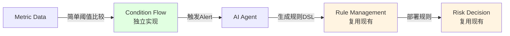

---

### 3.8 定时拉取数据流程

Alert系统支持两种数据获取方式：**外部系统推送**和**定时主动拉取**。本节描述定时拉取模式的工作流程。

#### 3.8.1 定时拉取架构

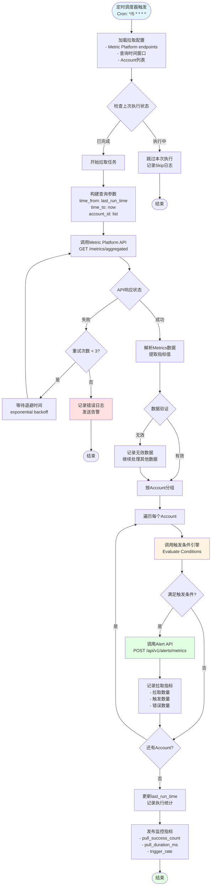

#### 3.8.2 拉取配置示例

```yaml
metric_pull_jobs:
  - job_name: card_testing_detection
    schedule: "*/5 * * * *"  # 每5分钟执行一次
    metric_platform:
      endpoint: "https://metric-platform.awx.im/api/v1/metrics/aggregated"
      timeout_seconds: 30
    query:
      metric_names:
        - "block_rate"
        - "failed_auth_rate"
      time_window: "10min"
      aggregation: "avg"
    accounts:
      type: "all"  # all | whitelist | blacklist
      # whitelist: ["account_1", "account_2"]
    alert_type: "CARD_TESTING"
    enabled: true

  - job_name: velocity_attack_detection
    schedule: "*/10 * * * *"  # 每10分钟执行一次
    metric_platform:
      endpoint: "https://metric-platform.awx.im/api/v1/metrics/aggregated"
      timeout_seconds: 30
    query:
      metric_names:
        - "transaction_count"
        - "unique_card_count"
      time_window: "5min"
      aggregation: "sum"
    accounts:
      type: "whitelist"
      whitelist: ["high_risk_account_1", "high_risk_account_2"]
    alert_type: "VELOCITY_ATTACK"
    enabled: true
```

#### 3.8.3 Metric Platform API 请求示例

**请求**：
```http
GET /api/v1/metrics/aggregated?time_from=2025-11-24T10:00:00Z&time_to=2025-11-24T10:05:00Z&account_ids=acc_1,acc_2&metric_names=block_rate,failed_auth_rate
Authorization: Bearer {api_token}
```

**响应**：
```json
{
  "data": [
    {
      "account_id": "acc_1",
      "time_window": {
        "from": "2025-11-24T10:00:00Z",
        "to": "2025-11-24T10:05:00Z"
      },
      "metrics": [
        {
          "metric_name": "block_rate",
          "metric_value": 0.45,
          "aggregation": "avg",
          "sample_count": 1000
        },
        {
          "metric_name": "failed_auth_rate",
          "metric_value": 0.67,
          "aggregation": "avg",
          "sample_count": 1000
        }
      ],
      "metadata": {
        "region": "AP",
        "source_system": "metric-platform"
      }
    },
    {
      "account_id": "acc_2",
      "time_window": {
        "from": "2025-11-24T10:00:00Z",
        "to": "2025-11-24T10:05:00Z"
      },
      "metrics": [
        {
          "metric_name": "block_rate",
          "metric_value": 0.15,
          "aggregation": "avg",
          "sample_count": 500
        },
        {
          "metric_name": "failed_auth_rate",
          "metric_value": 0.22,
          "aggregation": "avg",
          "sample_count": 500
        }
      ]
    }
  ],
  "pagination": {
    "total": 2,
    "has_more": false
  }
}
```

#### 3.8.4 错误处理与重试策略

**重试策略**：
```python
def pull_metrics_with_retry(config, max_retries=3):
    backoff_seconds = [1, 2, 4]  # 指数退避

    for attempt in range(max_retries):
        try:
            response = call_metric_platform_api(config)
            return response
        except APIError as e:
            if attempt < max_retries - 1:
                wait_time = backoff_seconds[attempt]
                logger.warning(f"API call failed, retry in {wait_time}s: {e}")
                time.sleep(wait_time)
            else:
                logger.error(f"API call failed after {max_retries} attempts: {e}")
                # 发送告警
                send_alert(f"Metric pull job failed: {config.job_name}")
                raise
```

**错误类型处理**：
- **网络超时**：重试3次，记录错误日志
- **API限流（429）**：等待Retry-After时间后重试
- **数据格式错误**：跳过该条数据，继续处理其他数据
- **认证失败（401）**：立即告警，停止任务
- **服务不可用（503）**：重试3次，失败后告警

#### 3.8.5 监控指标

系统需要监控以下指标：

| 指标名称 | 类型 | 描述 |
|---------|------|------|
| `metric_pull_success_count` | Counter | 成功拉取次数 |
| `metric_pull_failure_count` | Counter | 失败拉取次数 |
| `metric_pull_duration_ms` | Histogram | 拉取耗时（毫秒） |
| `metric_pull_data_count` | Gauge | 每次拉取的数据条数 |
| `metric_pull_trigger_rate` | Gauge | 触发告警的比率 |
| `metric_pull_last_run_timestamp` | Gauge | 上次执行时间戳 |

**告警规则**：
```yaml
- name: metric_pull_failure_rate_high
  condition: metric_pull_failure_count / metric_pull_success_count > 0.1
  duration: 10m
  severity: high

- name: metric_pull_lag_too_long
  condition: now() - metric_pull_last_run_timestamp > 600
  duration: 5m
  severity: critical
```

---

## 4. 数据模型

### 4.1 实体关系图 (ERD)

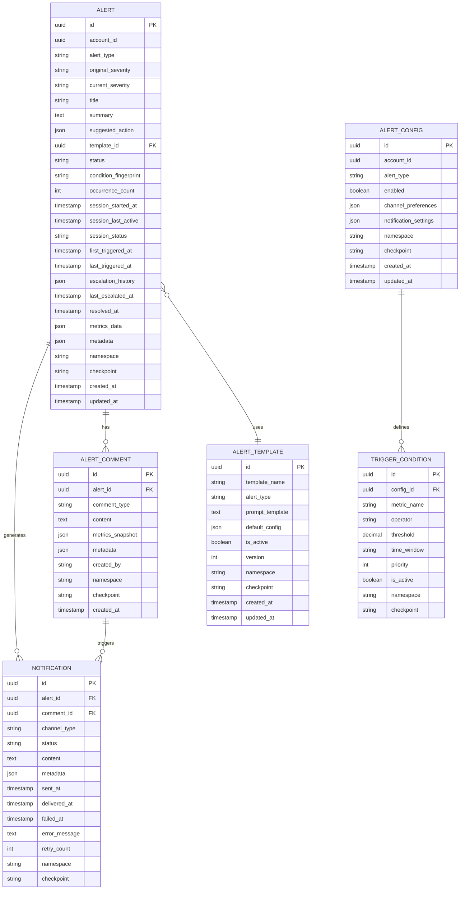

### 4.2 核心实体说明

#### 4.2.1 Alert (警报)
存储警报的核心信息，包括AI生成的摘要内容和聚合管理字段。

**关键字段**：
- `alert_type`: 警报类型（CARD_TESTING, VELOCITY_ATTACK等）
- `original_severity`: 初始严重程度（P0, P1, P2, P3）
- `current_severity`: 当前严重程度（可能被自动提升）
- `summary`: AI生成的警报摘要
- `suggested_action`: AI建议的操作（JSON格式）
- `status`: 警报状态（ACTIVE, RESOLVED, DISMISSED）

**聚合相关字段**：
- `condition_fingerprint`: 条件指纹（MD5哈希），用于识别相同触发条件的Alert
- `occurrence_count`: 触发次数计数器
- `session_started_at`: 会话开始时间
- `session_last_active`: 会话最后活跃时间
- `session_status`: 会话状态（ACTIVE, EXPIRED, RESOLVED）
- `first_triggered_at`: 首次触发时间
- `last_triggered_at`: 最后触发时间

**严重程度递进字段**：
- `escalation_history`: 严重程度提升历史记录（JSON格式）
- `last_escalated_at`: 最后一次提升时间

**指标与元数据字段**：
- `metrics_data`: 告警指标数据（JSON格式），存储首次触发的完整指标，如 block_rate、failed_auth_rate、total_transactions 等
- `metadata`: 其他元数据（JSON格式，nullable），存储来源系统、region、detected_at 等非指标信息

**通用字段**：
- `namespace`: 命名空间（字符串格式），用于多租户隔离
- `checkpoint`: 检查点标记（字符串格式），用于数据同步和恢复

#### 4.2.2 Alert Comment (警报评论/事件)
记录Alert的每次触发事件、用户评论和系统日志。

**关键字段**：
- `comment_type`: 评论类型（TRIGGER_EVENT: 触发事件, SEVERITY_ESCALATION: 严重程度提升, USER_NOTE: 用户备注, SYSTEM_LOG: 系统日志）
- `content`: 评论内容或事件描述
- `metrics_snapshot`: 指标快照（JSON格式，nullable），仅在 TRIGGER_EVENT 和 SEVERITY_ESCALATION 时填充，记录本次触发的指标数据
- `metadata`: 评论元数据（JSON格式，nullable），用于存储评论相关的额外信息，如用户信息、系统操作详情等
- `created_by`: 创建者（system 或 用户ID）

**使用场景**：
- **TRIGGER_EVENT**：会话更新时记录触发事件，填充 `metrics_snapshot`
- **SEVERITY_ESCALATION**：严重程度提升时记录变化详情，填充 `metrics_snapshot`
- **USER_NOTE**：用户手动添加备注，`metrics_snapshot` 为空，可选填充 `metadata` 记录用户信息
- **SYSTEM_LOG**：系统自动记录关键操作，可选填充 `metadata` 记录操作详情

#### 4.2.3 Notification (通知)
记录所有发送的通知，支持通过 Alert 或 Comment 触发。

**关键字段**：
- `alert_id`: 关联的 Alert ID（必填），用于追溯通知所属的告警
- `comment_id`: 关联的 Comment ID（可为空），如果通知是由 Comment 触发则填充此字段
- `channel_type`: 通知渠道类型（slack, sms, webapp）
- `status`: 通知状态（pending, sent, delivered, failed）
- `content`: 通知内容
- `metadata`: 通知元数据（JSON格式），存储通知相关的额外信息，如优先级、提及用户等

**触发来源判断**：
- `comment_id IS NULL`: 由 Alert 直接触发的通知（如首次创建告警）
- `comment_id IS NOT NULL`: 由 Comment 触发的通知（如严重程度提升、用户备注）

**使用场景**：
- **Alert 直接触发**：首次创建 Alert 时发送初始通知
- **严重程度提升触发**：SEVERITY_ESCALATION 类型的 Comment 触发紧急通知
- **用户备注触发**：USER_NOTE 类型的 Comment 触发团队协作通知
- **系统事件触发**：SYSTEM_LOG 类型的 Comment 触发状态变更通知

#### 4.2.4 Alert Template (警报模板)
定义不同类型警报的Prompt模板，用于生成AI摘要。

**Prompt模板示例**：
```
You are a fraud detection expert analyzing payment metrics for merchant {{merchant_name}}.

Metrics Data:
{{metrics_data}}

Historical Context:
{{historical_alerts}}

Please analyze the above metrics and provide:
1. A concise title (max 100 chars)
2. A summary of the potential fraud attack (max 300 words)
3. Severity level (P1/P2/P3)
4. Suggested immediate action

Format your response as JSON:
{
  "title": "...",
  "summary": "...",
  "severity": "...",
  "suggested_action": "..."
}
```

#### 4.2.5 Trigger Condition (触发条件)
定义基于Metrics的触发规则，支持多条件组合。

**条件示例**：
- `block_rate > 0.3` AND `time_window = 10min`
- `failed_auth_count > 100` AND `time_window = 5min`

---

## 5. API设计

### 5.1 警报接收API

#### 5.1.1 接收外部Metrics并创建警报

**端点**: `POST /api/v1/alerts/metrics`

**请求头**:
```
Content-Type: application/json
X-API-Key: {api_key}
X-Request-ID: {unique_request_id}
```

**请求体**:
```json
{
  "merchant_id": "uuid",
  "alert_type": "CARD_TESTING",
  "metrics": [
    {
      "metric_name": "block_rate",
      "metric_value": 0.45,
      "threshold": 0.30,
      "time_window": "10min",
      "metadata": {
        "total_transactions": 1000,
        "blocked_transactions": 450
      }
    },
    {
      "metric_name": "failed_auth_rate",
      "metric_value": 0.67,
      "threshold": 0.50,
      "time_window": "10min"
    }
  ],
  "event_metadata": {
    "source_system": "metric-platform",
    "detected_at": "2025-11-19T10:30:00Z",
    "region": "AP"
  }
}
```

**响应 (成功 - 201 Created)**:
```json
{
  "alert_id": "uuid",
  "status": "created",
  "triggered_at": "2025-11-19T10:30:05Z",
  "message": "Alert created and notifications queued"
}
```

**响应 (频率限制 - 429 Too Many Requests)**:
```json
{
  "error": "rate_limit_exceeded",
  "message": "Alert frequency limit exceeded for merchant",
  "retry_after_seconds": 1800,
  "limit_details": {
    "max_per_hour": 5,
    "current_count": 5,
    "window_reset_at": "2025-11-19T11:00:00Z"
  }
}
```

**响应 (条件不满足 - 200 OK)**:
```json
{
  "status": "no_alert",
  "message": "Metrics do not meet trigger conditions",
  "evaluated_conditions": [
    {
      "condition": "block_rate > 0.3",
      "met": true
    },
    {
      "condition": "failed_auth_rate > 0.5",
      "met": true
    }
  ]
}
```

---

### 5.2 警报查询API

#### 5.2.1 获取警报列表

**端点**: `GET /api/v1/alerts`

**查询参数**:
```
merchant_id: uuid (required)
alert_type: string (optional) - CARD_TESTING|VELOCITY_ATTACK|ACCOUNT_TAKEOVER
severity: string (optional) - P1|P2|P3
status: string (optional) - ACTIVE|RESOLVED|DISMISSED
from_date: datetime (optional)
to_date: datetime (optional)
page: int (default: 1)
page_size: int (default: 20, max: 100)
sort_by: string (default: triggered_at)
sort_order: string (default: desc)
```

**响应 (200 OK)**:
```json
{
  "data": [
    {
      "alert_id": "uuid",
      "merchant_id": "uuid",
      "alert_type": "CARD_TESTING",
      "severity": "P1",
      "title": "Suspected Card Testing Attack Detected",
      "summary": "We detected a significant spike in failed authorization attempts...",
      "status": "ACTIVE",
      "triggered_at": "2025-11-19T10:30:05Z",
      "metrics_summary": {
        "block_rate": 0.45,
        "failed_transactions": 450
      },
      "notification_channels": ["slack", "sms", "webapp"]
    }
  ],
  "pagination": {
    "page": 1,
    "page_size": 20,
    "total_count": 156,
    "total_pages": 8
  }
}
```

#### 5.2.2 获取警报详情

**端点**: `GET /api/v1/alerts/{alert_id}`

**路径参数**:
- `alert_id`: uuid (required)

**响应 (200 OK)**:
```json
{
  "alert_id": "uuid",
  "merchant_id": "uuid",
  "merchant_name": "Example Merchant Ltd",
  "alert_type": "CARD_TESTING",
  "severity": "P1",
  "title": "Suspected Card Testing Attack Detected",
  "summary": "We detected a significant spike in failed authorization attempts originating from multiple IP addresses in the past 10 minutes. The block rate increased from 5% to 45%, indicating a potential automated card testing attack...",
  "suggested_action": "Deploy the recommended rule to block transactions from suspicious IP ranges and enable additional verification for new cards.",
  "status": "ACTIVE",
  "triggered_at": "2025-11-19T10:30:05Z",
  "resolved_at": null,
  "metrics": [
    {
      "metric_name": "block_rate",
      "metric_value": 0.45,
      "threshold": 0.30,
      "time_window": "10min",
      "metadata": {
        "total_transactions": 1000,
        "blocked_transactions": 450,
        "comparison_to_baseline": "+40%"
      }
    },
    {
      "metric_name": "failed_auth_rate",
      "metric_value": 0.67,
      "threshold": 0.50,
      "time_window": "10min"
    }
  ],
  "raw_metrics": {
    "source_system": "metric-platform",
    "detected_at": "2025-11-19T10:30:00Z",
    "region": "AP",
    "detailed_breakdown": {...}
  },
  "notifications": [
    {
      "channel": "slack",
      "status": "delivered",
      "sent_at": "2025-11-19T10:30:06Z",
      "delivered_at": "2025-11-19T10:30:07Z"
    },
    {
      "channel": "sms",
      "status": "delivered",
      "sent_at": "2025-11-19T10:30:06Z",
      "delivered_at": "2025-11-19T10:30:08Z"
    },
    {
      "channel": "webapp",
      "status": "delivered",
      "sent_at": "2025-11-19T10:30:06Z",
      "delivered_at": "2025-11-19T10:30:06Z"
    }
  ],
  "actions_taken": [
    {
      "action_type": "rule_deployed",
      "action_time": "2025-11-19T10:35:00Z",
      "performed_by": "user_uuid",
      "details": {
        "rule_id": "rule_uuid",
        "rule_name": "Block suspicious IP ranges"
      }
    }
  ]
}
```

---

### 5.3 警报配置API

#### 5.3.1 获取警报配置

**端点**: `GET /api/v1/alerts/config`

**查询参数**:
```
merchant_id: uuid (required)
```

**响应 (200 OK)**:
```json
{
  "merchant_id": "uuid",
  "alert_configs": [
    {
      "alert_type": "CARD_TESTING",
      "enabled": true,
      "channels": {
        "slack": {
          "enabled": true,
          "webhook_url": "https://hooks.slack.com/..."
        },
        "sms": {
          "enabled": true,
          "phone_numbers": ["+1234567890"]
        },
        "webapp": {
          "enabled": true
        }
      },
      "trigger_conditions": [
        {
          "metric_name": "block_rate",
          "operator": ">",
          "threshold": 0.30,
          "time_window": "10min"
        }
      ],
      "frequency_control": {
        "max_alerts_per_hour": 5,
        "max_alerts_per_day": 20,
        "min_interval_minutes": 15
      }
    }
  ]
}
```

#### 5.3.2 更新警报配置

**端点**: `PUT /api/v1/alerts/config`

**请求体**:
```json
{
  "merchant_id": "uuid",
  "alert_type": "CARD_TESTING",
  "enabled": true,
  "channels": {
    "slack": {
      "enabled": true,
      "webhook_url": "https://hooks.slack.com/..."
    },
    "sms": {
      "enabled": false
    },
    "webapp": {
      "enabled": true
    }
  },
  "trigger_conditions": [
    {
      "metric_name": "block_rate",
      "operator": ">",
      "threshold": 0.35,
      "time_window": "10min"
    }
  ],
  "frequency_control": {
    "max_alerts_per_hour": 3,
    "max_alerts_per_day": 15,
    "min_interval_minutes": 20
  }
}
```

**响应 (200 OK)**:
```json
{
  "config_id": "uuid",
  "message": "Alert configuration updated successfully",
  "updated_at": "2025-11-19T11:00:00Z"
}
```

---

### 5.4 警报操作API

#### 5.4.1 标记警报为已解决

**端点**: `POST /api/v1/alerts/{alert_id}/resolve`

**请求体**:
```json
{
  "resolution_note": "Deployed blocking rule, attack mitigated",
  "resolved_by": "user_uuid"
}
```

**响应 (200 OK)**:
```json
{
  "alert_id": "uuid",
  "status": "RESOLVED",
  "resolved_at": "2025-11-19T11:30:00Z",
  "message": "Alert marked as resolved"
}
```

#### 5.4.2 忽略警报

**端点**: `POST /api/v1/alerts/{alert_id}/dismiss`

**请求体**:
```json
{
  "dismiss_reason": "False positive - normal traffic pattern",
  "dismissed_by": "user_uuid"
}
```

**响应 (200 OK)**:
```json
{
  "alert_id": "uuid",
  "status": "DISMISSED",
  "dismissed_at": "2025-11-19T11:30:00Z"
}
```

#### 5.4.3 重新发送通知

**端点**: `POST /api/v1/alerts/{alert_id}/resend-notification`

**请求体**:
```json
{
  "channels": ["slack", "sms"]
}
```

**响应 (200 OK)**:
```json
{
  "alert_id": "uuid",
  "message": "Notifications queued for resending",
  "queued_channels": ["slack", "sms"]
}
```

---

## 6. 通知渠道配置

### 6.1 Slack通知

**配置要求**:
- Webhook URL
- Channel名称
- 消息格式模板

**消息格式示例**:
```json
{
  "text": "🚨 Fraud Alert: Card Testing Attack Detected",
  "blocks": [
    {
      "type": "header",
      "text": {
        "type": "plain_text",
        "text": "🚨 Suspected Card Testing Attack"
      }
    },
    {
      "type": "section",
      "fields": [
        {
          "type": "mrkdwn",
          "text": "*Severity:*\nP1 - Critical"
        },
        {
          "type": "mrkdwn",
          "text": "*Merchant:*\nExample Merchant Ltd"
        }
      ]
    },
    {
      "type": "section",
      "text": {
        "type": "mrkdwn",
        "text": "*Summary:*\nWe detected a significant spike in failed authorization attempts..."
      }
    },
    {
      "type": "actions",
      "elements": [
        {
          "type": "button",
          "text": {
            "type": "plain_text",
            "text": "View Details"
          },
          "url": "https://portal.airwallex.com/alerts/{alert_id}"
        }
      ]
    }
  ]
}
```

### 6.2 SMS通知

**配置要求**:
- 电话号码列表
- SMS网关配置
- 字符限制（建议160字符以内）

**消息格式示例**:
```
Airwallex Alert [P1]: Card testing attack detected. Block rate: 45%. View: https://awx.link/a/{short_id}
```

### 6.3 Webapp通知

**配置要求**:
- WebSocket连接或SSE
- 浏览器Push API支持

**通知Payload**:
```json
{
  "notification_id": "uuid",
  "type": "fraud_alert",
  "severity": "P1",
  "title": "Card Testing Attack Detected",
  "body": "We detected suspicious activity on your account",
  "alert_id": "uuid",
  "timestamp": "2025-11-19T10:30:05Z",
  "actions": [
    {
      "label": "View Details",
      "action": "navigate",
      "url": "/alerts/{alert_id}"
    },
    {
      "label": "Dismiss",
      "action": "dismiss"
    }
  ]
}
```

---

## 7. 技术实现细节

### 7.1 AI Agent集成

#### 7.1.1 LLM选择
- **主要选择**: Claude 3.5 Sonnet (高质量分析)
- **备选方案**: GPT-4 (故障转移)
- **快速模式**: Claude 3 Haiku (低延迟场景)

#### 7.1.2 Prompt工程
**模板变量**:
- `{{merchant_name}}`: 商户名称
- `{{merchant_code}}`: 商户代码
- `{{metrics_data}}`: 格式化的指标数据
- `{{historical_alerts}}`: 历史警报上下文
- `{{time_window}}`: 时间窗口
- `{{baseline_metrics}}`: 基线指标对比

**响应解析**:
- 结构化JSON输出
- Schema验证
- 错误处理和重试机制

#### 7.1.3 性能优化
- 异步调用LLM API
- 响应缓存（相似Metrics）
- 批量处理（低优先级警报）
- 超时控制（5秒）

### 7.2 频率控制实现

#### 7.2.1 Redis数据结构
```
# 滑动窗口计数器
Key: freq_ctrl:merchant:{merchant_id}:alert:{alert_type}:hour:{timestamp_hour}
Value: count
TTL: 3600 seconds

Key: freq_ctrl:merchant:{merchant_id}:alert:{alert_type}:day:{timestamp_day}
Value: count
TTL: 86400 seconds

# 最小间隔控制
Key: freq_ctrl:merchant:{merchant_id}:alert:{alert_type}:last
Value: timestamp
TTL: min_interval_minutes * 60
```

#### 7.2.2 算法实现
```python
def check_frequency_limit(merchant_id, alert_type, config):
    now = datetime.now()

    # 检查最小间隔
    last_alert_key = f"freq_ctrl:merchant:{merchant_id}:alert:{alert_type}:last"
    last_alert_time = redis.get(last_alert_key)
    if last_alert_time:
        elapsed = (now - last_alert_time).seconds
        if elapsed < config.min_interval_minutes * 60:
            return False, f"Too soon, wait {config.min_interval_minutes * 60 - elapsed}s"

    # 检查小时限制
    hour_key = f"freq_ctrl:merchant:{merchant_id}:alert:{alert_type}:hour:{now.hour}"
    hour_count = redis.get(hour_key) or 0
    if hour_count >= config.max_alerts_per_hour:
        return False, "Hourly limit exceeded"

    # 检查每日限制
    day_key = f"freq_ctrl:merchant:{merchant_id}:alert:{alert_type}:day:{now.date()}"
    day_count = redis.get(day_key) or 0
    if day_count >= config.max_alerts_per_day:
        return False, "Daily limit exceeded"

    # 更新计数器
    redis.incr(hour_key)
    redis.expire(hour_key, 3600)
    redis.incr(day_key)
    redis.expire(day_key, 86400)
    redis.set(last_alert_key, now.timestamp(), ex=config.min_interval_minutes * 60)

    return True, "Passed"
```

### 7.3 消息队列设计

#### 7.3.1 主题设计
```
Topic: sentinel.alerts.notifications
Partitions: 10 (按merchant_id分区)
Replication: 3
Retention: 7 days
```

#### 7.3.2 消息格式
```json
{
  "message_id": "uuid",
  "alert_id": "uuid",
  "merchant_id": "uuid",
  "channels": ["slack", "sms", "webapp"],
  "priority": "high",
  "content": {
    "title": "...",
    "summary": "...",
    "alert_url": "..."
  },
  "created_at": "2025-11-19T10:30:05Z",
  "retry_count": 0,
  "max_retries": 3
}
```

---

## 8. 前端页面设计

### 8.1 Alert List页面

#### 8.1.1 功能需求
- 列表展示所有警报
- 筛选（类型、严重程度、状态、时间范围）
- 排序（时间、严重程度）
- 分页
- 批量操作（标记已读、忽略）

#### 8.1.2 UI组件
```
Alert List Component
├── Header
│   ├── Title: "Fraud Alerts"
│   ├── Summary Stats (Total, Active, Resolved)
│   └── Filter Bar
├── Alert Cards
│   ├── Alert Type Badge
│   ├── Severity Indicator (P1/P2/P3)
│   ├── Title
│   ├── Timestamp
│   ├── Status Badge
│   └── Quick Actions (View, Dismiss)
└── Pagination
```

#### 8.1.3 接口调用
```javascript
// 获取警报列表
GET /api/v1/alerts?merchant_id={id}&page=1&page_size=20&status=ACTIVE

// 响应数据绑定到UI
{
  data: [
    {
      alert_id: "...",
      severity: "P1",
      title: "Card Testing Attack",
      triggered_at: "2025-11-19T10:30:05Z",
      status: "ACTIVE"
    }
  ]
}
```

### 8.2 Alert Detail页面

#### 8.2.1 功能需求
- 完整警报信息展示
- AI生成的摘要和建议
- Metrics详细数据
- 通知发送状态
- 操作历史记录
- 快速操作按钮（部署规则、标记解决、忽略）

#### 8.2.2 UI布局
```
Alert Detail Page
├── Header
│   ├── Back Button
│   ├── Alert Title
│   ├── Severity Badge
│   └── Status Badge
├── Summary Section
│   ├── AI Generated Summary
│   ├── Suggested Action (highlighted)
│   └── Timestamp
├── Metrics Section
│   ├── Metric Cards (with charts)
│   │   ├── Block Rate: 45% (threshold: 30%)
│   │   └── Failed Auth Rate: 67% (threshold: 50%)
│   └── Raw Data Link
├── Notifications Section
│   ├── Channel Status (Slack ✓, SMS ✓, Webapp ✓)
│   └── Delivery Timeline
├── Actions Section
│   ├── Deploy Rule Button (primary)
│   ├── Mark Resolved Button
│   ├── Dismiss Button
│   └── Resend Notification
└── History Section
    └── Timeline of Actions Taken
```

#### 8.2.3 接口调用
```javascript
// 获取警报详情
GET /api/v1/alerts/{alert_id}

// 标记为已解决
POST /api/v1/alerts/{alert_id}/resolve
Body: { resolution_note: "...", resolved_by: "..." }

// 忽略警报
POST /api/v1/alerts/{alert_id}/dismiss
Body: { dismiss_reason: "...", dismissed_by: "..." }
```

---

## 9. 监控与日志

### 9.1 关键指标

#### 9.1.1 业务指标
- 警报触发率（按类型、商户）
- AI摘要生成成功率
- 通知发送成功率（按渠道）
- 频率控制拦截率
- 警报响应时间（从触发到首次操作）

#### 9.1.2 技术指标
- API响应时间（P50, P95, P99）
- LLM调用延迟和成功率
- 消息队列积压
- Redis缓存命中率
- 数据库查询性能

### 9.2 告警规则
```yaml
- name: alert_generation_failure
  condition: alert_generation_error_rate > 5%
  duration: 5m
  severity: critical

- name: notification_delivery_failure
  condition: notification_failure_rate > 10%
  duration: 5m
  severity: high

- name: llm_api_slow
  condition: llm_api_p95_latency > 5s
  duration: 3m
  severity: warning

- name: frequency_control_high_rejection
  condition: frequency_control_rejection_rate > 30%
  duration: 10m
  severity: warning
```

### 9.3 日志规范

#### 9.3.1 结构化日志格式
```json
{
  "timestamp": "2025-11-19T10:30:05.123Z",
  "level": "INFO",
  "service": "alert-service",
  "trace_id": "uuid",
  "merchant_id": "uuid",
  "alert_id": "uuid",
  "event": "alert_created",
  "message": "Alert created successfully",
  "metadata": {
    "alert_type": "CARD_TESTING",
    "severity": "P1",
    "processing_time_ms": 234
  }
}
```

#### 9.3.2 关键日志事件
- `alert_received`: 接收到外部Metrics
- `trigger_condition_evaluated`: 触发条件评估
- `frequency_check_passed/rejected`: 频率控制结果
- `ai_summary_requested`: AI摘要生成请求
- `ai_summary_generated`: AI摘要生成成功
- `alert_created`: 警报创建
- `notification_sent`: 通知发送
- `alert_resolved`: 警报解决

---

## 10. 安全考虑

### 10.1 API安全
- API Key认证
- Rate Limiting（基于IP和API Key）
- 请求签名验证
- HTTPS强制

### 10.2 数据安全
- 敏感数据加密存储（电话号码、Webhook URL）
- PII数据脱敏（日志中）
- 访问控制（商户只能访问自己的警报）
- 审计日志（所有操作记录）

### 10.3 通知安全
- Webhook URL验证
- SMS发送限流（防滥用）
- Slack OAuth Token加密存储

---

## 11. 扩展性设计

### 11.1 水平扩展
- 无状态服务设计
- 负载均衡
- 数据库读写分离
- 消息队列分区

### 11.2 未来扩展点
- 支持更多通知渠道（Email, MS Teams, Webhook）
- 多语言AI摘要
- 自定义Prompt模板（商户级别）
- 机器学习优化触发条件
- 警报聚合和关联分析

---

## 12. 部署架构

### 12.1 生产环境

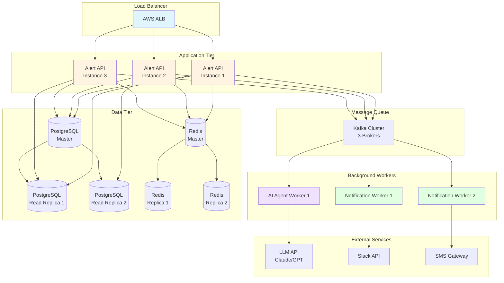

### 12.2 资源配置建议

#### 12.2.1 API服务
- **实例规格**: 4 vCPU, 8GB RAM
- **实例数量**: 3-5个（根据负载自动扩展）
- **自动扩展**: CPU > 70% 或 请求队列 > 100

#### 12.2.2 Worker服务
- **Notification Worker**: 2 vCPU, 4GB RAM × 2
- **AI Agent Worker**: 2 vCPU, 4GB RAM × 1-3（根据LLM调用量）

#### 12.2.3 数据库
- **PostgreSQL**: db.r6g.xlarge (4 vCPU, 32GB RAM)
- **Redis**: cache.r6g.large (2 vCPU, 13GB RAM)

#### 12.2.4 消息队列
- **Kafka**: 3 brokers × (4 vCPU, 16GB RAM, 500GB SSD)

---

## 13. 测试策略

### 13.1 单元测试
- 触发条件评估逻辑
- 频率控制算法
- AI响应解析
- 数据验证

### 13.2 集成测试
- API端到端流程
- 消息队列集成
- 数据库操作
- 外部服务Mock

### 13.3 性能测试
- 负载测试（1000 req/s）
- 压力测试（峰值处理能力）
- AI生成延迟测试
- 数据库查询优化

### 13.4 灾难恢复测试
- 数据库故障转移
- Redis故障恢复
- 消息队列重试机制
- LLM服务降级

---

## 14. 发布计划

### 14.1 Phase 1 - MVP (Week 1-4)
- 基础Alert接收和存储
- 简单的触发条件引擎
- AI摘要生成（Claude集成）
- Webapp通知渠道
- Alert List和Detail页面

### 14.2 Phase 2 - 频率控制与多渠道 (Week 5-6)
- 完整频率控制实现
- Slack通知集成
- SMS通知集成
- 配置管理API

### 14.3 Phase 3 - 优化与扩展 (Week 7-8)
- 性能优化
- 监控和告警完善
- 批量操作支持
- 高级筛选和搜索

---

## 15. 附录

### 15.1 术语表
- **Metric**: 指标，从外部系统获取的量化数据
- **Alert**: 警报，基于Metrics触发的通知
- **Trigger Condition**: 触发条件，定义何时生成警报的规则
- **Frequency Control**: 频率控制，限制警报发送频率的机制
- **AI Agent**: AI代理，使用LLM生成警报摘要的服务

### 15.2 参考文档
- Airwallex Sentinel PRD
- Metric Platform API文档
- Claude API文档
- Slack API文档

---

**文档版本历史**:
- v1.0 (2025-11-19): 初始版本
