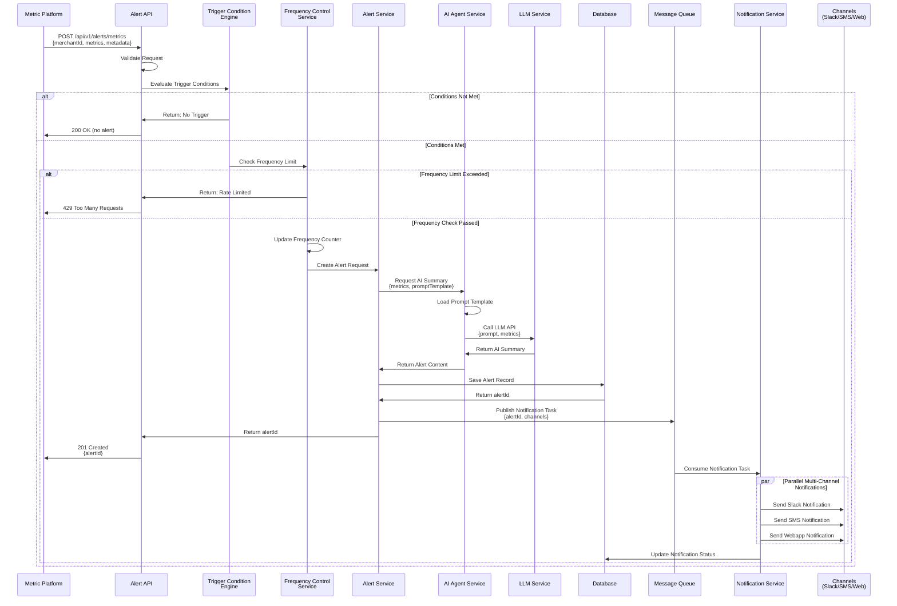
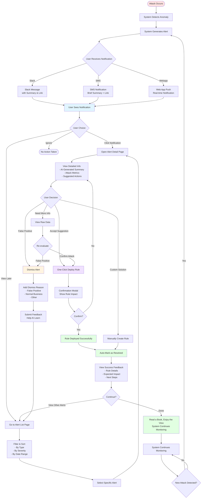
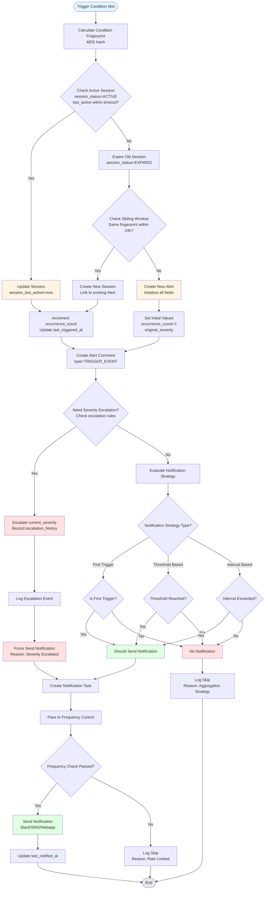
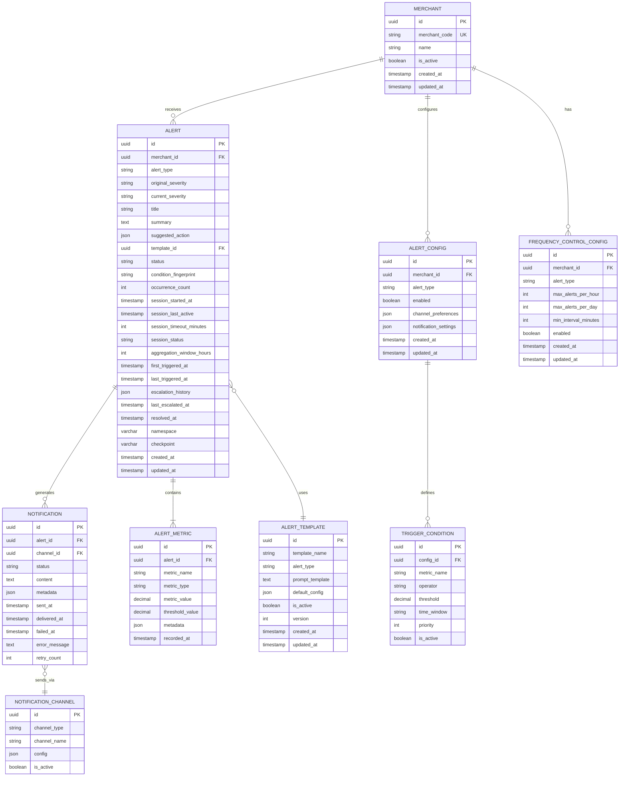

# Airwallex Sentinel - Alert System Technical Design Document

**Author:** Boyi Wang
**Date:** November 19, 2025
**Version:** 1.0

---

## 1. Overview

### 1.1 Document Purpose
This document describes the technical design of the Alert module in the Airwallex Sentinel system, including system architecture, data flows, entity models, and API interface definitions.

### 1.2 System Introduction
The Alert system is one of the core modules of Sentinel, responsible for receiving metric data from external risk detection systems, generating intelligent alert summaries through AI Agents, and notifying merchants via multiple channels (Slack, Webapp, SMS). The system supports flexible frequency control and trigger condition configuration.

### 1.3 Core Features
- **Intelligent Alert Generation**: Generate human-readable alert summaries through AI Agents based on external Metrics
- **Multi-channel Notifications**: Support three notification channels: Slack, Webapp, and SMS
- **Frequency Control**: Support frequency limit configuration at merchant and time dimensions
- **Flexible Trigger Conditions**: Configurable trigger rules based on external Metrics
- **Alert Management**: Provide Alert List and Alert Detail pages for merchants to view and manage alerts

---

## 2. System Architecture

### 2.1 Overall Architecture Diagram


### 2.2 Architecture Description

#### 2.2.1 Access Layer
- **Alert API Gateway**: Unified API entry point responsible for request validation, routing, and rate limiting

#### 2.2.2 Business Logic Layer
- **Trigger Condition Engine**: Evaluates whether external Metrics meet alert trigger conditions
- **Frequency Control Service**: Frequency control based on merchant and time dimensions
- **AI Agent Service**: Calls LLM to generate alert summaries and manages Prompt templates
- **Alert Service**: Core alert business logic, manages alert lifecycle
- **Notification Service**: Multi-channel notification delivery service

#### 2.2.3 Data Layer
- **PostgreSQL**: Stores persistent data such as alerts, configurations, and historical records
- **Redis**: Caches hot data and stores frequency control counters
- **Message Queue (Kafka/RabbitMQ)**: Asynchronously processes notification tasks

---

## 3. Core Workflows

### 3.1 Alert Generation and Notification Flow



### 3.2 AI Summary Generation Flow


### 3.3 Frequency Control Flow


### 3.4 User Interaction Flow



### 3.5 Trigger Condition Evaluation Flow


### 3.6 Alert Aggregation Flow

The Alert system adopts a **hybrid aggregation strategy**, combining session-based aggregation, sliding window, and severity escalation to handle fraud attack alerts more intelligently.

#### 3.6.1 Aggregation Strategy Description

**1. Session-based Aggregation**
- **Core Concept**: Dynamically determine if triggers belong to the same attack based on activity
- **Strategy**: If interval between triggers < session_timeout_minutes (default 15 minutes) → consider as same attack session
- **Advantages**: Better aligns with real attack scenarios (attacks are usually bursty), automatically distinguishes multiple attack rounds

**2. Sliding Window**
- **Core Concept**: Search for Alerts with same fingerprint within a fixed duration (e.g., 24 hours)
- **Purpose**: Serves as fallback mechanism to avoid creating too many Alerts
- **Advantages**: Avoids fixed window boundary issues, provides smoother aggregation

**3. Severity Escalation**
- **Core Concept**: Automatically escalate severity as attack duration/frequency increases
- **Strategy**:
  - Trigger count reaches 10 → escalate to P2
  - Trigger count reaches 50 → escalate to P1
  - Duration exceeds 2 hours → escalate to P1
- **Advantages**: Automatically identify severe attacks, increase response priority

#### 3.6.2 Aggregation Flow Diagram



#### 3.6.3 Severity Escalation Rules

The system automatically escalates Alert severity based on the following rules:

| Trigger Condition | Escalate To | Description |
|------------------|-------------|-------------|
| occurrence_count >= 10 | P2 | Medium intensity attack |
| occurrence_count >= 50 | P1 | High intensity attack |
| Duration >= 2 hours | P1 | Sustained attack |
| Duration >= 6 hours | P0 | Severe sustained attack |

**Escalation History Example**:
```json
{
  "escalations": [
    {
      "from_severity": "P3",
      "to_severity": "P2",
      "reason": "occurrence_count_threshold",
      "occurrence_count": 10,
      "escalated_at": "2025-11-19T10:45:00Z"
    },
    {
      "from_severity": "P2",
      "to_severity": "P1",
      "reason": "occurrence_count_threshold",
      "occurrence_count": 50,
      "escalated_at": "2025-11-19T11:30:00Z"
    }
  ]
}
```

#### 3.6.4 Session Management

**Session Status Transitions**:
```
ACTIVE → EXPIRED → (may reactivate to ACTIVE)
ACTIVE → RESOLVED (manually resolved by user)
```

**Session Timeout Configuration**:
- Default timeout: 15 minutes
- Configurable per Alert type
- Example: Card testing attacks suggest 15 minutes, velocity attacks suggest 30 minutes

**Session Reactivation**:
- If an EXPIRED session is triggered again within the sliding window, a new session can be created linked to the same Alert
- This tracks intermittent attack patterns

---

## 4. Data Model

### 4.1 Entity Relationship Diagram (ERD)



### 4.2 Core Entity Descriptions

#### 4.2.1 Alert
Stores core alert information, including AI-generated summary content and aggregation management fields.

**Key Fields**:
- `alert_type`: Alert type (CARD_TESTING, VELOCITY_ATTACK, etc.)
- `original_severity`: Initial severity level (P0, P1, P2, P3)
- `current_severity`: Current severity level (may be auto-escalated)
- `summary`: AI-generated alert summary
- `suggested_action`: AI-recommended actions (JSON format)
- `status`: Alert status (ACTIVE, RESOLVED, DISMISSED)

**Aggregation Fields**:
- `condition_fingerprint`: Condition fingerprint (MD5 hash), used to identify Alerts with same trigger conditions
- `occurrence_count`: Trigger count counter
- `session_started_at`: Session start time
- `session_last_active`: Session last active time
- `session_timeout_minutes`: Session timeout duration (minutes)
- `session_status`: Session status (ACTIVE, EXPIRED, RESOLVED)
- `aggregation_window_hours`: Aggregation window duration (hours)
- `first_triggered_at`: First trigger time
- `last_triggered_at`: Last trigger time

**Severity Escalation Fields**:
- `escalation_history`: Severity escalation history (JSON format)
- `last_escalated_at`: Last escalation time

**Common Fields**:
- `namespace`: Namespace for multi-tenant isolation
- `checkpoint`: Checkpoint marker for data sync and recovery

#### 4.2.2 Alert Metric
Records specific metric data that triggered the alert, supports multiple metrics.

#### 4.2.3 Alert Template
Defines Prompt templates for different types of alerts, used to generate AI summaries.

**Prompt Template Example**:
```
You are a fraud detection expert analyzing payment metrics for merchant {{merchant_name}}.

Metrics Data:
{{metrics_data}}

Historical Context:
{{historical_alerts}}

Please analyze the above metrics and provide:
1. A concise title (max 100 chars)
2. A summary of the potential fraud attack (max 300 words)
3. Severity level (P1/P2/P3)
4. Suggested immediate action

Format your response as JSON:
{
  "title": "...",
  "summary": "...",
  "severity": "...",
  "suggested_action": "..."
}
```

#### 4.2.4 Frequency Control Config
Defines frequency limit rules at merchant and time dimensions.

**Configuration Example**:
- Maximum 5 alerts per hour
- Maximum 20 alerts per day
- Minimum interval of 15 minutes between alerts of the same type

#### 4.2.5 Trigger Condition
Defines trigger rules based on Metrics, supports multiple condition combinations.

**Condition Examples**:
- `block_rate > 0.3` AND `time_window = 10min`
- `failed_auth_count > 100` AND `time_window = 5min`

---

## 5. API Design

### 5.1 Alert Ingestion API

#### 5.1.1 Receive External Metrics and Create Alert

**Endpoint**: `POST /api/v1/alerts/metrics`

**Request Headers**:
```
Content-Type: application/json
X-API-Key: {api_key}
X-Request-ID: {unique_request_id}
```

**Request Body**:
```json
{
  "merchant_id": "uuid",
  "alert_type": "CARD_TESTING",
  "metrics": [
    {
      "metric_name": "block_rate",
      "metric_value": 0.45,
      "threshold": 0.30,
      "time_window": "10min",
      "metadata": {
        "total_transactions": 1000,
        "blocked_transactions": 450
      }
    },
    {
      "metric_name": "failed_auth_rate",
      "metric_value": 0.67,
      "threshold": 0.50,
      "time_window": "10min"
    }
  ],
  "event_metadata": {
    "source_system": "metric-platform",
    "detected_at": "2025-11-19T10:30:00Z",
    "region": "AP"
  }
}
```

**Response (Success - 201 Created)**:
```json
{
  "alert_id": "uuid",
  "status": "created",
  "triggered_at": "2025-11-19T10:30:05Z",
  "message": "Alert created and notifications queued"
}
```

**Response (Rate Limited - 429 Too Many Requests)**:
```json
{
  "error": "rate_limit_exceeded",
  "message": "Alert frequency limit exceeded for merchant",
  "retry_after_seconds": 1800,
  "limit_details": {
    "max_per_hour": 5,
    "current_count": 5,
    "window_reset_at": "2025-11-19T11:00:00Z"
  }
}
```

**Response (Conditions Not Met - 200 OK)**:
```json
{
  "status": "no_alert",
  "message": "Metrics do not meet trigger conditions",
  "evaluated_conditions": [
    {
      "condition": "block_rate > 0.3",
      "met": true
    },
    {
      "condition": "failed_auth_rate > 0.5",
      "met": true
    }
  ]
}
```

---

### 5.2 Alert Query API

#### 5.2.1 Get Alert List

**Endpoint**: `GET /api/v1/alerts`

**Query Parameters**:
```
merchant_id: uuid (required)
alert_type: string (optional) - CARD_TESTING|VELOCITY_ATTACK|ACCOUNT_TAKEOVER
severity: string (optional) - P1|P2|P3
status: string (optional) - ACTIVE|RESOLVED|DISMISSED
from_date: datetime (optional)
to_date: datetime (optional)
page: int (default: 1)
page_size: int (default: 20, max: 100)
sort_by: string (default: triggered_at)
sort_order: string (default: desc)
```

**Response (200 OK)**:
```json
{
  "data": [
    {
      "alert_id": "uuid",
      "merchant_id": "uuid",
      "alert_type": "CARD_TESTING",
      "severity": "P1",
      "title": "Suspected Card Testing Attack Detected",
      "summary": "We detected a significant spike in failed authorization attempts...",
      "status": "ACTIVE",
      "triggered_at": "2025-11-19T10:30:05Z",
      "metrics_summary": {
        "block_rate": 0.45,
        "failed_transactions": 450
      },
      "notification_channels": ["slack", "sms", "webapp"]
    }
  ],
  "pagination": {
    "page": 1,
    "page_size": 20,
    "total_count": 156,
    "total_pages": 8
  }
}
```

#### 5.2.2 Get Alert Detail

**Endpoint**: `GET /api/v1/alerts/{alert_id}`

**Path Parameters**:
- `alert_id`: uuid (required)

**Response (200 OK)**:
```json
{
  "alert_id": "uuid",
  "merchant_id": "uuid",
  "merchant_name": "Example Merchant Ltd",
  "alert_type": "CARD_TESTING",
  "severity": "P1",
  "title": "Suspected Card Testing Attack Detected",
  "summary": "We detected a significant spike in failed authorization attempts originating from multiple IP addresses in the past 10 minutes. The block rate increased from 5% to 45%, indicating a potential automated card testing attack...",
  "suggested_action": "Deploy the recommended rule to block transactions from suspicious IP ranges and enable additional verification for new cards.",
  "status": "ACTIVE",
  "triggered_at": "2025-11-19T10:30:05Z",
  "resolved_at": null,
  "metrics": [
    {
      "metric_name": "block_rate",
      "metric_value": 0.45,
      "threshold": 0.30,
      "time_window": "10min",
      "metadata": {
        "total_transactions": 1000,
        "blocked_transactions": 450,
        "comparison_to_baseline": "+40%"
      }
    },
    {
      "metric_name": "failed_auth_rate",
      "metric_value": 0.67,
      "threshold": 0.50,
      "time_window": "10min"
    }
  ],
  "raw_metrics": {
    "source_system": "metric-platform",
    "detected_at": "2025-11-19T10:30:00Z",
    "region": "AP",
    "detailed_breakdown": {...}
  },
  "notifications": [
    {
      "channel": "slack",
      "status": "delivered",
      "sent_at": "2025-11-19T10:30:06Z",
      "delivered_at": "2025-11-19T10:30:07Z"
    },
    {
      "channel": "sms",
      "status": "delivered",
      "sent_at": "2025-11-19T10:30:06Z",
      "delivered_at": "2025-11-19T10:30:08Z"
    },
    {
      "channel": "webapp",
      "status": "delivered",
      "sent_at": "2025-11-19T10:30:06Z",
      "delivered_at": "2025-11-19T10:30:06Z"
    }
  ],
  "actions_taken": [
    {
      "action_type": "rule_deployed",
      "action_time": "2025-11-19T10:35:00Z",
      "performed_by": "user_uuid",
      "details": {
        "rule_id": "rule_uuid",
        "rule_name": "Block suspicious IP ranges"
      }
    }
  ]
}
```

---

### 5.3 Alert Configuration API

#### 5.3.1 Get Alert Configuration

**Endpoint**: `GET /api/v1/alerts/config`

**Query Parameters**:
```
merchant_id: uuid (required)
```

**Response (200 OK)**:
```json
{
  "merchant_id": "uuid",
  "alert_configs": [
    {
      "alert_type": "CARD_TESTING",
      "enabled": true,
      "channels": {
        "slack": {
          "enabled": true,
          "webhook_url": "https://hooks.slack.com/..."
        },
        "sms": {
          "enabled": true,
          "phone_numbers": ["+1234567890"]
        },
        "webapp": {
          "enabled": true
        }
      },
      "trigger_conditions": [
        {
          "metric_name": "block_rate",
          "operator": ">",
          "threshold": 0.30,
          "time_window": "10min"
        }
      ],
      "frequency_control": {
        "max_alerts_per_hour": 5,
        "max_alerts_per_day": 20,
        "min_interval_minutes": 15
      }
    }
  ]
}
```

#### 5.3.2 Update Alert Configuration

**Endpoint**: `PUT /api/v1/alerts/config`

**Request Body**:
```json
{
  "merchant_id": "uuid",
  "alert_type": "CARD_TESTING",
  "enabled": true,
  "channels": {
    "slack": {
      "enabled": true,
      "webhook_url": "https://hooks.slack.com/..."
    },
    "sms": {
      "enabled": false
    },
    "webapp": {
      "enabled": true
    }
  },
  "trigger_conditions": [
    {
      "metric_name": "block_rate",
      "operator": ">",
      "threshold": 0.35,
      "time_window": "10min"
    }
  ],
  "frequency_control": {
    "max_alerts_per_hour": 3,
    "max_alerts_per_day": 15,
    "min_interval_minutes": 20
  }
}
```

**Response (200 OK)**:
```json
{
  "config_id": "uuid",
  "message": "Alert configuration updated successfully",
  "updated_at": "2025-11-19T11:00:00Z"
}
```

---

### 5.4 Alert Action API

#### 5.4.1 Mark Alert as Resolved

**Endpoint**: `POST /api/v1/alerts/{alert_id}/resolve`

**Request Body**:
```json
{
  "resolution_note": "Deployed blocking rule, attack mitigated",
  "resolved_by": "user_uuid"
}
```

**Response (200 OK)**:
```json
{
  "alert_id": "uuid",
  "status": "RESOLVED",
  "resolved_at": "2025-11-19T11:30:00Z",
  "message": "Alert marked as resolved"
}
```

#### 5.4.2 Dismiss Alert

**Endpoint**: `POST /api/v1/alerts/{alert_id}/dismiss`

**Request Body**:
```json
{
  "dismiss_reason": "False positive - normal traffic pattern",
  "dismissed_by": "user_uuid"
}
```

**Response (200 OK)**:
```json
{
  "alert_id": "uuid",
  "status": "DISMISSED",
  "dismissed_at": "2025-11-19T11:30:00Z"
}
```

#### 5.4.3 Resend Notification

**Endpoint**: `POST /api/v1/alerts/{alert_id}/resend-notification`

**Request Body**:
```json
{
  "channels": ["slack", "sms"]
}
```

**Response (200 OK)**:
```json
{
  "alert_id": "uuid",
  "message": "Notifications queued for resending",
  "queued_channels": ["slack", "sms"]
}
```

---

## 6. Notification Channel Configuration

### 6.1 Slack Notification

**Configuration Requirements**:
- Webhook URL
- Channel name
- Message format template

**Message Format Example**:
```json
{
  "text": "🚨 Fraud Alert: Card Testing Attack Detected",
  "blocks": [
    {
      "type": "header",
      "text": {
        "type": "plain_text",
        "text": "🚨 Suspected Card Testing Attack"
      }
    },
    {
      "type": "section",
      "fields": [
        {
          "type": "mrkdwn",
          "text": "*Severity:*\nP1 - Critical"
        },
        {
          "type": "mrkdwn",
          "text": "*Merchant:*\nExample Merchant Ltd"
        }
      ]
    },
    {
      "type": "section",
      "text": {
        "type": "mrkdwn",
        "text": "*Summary:*\nWe detected a significant spike in failed authorization attempts..."
      }
    },
    {
      "type": "actions",
      "elements": [
        {
          "type": "button",
          "text": {
            "type": "plain_text",
            "text": "View Details"
          },
          "url": "https://portal.airwallex.com/alerts/{alert_id}"
        }
      ]
    }
  ]
}
```

### 6.2 SMS Notification

**Configuration Requirements**:
- Phone number list
- SMS gateway configuration
- Character limit (recommended within 160 characters)

**Message Format Example**:
```
Airwallex Alert [P1]: Card testing attack detected. Block rate: 45%. View: https://awx.link/a/{short_id}
```

### 6.3 Webapp Notification

**Configuration Requirements**:
- WebSocket connection or SSE
- Browser Push API support

**Notification Payload**:
```json
{
  "notification_id": "uuid",
  "type": "fraud_alert",
  "severity": "P1",
  "title": "Card Testing Attack Detected",
  "body": "We detected suspicious activity on your account",
  "alert_id": "uuid",
  "timestamp": "2025-11-19T10:30:05Z",
  "actions": [
    {
      "label": "View Details",
      "action": "navigate",
      "url": "/alerts/{alert_id}"
    },
    {
      "label": "Dismiss",
      "action": "dismiss"
    }
  ]
}
```

---

## 7. Technical Implementation Details

### 7.1 AI Agent Integration

#### 7.1.1 LLM Selection
- **Primary Choice**: Claude 3.5 Sonnet (high-quality analysis)
- **Fallback Option**: GPT-4 (failover)
- **Fast Mode**: Claude 3 Haiku (low-latency scenarios)

#### 7.1.2 Prompt Engineering
**Template Variables**:
- `{{merchant_name}}`: Merchant name
- `{{merchant_code}}`: Merchant code
- `{{metrics_data}}`: Formatted metric data
- `{{historical_alerts}}`: Historical alert context
- `{{time_window}}`: Time window
- `{{baseline_metrics}}`: Baseline metric comparison

**Response Parsing**:
- Structured JSON output
- Schema validation
- Error handling and retry mechanism

#### 7.1.3 Performance Optimization
- Asynchronous LLM API calls
- Response caching (similar Metrics)
- Batch processing (low-priority alerts)
- Timeout control (5 seconds)

### 7.2 Frequency Control Implementation

#### 7.2.1 Redis Data Structure
```
# Sliding window counter
Key: freq_ctrl:merchant:{merchant_id}:alert:{alert_type}:hour:{timestamp_hour}
Value: count
TTL: 3600 seconds

Key: freq_ctrl:merchant:{merchant_id}:alert:{alert_type}:day:{timestamp_day}
Value: count
TTL: 86400 seconds

# Minimum interval control
Key: freq_ctrl:merchant:{merchant_id}:alert:{alert_type}:last
Value: timestamp
TTL: min_interval_minutes * 60
```

#### 7.2.2 Algorithm Implementation
```python
def check_frequency_limit(merchant_id, alert_type, config):
    now = datetime.now()

    # Check minimum interval
    last_alert_key = f"freq_ctrl:merchant:{merchant_id}:alert:{alert_type}:last"
    last_alert_time = redis.get(last_alert_key)
    if last_alert_time:
        elapsed = (now - last_alert_time).seconds
        if elapsed < config.min_interval_minutes * 60:
            return False, f"Too soon, wait {config.min_interval_minutes * 60 - elapsed}s"

    # Check hourly limit
    hour_key = f"freq_ctrl:merchant:{merchant_id}:alert:{alert_type}:hour:{now.hour}"
    hour_count = redis.get(hour_key) or 0
    if hour_count >= config.max_alerts_per_hour:
        return False, "Hourly limit exceeded"

    # Check daily limit
    day_key = f"freq_ctrl:merchant:{merchant_id}:alert:{alert_type}:day:{now.date()}"
    day_count = redis.get(day_key) or 0
    if day_count >= config.max_alerts_per_day:
        return False, "Daily limit exceeded"

    # Update counters
    redis.incr(hour_key)
    redis.expire(hour_key, 3600)
    redis.incr(day_key)
    redis.expire(day_key, 86400)
    redis.set(last_alert_key, now.timestamp(), ex=config.min_interval_minutes * 60)

    return True, "Passed"
```

### 7.3 Message Queue Design

#### 7.3.1 Topic Design
```
Topic: sentinel.alerts.notifications
Partitions: 10 (partitioned by merchant_id)
Replication: 3
Retention: 7 days
```

#### 7.3.2 Message Format
```json
{
  "message_id": "uuid",
  "alert_id": "uuid",
  "merchant_id": "uuid",
  "channels": ["slack", "sms", "webapp"],
  "priority": "high",
  "content": {
    "title": "...",
    "summary": "...",
    "alert_url": "..."
  },
  "created_at": "2025-11-19T10:30:05Z",
  "retry_count": 0,
  "max_retries": 3
}
```

---

## 8. Frontend Page Design

### 8.1 Alert List Page

#### 8.1.1 Functional Requirements
- Display all alerts in a list
- Filtering (type, severity, status, date range)
- Sorting (time, severity)
- Pagination
- Batch operations (mark as read, dismiss)

#### 8.1.2 UI Components
```
Alert List Component
├── Header
│   ├── Title: "Fraud Alerts"
│   ├── Summary Stats (Total, Active, Resolved)
│   └── Filter Bar
├── Alert Cards
│   ├── Alert Type Badge
│   ├── Severity Indicator (P1/P2/P3)
│   ├── Title
│   ├── Timestamp
│   ├── Status Badge
│   └── Quick Actions (View, Dismiss)
└── Pagination
```

#### 8.1.3 API Calls
```javascript
// Get alert list
GET /api/v1/alerts?merchant_id={id}&page=1&page_size=20&status=ACTIVE

// Bind response data to UI
{
  data: [
    {
      alert_id: "...",
      severity: "P1",
      title: "Card Testing Attack",
      triggered_at: "2025-11-19T10:30:05Z",
      status: "ACTIVE"
    }
  ]
}
```

### 8.2 Alert Detail Page

#### 8.2.1 Functional Requirements
- Display complete alert information
- AI-generated summary and recommendations
- Detailed Metrics data
- Notification delivery status
- Action history
- Quick action buttons (deploy rule, mark resolved, dismiss)

#### 8.2.2 UI Layout
```
Alert Detail Page
├── Header
│   ├── Back Button
│   ├── Alert Title
│   ├── Severity Badge
│   └── Status Badge
├── Summary Section
│   ├── AI Generated Summary
│   ├── Suggested Action (highlighted)
│   └── Timestamp
├── Metrics Section
│   ├── Metric Cards (with charts)
│   │   ├── Block Rate: 45% (threshold: 30%)
│   │   └── Failed Auth Rate: 67% (threshold: 50%)
│   └── Raw Data Link
├── Notifications Section
│   ├── Channel Status (Slack ✓, SMS ✓, Webapp ✓)
│   └── Delivery Timeline
├── Actions Section
│   ├── Deploy Rule Button (primary)
│   ├── Mark Resolved Button
│   ├── Dismiss Button
│   └── Resend Notification
└── History Section
    └── Timeline of Actions Taken
```

#### 8.2.3 API Calls
```javascript
// Get alert detail
GET /api/v1/alerts/{alert_id}

// Mark as resolved
POST /api/v1/alerts/{alert_id}/resolve
Body: { resolution_note: "...", resolved_by: "..." }

// Dismiss alert
POST /api/v1/alerts/{alert_id}/dismiss
Body: { dismiss_reason: "...", dismissed_by: "..." }
```

---

## 9. Monitoring and Logging

### 9.1 Key Metrics

#### 9.1.1 Business Metrics
- Alert trigger rate (by type, merchant)
- AI summary generation success rate
- Notification delivery success rate (by channel)
- Frequency control rejection rate
- Alert response time (from trigger to first action)

#### 9.1.2 Technical Metrics
- API response time (P50, P95, P99)
- LLM call latency and success rate
- Message queue backlog
- Redis cache hit rate
- Database query performance

### 9.2 Alert Rules
```yaml
- name: alert_generation_failure
  condition: alert_generation_error_rate > 5%
  duration: 5m
  severity: critical

- name: notification_delivery_failure
  condition: notification_failure_rate > 10%
  duration: 5m
  severity: high

- name: llm_api_slow
  condition: llm_api_p95_latency > 5s
  duration: 3m
  severity: warning

- name: frequency_control_high_rejection
  condition: frequency_control_rejection_rate > 30%
  duration: 10m
  severity: warning
```

### 9.3 Logging Standards

#### 9.3.1 Structured Log Format
```json
{
  "timestamp": "2025-11-19T10:30:05.123Z",
  "level": "INFO",
  "service": "alert-service",
  "trace_id": "uuid",
  "merchant_id": "uuid",
  "alert_id": "uuid",
  "event": "alert_created",
  "message": "Alert created successfully",
  "metadata": {
    "alert_type": "CARD_TESTING",
    "severity": "P1",
    "processing_time_ms": 234
  }
}
```

#### 9.3.2 Key Log Events
- `alert_received`: Received external Metrics
- `trigger_condition_evaluated`: Trigger condition evaluated
- `frequency_check_passed/rejected`: Frequency control result
- `ai_summary_requested`: AI summary generation requested
- `ai_summary_generated`: AI summary generated successfully
- `alert_created`: Alert created
- `notification_sent`: Notification sent
- `alert_resolved`: Alert resolved

---

## 10. Security Considerations

### 10.1 API Security
- API Key authentication
- Rate Limiting (based on IP and API Key)
- Request signature verification
- HTTPS enforcement

### 10.2 Data Security
- Sensitive data encryption at rest (phone numbers, Webhook URLs)
- PII data masking (in logs)
- Access control (merchants can only access their own alerts)
- Audit logs (all operations recorded)

### 10.3 Notification Security
- Webhook URL validation
- SMS sending rate limiting (prevent abuse)
- Slack OAuth Token encrypted storage

---

## 11. Scalability Design

### 11.1 Horizontal Scaling
- Stateless service design
- Load balancing
- Database read-write separation
- Message queue partitioning

### 11.2 Future Extension Points
- Support more notification channels (Email, MS Teams, Webhook)
- Multi-language AI summaries
- Custom Prompt templates (merchant-level)
- Machine learning optimized trigger conditions
- Alert aggregation and correlation analysis

---

## 12. Deployment Architecture

### 12.1 Production Environment


### 12.2 Resource Configuration Recommendations

#### 12.2.1 API Service
- **Instance Spec**: 4 vCPU, 8GB RAM
- **Instance Count**: 3-5 (auto-scale based on load)
- **Auto Scaling**: CPU > 70% or Request Queue > 100

#### 12.2.2 Worker Service
- **Notification Worker**: 2 vCPU, 4GB RAM × 2
- **AI Agent Worker**: 2 vCPU, 4GB RAM × 1-3 (based on LLM call volume)

#### 12.2.3 Database
- **PostgreSQL**: db.r6g.xlarge (4 vCPU, 32GB RAM)
- **Redis**: cache.r6g.large (2 vCPU, 13GB RAM)

#### 12.2.4 Message Queue
- **Kafka**: 3 brokers × (4 vCPU, 16GB RAM, 500GB SSD)

---

## 13. Testing Strategy

### 13.1 Unit Testing
- Trigger condition evaluation logic
- Frequency control algorithm
- AI response parsing
- Data validation

### 13.2 Integration Testing
- End-to-end API flows
- Message queue integration
- Database operations
- External service mocking

### 13.3 Performance Testing
- Load testing (1000 req/s)
- Stress testing (peak capacity)
- AI generation latency testing
- Database query optimization

### 13.4 Disaster Recovery Testing
- Database failover
- Redis failure recovery
- Message queue retry mechanism
- LLM service degradation

---

## 14. Release Plan

### 14.1 Phase 1 - MVP (Week 1-4)
- Basic Alert ingestion and storage
- Simple trigger condition engine
- AI summary generation (Claude integration)
- Webapp notification channel
- Alert List and Detail pages

### 14.2 Phase 2 - Frequency Control & Multi-Channel (Week 5-6)
- Complete frequency control implementation
- Slack notification integration
- SMS notification integration
- Configuration management API

### 14.3 Phase 3 - Optimization & Extension (Week 7-8)
- Performance optimization
- Monitoring and alerting improvements
- Batch operation support
- Advanced filtering and search

---

## 15. Appendix

### 15.1 Glossary
- **Metric**: Quantitative data obtained from external systems
- **Alert**: Notification triggered based on Metrics
- **Trigger Condition**: Rules that define when to generate alerts
- **Frequency Control**: Mechanism to limit alert sending frequency
- **AI Agent**: Service that uses LLM to generate alert summaries

### 15.2 Reference Documents
- Airwallex Sentinel PRD
- Metric Platform API Documentation
- Claude API Documentation
- Slack API Documentation

---

**Document Version History**:
- v1.0 (2025-11-19): Initial version
