# Airwallex Sentinel - 架构与流程图

**版本：** 1.0
**日期：** 2025年11月14日
**作者：** 技术架构团队

---

## 目录

1. [系统架构总览](#系统架构总览)
2. [核心组件关系图](#核心组件关系图)
3. [实时欺诈检测流程](#实时欺诈检测流程)
4. [AI 分析处理流程](#ai-分析处理流程)
5. [规则部署流程](#规则部署流程)
6. [自动化平台工作流](#自动化平台工作流)
7. [数据处理管道](#数据处理管道)
8. [部署架构](#部署架构)
9. [用户交互流程](#用户交互流程)

---

## 系统架构总览

### Airwallex Sentinel 完整系统架构图

基于产品需求和技术设计的综合系统架构视图,展示从用户交互到数据处理的完整流程。

```mermaid
graph TB
    subgraph "用户交互层"
        direction LR
        Merchant([商户用户])
        OpsTeam([风控运营])

        WebUI[Web 仪表板<br/>━━━━━━━━<br/>• 警报中心<br/>• 规则管理<br/>• 防护报告]
        MobileApp[移动应用<br/>━━━━━━━━<br/>• 实时推送<br/>• 快捷操作]
    end

    subgraph "通知渠道层"
        direction LR
        PushNotif[应用内推送]
        EmailNotif[邮件通知]
        SMSNotif[短信通知<br/>P1警报]
    end

    subgraph "接入与安全层"
        direction TB
        CDN[CDN/CloudFlare<br/>━━━━━━━━<br/>静态资源加速]
        WAF[WAF 防火墙<br/>━━━━━━━━<br/>攻击防护]
        ALB[负载均衡器<br/>━━━━━━━━<br/>流量分发]
        APIGateway[API 网关<br/>Kong/APISIX<br/>━━━━━━━━<br/>• 路由管理<br/>• 限流控制<br/>• 协议转换]
        AuthService[认证服务<br/>━━━━━━━━<br/>OAuth 2.0<br/>JWT + MFA]
    end

    subgraph "Sentinel 核心引擎"
        direction TB

        subgraph "实时监控与检测"
            StreamProc[流处理引擎<br/>Flink<br/>━━━━━━━━<br/>• 实时聚合<br/>• 窗口计算<br/>• 指标提取]
            MetricMonitor[指标监控器<br/>━━━━━━━━<br/>• 拦截率<br/>• 失败率<br/>• 交易量]
            ThresholdCheck[阈值检查器<br/>━━━━━━━━<br/>动态阈值检测]
            AlertGen[警报生成器<br/>━━━━━━━━<br/>• P1/P2/P3分类<br/>• 数据收集]
        end

        subgraph "AI 智能分析"
            FeatureExtract[特征提取器<br/>━━━━━━━━<br/>• 实时特征<br/>• 历史特征]
            AIEngine[AI 分析引擎<br/>━━━━━━━━<br/>• 聚类分析<br/>• 模式识别<br/>• 异常检测]
            RuleRecommend[规则推荐器<br/>━━━━━━━━<br/>• 规则生成<br/>• 置信度计算<br/>• 影响评估]
        end

        subgraph "规则部署引擎"
            RuleValidator[规则验证器<br/>━━━━━━━━<br/>• 语法检查<br/>• 冲突检测]
            ShadowDeploy[影子部署器<br/>━━━━━━━━<br/>• 流量切分<br/>• 性能监控]
            LiveDeploy[上线管理器<br/>━━━━━━━━<br/>• 灰度发布<br/>• 自动回滚]
        end
    end

    subgraph "自动化智能平台"
        direction TB

        RuleGenSvc[规则生成服务<br/>━━━━━━━━<br/>• XGBoost训练<br/>• 贪心搜索<br/>• 规则优化]
        ModelTrainSvc[模型训练服务<br/>━━━━━━━━<br/>• 特征工程<br/>• 模型评估<br/>• A/B测试]
        BacktestSvc[回测服务<br/>Spark<br/>━━━━━━━━<br/>• 历史模拟<br/>• 性能计算]
        GovernSvc[规则治理服务<br/>━━━━━━━━<br/>• 性能监控<br/>• 自动退役<br/>• 版本控制]
    end

    subgraph "数据与ML层"
        direction LR

        FeatureStore[(特征存储<br/>Feast<br/>━━━━━━━━<br/>在线/离线特征)]
        ModelServing[模型服务<br/>TF Serving<br/>━━━━━━━━<br/>实时推理]
        MLRegistry[模型注册表<br/>━━━━━━━━<br/>版本管理]
        BatchProc[批处理<br/>Spark<br/>━━━━━━━━<br/>ETL + 训练]
    end

    subgraph "外部系统集成"
        direction TB
        RiskEngine[Airwallex<br/>风险引擎<br/>━━━━━━━━<br/>规则执行]
        PaymentSys[支付系统<br/>━━━━━━━━<br/>交易数据]
    end

    subgraph "数据存储层"
        direction LR

        Kafka[(Kafka<br/>消息队列<br/>━━━━━━━━<br/>交易事件流)]
        PostgreSQL[(PostgreSQL<br/>OLTP数据库<br/>━━━━━━━━<br/>• 警报数据<br/>• 规则配置)]
        Redis[(Redis Cluster<br/>缓存<br/>━━━━━━━━<br/>• 实时指标<br/>• 特征缓存)]
        BigQuery[(BigQuery<br/>数据仓库<br/>━━━━━━━━<br/>• 历史数据<br/>• 分析查询)]
        S3[(S3/GCS<br/>对象存储<br/>━━━━━━━━<br/>• 模型文件<br/>• 训练数据)]
    end

    %% 用户交互流
    Merchant --> WebUI
    Merchant --> MobileApp
    OpsTeam --> WebUI

    WebUI --> CDN
    MobileApp --> CDN

    %% 接入层流
    CDN --> WAF
    WAF --> ALB
    ALB --> APIGateway
    APIGateway --> AuthService

    %% 核心引擎流
    AuthService --> StreamProc
    AuthService --> AlertGen
    AuthService --> RuleValidator

    PaymentSys -->|交易事件| Kafka
    Kafka --> StreamProc
    StreamProc --> MetricMonitor
    MetricMonitor --> ThresholdCheck
    ThresholdCheck -->|阈值突破| AlertGen

    AlertGen --> FeatureExtract
    FeatureExtract --> AIEngine
    AIEngine --> RuleRecommend

    RuleRecommend --> RuleValidator
    RuleValidator --> ShadowDeploy
    ShadowDeploy --> LiveDeploy

    %% 规则部署到风险引擎
    LiveDeploy -->|同步规则| RiskEngine
    RiskEngine -->|拦截结果| PaymentSys

    %% 通知流
    AlertGen --> PushNotif
    AlertGen --> EmailNotif
    AlertGen --> SMSNotif
    LiveDeploy --> PushNotif

    PushNotif --> WebUI
    EmailNotif --> Merchant
    SMSNotif --> Merchant

    %% 自动化平台流
    AIEngine --> RuleGenSvc
    RuleGenSvc --> BacktestSvc
    BacktestSvc --> GovernSvc
    GovernSvc -.监控.-> LiveDeploy

    ModelTrainSvc --> MLRegistry
    MLRegistry --> ModelServing

    %% 数据层交互
    StreamProc --> Redis
    AIEngine --> FeatureStore
    ModelServing --> FeatureStore

    AlertGen --> PostgreSQL
    RuleValidator --> PostgreSQL

    BatchProc --> BigQuery
    ModelTrainSvc --> S3
    MLRegistry --> S3

    FeatureStore --> Redis
    RuleGenSvc --> BigQuery
    BacktestSvc --> BigQuery

    %% 反馈循环
    RiskEngine -.执行反馈.-> AlertGen
    LiveDeploy -.性能数据.-> GovernSvc
    GovernSvc -.训练数据.-> ModelTrainSvc

    %% 样式定义
    style 用户交互层 fill:#e3f2fd,stroke:#1976d2,stroke-width:3px
    style 通知渠道层 fill:#fff9c4,stroke:#f9a825,stroke-width:2px
    style 接入与安全层 fill:#f3e5f5,stroke:#7b1fa2,stroke-width:2px
    style Sentinel核心引擎 fill:#e8f5e9,stroke:#388e3c,stroke-width:4px
    style 实时监控与检测 fill:#c8e6c9,stroke:#388e3c,stroke-width:2px
    style AI智能分析 fill:#c8e6c9,stroke:#388e3c,stroke-width:2px
    style 规则部署引擎 fill:#c8e6c9,stroke:#388e3c,stroke-width:2px
    style 自动化智能平台 fill:#fff3e0,stroke:#f57c00,stroke-width:3px
    style 数据与ML层 fill:#e0f2f1,stroke:#00796b,stroke-width:2px
    style 外部系统集成 fill:#efebe9,stroke:#5d4037,stroke-width:2px
    style 数据存储层 fill:#fce4ec,stroke:#c2185b,stroke-width:3px

    classDef userNode fill:#bbdefb,stroke:#1976d2,stroke-width:2px,color:#000
    classDef coreService fill:#a5d6a7,stroke:#388e3c,stroke-width:2px,color:#000
    classDef dataNode fill:#f48fb1,stroke:#c2185b,stroke-width:2px,color:#000
    classDef mlNode fill:#80cbc4,stroke:#00796b,stroke-width:2px,color:#000

    class Merchant,OpsTeam userNode
    class AlertGen,AIEngine,RuleValidator,LiveDeploy coreService
    class Kafka,PostgreSQL,Redis,BigQuery,S3 dataNode
    class FeatureStore,ModelServing,MLRegistry mlNode
```

### 架构说明

**核心设计理念：**
1. **实时性**：< 1秒警报检测，< 5秒AI分析
2. **智能化**：AI驱动的攻击分类和规则推荐
3. **自动化**：支持一键部署和完全自主的Auto-On模式
4. **可扩展**：支持50,000 TPS峰值处理能力
5. **高可用**：99.9%+ 系统可用性保障

**关键数据流：**
- 🔴 **实时检测路径**：交易事件 → Kafka → Flink → 指标监控 → 阈值检查 → 警报生成
- 🟢 **AI分析路径**：警报 → 特征提取 → AI引擎 → 规则推荐
- 🔵 **规则部署路径**：规则推荐 → 验证 → 影子部署 → 性能评估 → 上线 → 风险引擎
- 🟡 **自动化路径**：历史数据 → 规则生成 → 回测 → 治理 → 持续优化

---

### 高层架构（原版）

```mermaid
graph TB
    subgraph "用户层"
        UI[商户仪表板]
        Mobile[移动应用]
        Email[邮件通知]
        SMS[短信通知]
    end

    subgraph "接入层"
        LB[负载均衡器]
        Gateway[API 网关]
        Auth[认证服务]
    end

    subgraph "应用服务层"
        subgraph "Sentinel 核心"
            AlertEngine[警报检测引擎]
            AIAnalysis[AI 分析模块]
            RuleDeploy[规则部署引擎]
            Notification[通知服务]
        end

        subgraph "自动化平台"
            RuleGen[规则自动生成]
            ModelTrain[模型训练]
            Backtest[回测服务]
            Governance[规则治理]
        end

        RiskEngine[风险引擎<br/>现有系统]
    end

    subgraph "数据与AI层"
        FeatureStore[特征存储]
        ModelServing[模型服务]
        MLPipeline[ML 训练管道]
        Analytics[实时分析]
    end

    subgraph "存储层"
        PostgreSQL[(PostgreSQL)]
        Redis[(Redis 缓存)]
        BigQuery[(BigQuery)]
        Kafka[Kafka 消息队列]
        S3[(对象存储)]
    end

    UI --> LB
    Mobile --> LB
    LB --> Gateway
    Gateway --> Auth

    Auth --> AlertEngine
    Auth --> RuleDeploy
    Auth --> RuleGen

    AlertEngine --> AIAnalysis
    AIAnalysis --> RuleDeploy
    RuleDeploy --> RiskEngine
    RuleDeploy --> Notification

    Notification --> Email
    Notification --> SMS
    Notification --> UI

    RuleGen --> ModelServing
    ModelTrain --> MLPipeline
    Backtest --> Analytics

    AlertEngine --> Kafka
    AIAnalysis --> FeatureStore
    ModelServing --> FeatureStore

    RuleDeploy --> PostgreSQL
    AlertEngine --> Redis
    Analytics --> BigQuery
    ModelTrain --> S3

    RiskEngine -.反馈.-> AlertEngine
    Governance -.监控.-> RuleDeploy

    style Sentinel核心 fill:#e1f5ff
    style 自动化平台 fill:#fff4e6
    style 数据与AI层 fill:#f3e5f5
```

---

## 一键部署系统架构图

### 基于一键部署流程的组件架构

根据一键部署详细流程设计，展示商户从接收警报到规则上线的完整系统架构。

```mermaid
graph TB
    subgraph "前端展示层"
        Merchant([👤 商户用户<br/>━━━━━━━━<br/>查看警报<br/>确认部署<br/>监控进度])

        subgraph "用户界面组件"
            AlertUI[警报面板<br/>━━━━━━━━<br/>• 警报列表<br/>• 实时推送<br/>• 徽章提醒]
            DetailUI[详情视图<br/>━━━━━━━━<br/>• AI分析展示<br/>• 推荐规则<br/>• 影响范围]
            DeployUI[部署界面<br/>━━━━━━━━<br/>• 一键部署按钮<br/>• 确认对话框<br/>• 影子监控]
            FeedbackUI[反馈组件<br/>━━━━━━━━<br/>• 👍 有用<br/>• 👎 无用]
        end
    end

    subgraph "API 网关层"
        direction TB
        Gateway[API 网关<br/>Kong/APISIX<br/>━━━━━━━━<br/>• 路由管理<br/>• 请求验证<br/>• 流量控制]

        subgraph "API 端点"
            GetAlertAPI[GET /api/v1/alerts/:id<br/>━━━━━━━━<br/>查询警报详情]
            DeployAPI[POST /api/v1/rules/deploy<br/>━━━━━━━━<br/>部署规则]
            MetricsAPI[GET /api/v1/rules/:id/metrics<br/>━━━━━━━━<br/>查询性能指标]
            FeedbackAPI[POST /api/v1/feedback<br/>━━━━━━━━<br/>提交反馈]
        end
    end

    subgraph "核心服务层"
        direction TB

        subgraph "警报服务集群"
            AlertSvc1[警报服务 Pod-1<br/>━━━━━━━━<br/>Go Service]
            AlertSvc2[警报服务 Pod-2<br/>━━━━━━━━<br/>Go Service]
            AlertStore[(警报存储<br/>PostgreSQL)]
        end

        subgraph "AI 分析服务集群"
            AISvc1[AI 服务 Pod-1<br/>━━━━━━━━<br/>Python/FastAPI]
            AISvc2[AI 服务 Pod-2<br/>━━━━━━━━<br/>Python/FastAPI]

            AnalysisEngine[分析引擎<br/>━━━━━━━━<br/>• 特征提取<br/>• 攻击分类<br/>• 规则生成]
            ModelCache[(模型缓存<br/>Redis)]
        end

        subgraph "部署引擎集群"
            DeploySvc1[部署服务 Pod-1<br/>━━━━━━━━<br/>Go Service]
            DeploySvc2[部署服务 Pod-2<br/>━━━━━━━━<br/>Go Service]

            subgraph "部署流程组件"
                Validator[规则验证器<br/>━━━━━━━━<br/>• 语法检查<br/>• 冲突检测<br/>• 影响评估]
                ShadowMgr[影子管理器<br/>━━━━━━━━<br/>• 部署协调<br/>• 流量控制<br/>• 指标收集]
                Launcher[上线发射器<br/>━━━━━━━━<br/>• 上线决策<br/>• 规则推送<br/>• 状态同步]
            end
        end

        subgraph "通知服务"
            NotifySvc[通知服务<br/>━━━━━━━━<br/>Go Service]

            subgraph "通知渠道"
                AppPush[应用推送]
                EmailSend[邮件发送]
                SMSSend[短信发送]
            end
        end
    end

    subgraph "影子测试环境"
        direction LR
        ShadowEnv[影子环境<br/>━━━━━━━━<br/>• 隔离沙箱<br/>• 流量复制<br/>• 性能监控]

        ShadowMetrics[性能采集器<br/>━━━━━━━━<br/>• 精确率<br/>• 召回率<br/>• 误报率<br/>• 执行延迟]

        ShadowStore[(影子数据存储<br/>Redis)]
    end

    subgraph "外部系统集成"
        direction TB
        RiskEngine[🎯 Airwallex<br/>风险引擎<br/>━━━━━━━━<br/>• 规则执行<br/>• 交易拦截<br/>• 结果反馈]

        RuleDB[(规则数据库<br/>PostgreSQL)]
    end

    subgraph "消息与事件总线"
        direction LR
        MessageBus[事件总线<br/>Kafka<br/>━━━━━━━━]

        subgraph "事件主题"
            AlertTopic[alert-events]
            DeployTopic[deployment-events]
            MetricTopic[metrics-stream]
        end
    end

    subgraph "监控与WebSocket"
        WSGateway[WebSocket 网关<br/>━━━━━━━━<br/>实时数据推送]

        subgraph "推送数据流"
            AlertPush[警报推送流]
            DeployPush[部署状态流]
            MetricPush[指标更新流]
        end
    end

    %% 用户交互流
    Merchant --> AlertUI
    Merchant --> DetailUI
    Merchant --> DeployUI
    Merchant --> FeedbackUI

    %% UI到API的调用
    AlertUI --> Gateway
    DetailUI --> Gateway
    DeployUI --> Gateway
    FeedbackUI --> Gateway

    %% API路由分发
    Gateway --> GetAlertAPI
    Gateway --> DeployAPI
    Gateway --> MetricsAPI
    Gateway --> FeedbackAPI

    %% API到服务的调用
    GetAlertAPI --> AlertSvc1
    GetAlertAPI --> AlertSvc2
    DeployAPI --> DeploySvc1
    DeployAPI --> DeploySvc2
    MetricsAPI --> DeploySvc1
    FeedbackAPI --> AISvc1

    %% 警报服务流
    AlertSvc1 --> AlertStore
    AlertSvc2 --> AlertStore
    AlertSvc1 --> AISvc1
    AlertSvc2 --> AISvc2

    %% AI服务流
    AISvc1 --> AnalysisEngine
    AISvc2 --> AnalysisEngine
    AnalysisEngine --> ModelCache

    %% 部署服务流程
    DeploySvc1 --> Validator
    DeploySvc2 --> Validator
    Validator --> ShadowMgr
    ShadowMgr --> ShadowEnv
    ShadowMgr --> Launcher

    %% 影子环境监控
    ShadowEnv --> ShadowMetrics
    ShadowMetrics --> ShadowStore
    ShadowMetrics --> ShadowMgr

    %% 上线流程
    Launcher --> RiskEngine
    RiskEngine --> RuleDB

    %% 通知流程
    AlertSvc1 --> NotifySvc
    Launcher --> NotifySvc
    NotifySvc --> AppPush
    NotifySvc --> EmailSend
    NotifySvc --> SMSSend

    %% 消息总线
    AlertSvc1 --> AlertTopic
    DeploySvc1 --> DeployTopic
    ShadowMetrics --> MetricTopic

    %% WebSocket推送
    AlertTopic --> WSGateway
    DeployTopic --> WSGateway
    MetricTopic --> WSGateway

    WSGateway --> AlertPush
    WSGateway --> DeployPush
    WSGateway --> MetricPush

    AlertPush --> AlertUI
    DeployPush --> DeployUI
    MetricPush --> DeployUI

    %% 反馈循环
    AppPush -.通知.-> Merchant
    EmailSend -.通知.-> Merchant
    SMSSend -.通知.-> Merchant

    %% 样式定义
    style 前端展示层 fill:#e3f2fd,stroke:#1976d2,stroke-width:3px
    style 用户界面组件 fill:#bbdefb,stroke:#1976d2,stroke-width:2px
    style API网关层 fill:#f3e5f5,stroke:#7b1fa2,stroke-width:3px
    style API端点 fill:#e1bee7,stroke:#7b1fa2,stroke-width:2px
    style 核心服务层 fill:#e8f5e9,stroke:#388e3c,stroke-width:3px
    style 警报服务集群 fill:#c8e6c9,stroke:#388e3c,stroke-width:2px
    style AI分析服务集群 fill:#c8e6c9,stroke:#388e3c,stroke-width:2px
    style 部署引擎集群 fill:#c8e6c9,stroke:#388e3c,stroke-width:2px
    style 部署流程组件 fill:#a5d6a7,stroke:#2e7d32,stroke-width:2px
    style 通知服务 fill:#c8e6c9,stroke:#388e3c,stroke-width:2px
    style 通知渠道 fill:#a5d6a7,stroke:#2e7d32,stroke-width:2px
    style 影子测试环境 fill:#fff3e0,stroke:#f57c00,stroke-width:3px
    style 外部系统集成 fill:#efebe9,stroke:#5d4037,stroke-width:3px
    style 消息与事件总线 fill:#e0f2f1,stroke:#00796b,stroke-width:3px
    style 事件主题 fill:#b2dfdb,stroke:#00796b,stroke-width:2px
    style 监控与WebSocket fill:#fce4ec,stroke:#c2185b,stroke-width:3px
    style 推送数据流 fill:#f8bbd0,stroke:#c2185b,stroke-width:2px

    classDef userNode fill:#64b5f6,stroke:#1976d2,stroke-width:3px,color:#000
    classDef serviceNode fill:#81c784,stroke:#388e3c,stroke-width:2px,color:#000
    classDef storageNode fill:#f48fb1,stroke:#c2185b,stroke-width:2px,color:#000
    classDef externalNode fill:#a1887f,stroke:#5d4037,stroke-width:3px,color:#000

    class Merchant userNode
    class AlertSvc1,AlertSvc2,AISvc1,AISvc2,DeploySvc1,DeploySvc2,NotifySvc serviceNode
    class AlertStore,ModelCache,ShadowStore,RuleDB storageNode
    class RiskEngine externalNode
```

### 一键部署架构说明

**🎯 核心设计特点：**

1. **前端层 (Front-End Layer)**
   - 模块化UI组件，专注于不同交互场景
   - 实时WebSocket连接，支持毫秒级更新
   - 友好的用户体验设计（警报→详情→部署→反馈）

2. **API网关层 (API Gateway)**
   - RESTful API设计，清晰的端点定义
   - 统一的认证、限流、路由管理
   - 支持HTTP和WebSocket双协议

3. **核心服务层 (Core Services)**
   - **警报服务**：管理警报生命周期，触发AI分析
   - **AI服务**：执行智能分析，生成规则推荐
   - **部署引擎**：三阶段部署流程（验证→影子→上线）
   - **通知服务**：多渠道通知分发

4. **影子测试环境 (Shadow Environment)**
   - 隔离的沙箱环境，零风险测试
   - 实时性能监控（5-10分钟）
   - 自动化性能评估和决策

5. **消息总线 (Event Bus)**
   - Kafka事件驱动架构
   - 解耦服务间通信
   - 支持异步处理和重放

**🔄 一键部署关键流程：**

```
商户点击"一键部署"
  ↓
API网关验证 → 部署引擎
  ↓
规则验证（语法、冲突、影响）
  ↓
影子环境部署 → 性能监控（5-10分钟）
  ↓
自动评估 → 决策
  ↓
上线到风险引擎 ← 性能达标
  ↓
多渠道通知商户
  ↓
WebSocket实时推送状态更新
```

**⚡ 性能指标：**
- API响应时间：< 100ms (p95)
- 影子部署时间：< 30秒
- 监控评估周期：5-10分钟
- 上线时间：< 10秒
- 总体端到端：< 15分钟

**🛡️ 可靠性保障：**
- 服务多副本部署（每个服务至少2个Pod）
- 数据多层缓存（Redis + PostgreSQL）
- 消息队列异步解耦
- WebSocket断线重连机制
- 影子环境故障隔离

---

## 核心组件关系图

### 组件交互与依赖

```mermaid
graph LR
    subgraph "前端组件"
        Dashboard[仪表板 UI]
        AlertPanel[警报面板]
        RuleManager[规则管理器]
        Analytics_UI[分析报表]
    end

    subgraph "后端核心服务"
        API[API 服务]
        AlertDetector[警报检测器]
        AIEngine[AI 引擎]
        RuleEngine[规则引擎]
        NotificationSvc[通知服务]
    end

    subgraph "ML 服务"
        ModelRegistry[模型注册表]
        Inference[推理服务]
        Training[训练服务]
        FeatureEng[特征工程]
    end

    subgraph "数据服务"
        DataPipeline[数据管道]
        CacheService[缓存服务]
        Storage[存储服务]
        StreamProcessor[流处理器]
    end

    Dashboard --> API
    AlertPanel --> API
    RuleManager --> API
    Analytics_UI --> API

    API --> AlertDetector
    API --> RuleEngine
    API --> NotificationSvc

    AlertDetector --> AIEngine
    AlertDetector --> StreamProcessor

    AIEngine --> Inference
    AIEngine --> FeatureEng

    RuleEngine --> ModelRegistry

    Training --> ModelRegistry
    FeatureEng --> DataPipeline

    Inference --> CacheService
    StreamProcessor --> DataPipeline
    DataPipeline --> Storage

    style ML服务 fill:#ffe0b2
    style 数据服务 fill:#c8e6c9
```

---

## 实时欺诈检测流程

### 端到端检测流程

```mermaid
sequenceDiagram
    participant Txn as 交易事件
    participant Stream as 流处理器<br/>(Kafka/Flink)
    participant Monitor as 指标监控器
    participant Threshold as 阈值检查器
    participant Alert as 警报生成器
    participant AI as AI 分析引擎
    participant Rule as 规则推荐器
    participant Notify as 通知服务
    participant Merchant as 商户
    participant Deploy as 部署引擎
    participant Risk as 风险引擎

    Txn->>Stream: 1. 接收交易流
    Stream->>Monitor: 2. 实时特征提取
    Monitor->>Monitor: 3. 计算滑动窗口指标
    Note over Monitor: 拦截率、失败率<br/>交易量等

    Monitor->>Threshold: 4. 检查阈值
    alt 阈值被突破
        Threshold->>Alert: 5. 触发警报
        Alert->>AI: 6. 启动 AI 分析

        par 并行分析
            AI->>AI: 聚类分析
        and
            AI->>AI: 模式识别
        and
            AI->>AI: 数据完整性检查
        and
            AI->>AI: 泄漏分析
        end

        AI->>Rule: 7. 生成规则推荐
        Rule->>Notify: 8. 发送通知

        par 多渠道通知
            Notify->>Merchant: 应用内推送
        and
            Notify->>Merchant: 邮件通知
        and
            Notify->>Merchant: 短信 (P1)
        end

        Merchant->>Deploy: 9. 一键部署/自动部署
        Deploy->>Risk: 10. 推送规则到风险引擎
        Risk->>Txn: 11. 应用规则拦截
    else 正常
        Threshold->>Monitor: 继续监控
    end
```



---

## AI 分析处理流程

### AI 分析模块详细流程

```mermaid
flowchart TD
    Start([接收警报]) --> LoadData[加载交易数据]
    LoadData --> FeatureExtract[特征提取]

    FeatureExtract --> ParallelAnalysis{并行分析任务}

    ParallelAnalysis --> Clustering[行为聚类分析]
    ParallelAnalysis --> Pattern[模式识别]
    ParallelAnalysis --> Integrity[数据完整性检查]
    ParallelAnalysis --> Leakage[泄漏分析]

    Clustering --> ClusterAlgo[DBSCAN/K-Means<br/>聚类算法]
    ClusterAlgo --> ClusterResult[识别可疑群集]

    Pattern --> ClassifyModel[XGBoost<br/>分类模型]
    ClassifyModel --> AttackType[攻击类型分类]

    Integrity --> NLP[NLP 检测]
    Integrity --> AnomalyDet[异常检测]
    NLP --> DataQuality[数据质量评分]
    AnomalyDet --> DataQuality

    Leakage --> QueryBypass[查询绕过交易]
    QueryBypass --> AnalyzeTraits[分析共同特征]

    ClusterResult --> Aggregate[聚合分析结果]
    AttackType --> Aggregate
    DataQuality --> Aggregate
    AnalyzeTraits --> Aggregate

    Aggregate --> GenConclusion[生成结论]
    GenConclusion --> CalcConfidence[计算置信度]
    CalcConfidence --> GenAction[生成推荐操作]

    GenAction --> CheckConfidence{置信度 > 0.9?}
    CheckConfidence -->|是| AutoDeploy[标记为自动部署]
    CheckConfidence -->|否| ManualReview[标记为人工审核]

    AutoDeploy --> Output[输出 JSON 结果]
    ManualReview --> Output

    Output --> End([返回分析报告])

    style Clustering fill:#e3f2fd
    style Pattern fill:#e8f5e9
    style Integrity fill:#fff3e0
    style Leakage fill:#fce4ec
```



---

## 规则部署流程

### 一键部署与自动部署流程

```mermaid
stateDiagram-v2
    [*] --> ReceiveRecommendation: AI 生成推荐

    ReceiveRecommendation --> ValidateRule: 规则验证
    ValidateRule --> CheckSyntax: 检查语法
    CheckSyntax --> CheckConflict: 检查冲突

    CheckConflict --> DeploymentMode: 确定部署模式

    DeploymentMode --> OneClick: 一键模式
    DeploymentMode --> AutoOn: 自动模式

    OneClick --> ShadowDeploy: 影子部署
    AutoOn --> ShadowDeploy

    ShadowDeploy --> Monitor: 监控性能
    Monitor --> Evaluate: 评估指标

    Evaluate --> OneClickApproval: 一键模式
    Evaluate --> AutoApproval: 自动模式

    OneClickApproval --> WaitMerchant: 等待商户确认
    WaitMerchant --> MerchantApproved: 商户批准
    WaitMerchant --> MerchantRejected: 商户拒绝

    AutoApproval --> AutoCheck: 自动检查
    AutoCheck --> PerformanceGood: 性能良好
    AutoCheck --> PerformancePoor: 性能不佳

    MerchantApproved --> LiveDeploy: 上线部署
    PerformanceGood --> LiveDeploy

    LiveDeploy --> UpdateRiskEngine: 更新风险引擎
    UpdateRiskEngine --> NotifySuccess: 通知部署成功
    NotifySuccess --> ContinuousMonitor: 持续监控

    MerchantRejected --> ArchiveRule: 归档规则
    PerformancePoor --> Refine: 优化规则
    Refine --> ShadowDeploy

    ContinuousMonitor --> RuleRetirement: 规则退役流程
    ArchiveRule --> [*]
    RuleRetirement --> [*]
```



---

## 自动化平台工作流

### 规则自动生成流程

```mermaid
graph TD
    subgraph "数据准备阶段"
        Start([开始]) --> ConfigJob[配置生成任务]
        ConfigJob --> SelectUseCase{选择用例类型}

        SelectUseCase -->|细分级别| SegmentData[提取细分数据]
        SelectUseCase -->|商户级别| MerchantData[提取商户数据]
        SelectUseCase -->|攻击模式| AttackData[提取攻击模式数据]

        SegmentData --> PrepData[数据清洗与准备]
        MerchantData --> PrepData
        AttackData --> PrepData

        PrepData --> FeatureGen[特征生成]
        FeatureGen --> LabelGen[标签生成<br/>软标签/硬标签]
    end

    subgraph "算法训练阶段"
        LabelGen --> SelectAlgo{选择算法}

        SelectAlgo -->|XGBoost| XGB[XGBoost 训练]
        SelectAlgo -->|贪心搜索| Greedy[贪心算法]
        SelectAlgo -->|穷举搜索| Exhaustive[穷举搜索]

        XGB --> BuildModel[构建模型]
        Greedy --> BuildModel
        Exhaustive --> BuildModel

        BuildModel --> OptimizeObj[优化目标函数]
        OptimizeObj --> GenRules[生成规则候选集]
    end

    subgraph "规则优化阶段"
        GenRules --> RankRules[规则排序]
        RankRules --> FilterRules[过滤低质量规则]
        FilterRules --> RefineRules[规则精炼]
        RefineRules --> ValidateRules[规则验证]
    end

    subgraph "部署评估阶段"
        ValidateRules --> RunBacktest[运行回测]
        RunBacktest --> CalcMetrics[计算性能指标]
        CalcMetrics --> CheckThreshold{满足阈值?}

        CheckThreshold -->|是| ShadowTest[影子测试]
        CheckThreshold -->|否| Reject[拒绝规则]

        ShadowTest --> ABTest[A/B 测试]
        ABTest --> FinalApproval{最终批准?}

        FinalApproval -->|是| Deploy[部署到生产]
        FinalApproval -->|否| Archive[归档规则]

        Deploy --> Monitor[持续监控]
        Monitor --> End([完成])
        Reject --> End
        Archive --> End
    end

    style 数据准备阶段 fill:#e1f5fe
    style 算法训练阶段 fill:#f3e5f5
    style 规则优化阶段 fill:#fff9c4
    style 部署评估阶段 fill:#c8e6c9
```

### 模型训练管道

```mermaid
flowchart LR
    subgraph "数据阶段"
        DC[数据收集] --> DV[数据验证]
        DV --> DT[数据转换]
    end

    subgraph "特征阶段"
        DT --> FE[特征工程]
        FE --> FS[特征选择]
        FS --> FStore[(特征存储)]
    end

    subgraph "训练阶段"
        FStore --> Split[数据分割]
        Split --> Train[模型训练]
        Train --> Validate[模型验证]
        Validate --> HyperTune[超参数调优]
    end

    subgraph "评估阶段"
        HyperTune --> Eval[模型评估]
        Eval --> Compare{与冠军模型<br/>比较}
        Compare -->|更好| Register[注册挑战者]
        Compare -->|更差| Discard[丢弃模型]
    end

    subgraph "部署阶段"
        Register --> Package[模型打包]
        Package --> ABTestDeploy[A/B 测试部署]
        ABTestDeploy --> MonitorAB[监控 A/B 测试]
        MonitorAB --> Promote{提升为冠军?}
        Promote -->|是| ProdDeploy[生产部署]
        Promote -->|否| Rollback[回滚]
        ProdDeploy --> ContinuousMonitor[持续监控]
    end

    Discard -.反馈.-> FE
    Rollback -.反馈.-> Train

    style 数据阶段 fill:#e8eaf6
    style 特征阶段 fill:#f3e5f5
    style 训练阶段 fill:#e0f2f1
    style 评估阶段 fill:#fff3e0
    style 部署阶段 fill:#e8f5e9
```

---

## 数据处理管道

### 实时数据流架构

```mermaid
graph TB
    subgraph "数据源"
        Txns[交易事件流]
        User[用户行为数据]
        External[外部数据源]
    end

    subgraph "摄入层"
        Txns --> KafkaTxn[Kafka Topic:<br/>transactions]
        User --> KafkaUser[Kafka Topic:<br/>user-events]
        External --> KafkaExt[Kafka Topic:<br/>external-data]
    end

    subgraph "流处理层 (Flink)"
        KafkaTxn --> FlinkJob1[实时聚合任务]
        KafkaUser --> FlinkJob2[用户画像任务]
        KafkaExt --> FlinkJob3[数据富化任务]

        FlinkJob1 --> Window1[滑动窗口<br/>5分钟]
        FlinkJob2 --> Window2[会话窗口]
        FlinkJob3 --> Window3[滚动窗口<br/>1小时]
    end

    subgraph "特征计算"
        Window1 --> Metrics[实时指标计算]
        Window2 --> Profile[用户画像更新]
        Window3 --> Enrichment[数据富化]

        Metrics --> FeatureCache[(Redis<br/>特征缓存)]
        Profile --> FeatureCache
        Enrichment --> FeatureCache
    end

    subgraph "存储层"
        FeatureCache --> RealTime[实时查询]

        Metrics --> OLAP[(BigQuery<br/>OLAP)]
        Profile --> OLTP[(PostgreSQL<br/>OLTP)]
        Enrichment --> DataLake[(S3<br/>数据湖)]
    end

    subgraph "消费层"
        RealTime --> AlertSystem[警报系统]
        RealTime --> MLInference[ML 推理]
        OLAP --> Analytics[离线分析]
        OLTP --> API[API 查询]
        DataLake --> Training[模型训练]
    end

    style 摄入层 fill:#e3f2fd
    style 流处理层Flink fill:#f3e5f5
    style 特征计算 fill:#fff3e0
    style 存储层 fill:#e8f5e9
```

### 批处理数据流

```mermaid
flowchart TD
    subgraph "调度层"
        Scheduler[Airflow 调度器]
    end

    subgraph "数据抽取"
        Scheduler --> Extract1[抽取交易数据]
        Scheduler --> Extract2[抽取用户数据]
        Scheduler --> Extract3[抽取标签数据]
    end

    subgraph "ETL 处理"
        Extract1 --> Transform[Spark 转换任务]
        Extract2 --> Transform
        Extract3 --> Transform

        Transform --> Clean[数据清洗]
        Clean --> Join[数据关联]
        Join --> Aggregate[数据聚合]
    end

    subgraph "特征工程"
        Aggregate --> FeatureCalc[特征计算]
        FeatureCalc --> FeatureValidate[特征验证]
        FeatureValidate --> FeatureStore[(特征存储)]
    end

    subgraph "模型训练"
        FeatureStore --> SampleData[采样数据]
        SampleData --> TrainModel[训练模型]
        TrainModel --> EvalModel[评估模型]
        EvalModel --> SaveModel[(模型存储)]
    end

    subgraph "规则生成"
        FeatureStore --> RuleGenJob[规则生成任务]
        SaveModel --> RuleGenJob
        RuleGenJob --> RuleValidate[规则验证]
        RuleValidate --> RuleStore[(规则库)]
    end

    subgraph "质量检查"
        Transform -.质量检查.-> QC[数据质量监控]
        FeatureCalc -.质量检查.-> QC
        TrainModel -.质量检查.-> QC
        RuleGenJob -.质量检查.-> QC
    end

    QC --> Alert{质量问题?}
    Alert -->|是| NotifyTeam[通知团队]
    Alert -->|否| Success[任务成功]
```



---

## 部署架构

### Kubernetes 部署拓扑

```mermaid
graph TB
    subgraph "入口层"
        Internet([互联网])
        CDN[CDN]
        WAF[WAF 防火墙]
        LB[负载均衡器<br/>ALB/NLB]
    end

    subgraph "K8s 集群 - 可用区 1"
        subgraph "Namespace: sentinel-prod"
            API1[API Pod x3]
            Alert1[Alert Engine Pod x2]
            AI1[AI Engine Pod x2]
            Rule1[Rule Engine Pod x2]
        end

        subgraph "Namespace: automation"
            AutoRule1[Rule Gen Pod x2]
            Train1[Training Pod x2]
        end
    end

    subgraph "K8s 集群 - 可用区 2"
        subgraph "Namespace: sentinel-prod "
            API2[API Pod x3]
            Alert2[Alert Engine Pod x2]
            AI2[AI Engine Pod x2]
            Rule2[Rule Engine Pod x2]
        end

        subgraph "Namespace: automation "
            AutoRule2[Rule Gen Pod x2]
            Train2[Training Pod x2]
        end
    end

    subgraph "K8s 集群 - 可用区 3"
        subgraph "Namespace: sentinel-prod  "
            API3[API Pod x3]
            Alert3[Alert Engine Pod x2]
            AI3[AI Engine Pod x2]
            Rule3[Rule Engine Pod x2]
        end

        subgraph "Namespace: automation  "
            AutoRule3[Rule Gen Pod x2]
            Train3[Training Pod x2]
        end
    end

    subgraph "数据层 - 多可用区"
        PG[(PostgreSQL<br/>Primary + 2 Replicas)]
        Redis[(Redis Cluster<br/>6 Nodes)]
        Kafka[(Kafka Cluster<br/>3 Brokers)]
    end

    subgraph "外部服务"
        BigQuery[(BigQuery)]
        S3[(S3)]
        Monitoring[Prometheus/Grafana]
    end

    Internet --> CDN
    CDN --> WAF
    WAF --> LB

    LB --> API1
    LB --> API2
    LB --> API3

    API1 --> Alert1
    API2 --> Alert2
    API3 --> Alert3

    Alert1 --> AI1
    Alert2 --> AI2
    Alert3 --> AI3

    AI1 --> Rule1
    AI2 --> Rule2
    AI3 --> Rule3

    API1 & API2 & API3 --> PG
    Alert1 & Alert2 & Alert3 --> Redis
    Alert1 & Alert2 & Alert3 --> Kafka

    Train1 & Train2 & Train3 --> BigQuery
    Train1 & Train2 & Train3 --> S3

    API1 & API2 & API3 -.metrics.-> Monitoring
    Alert1 & Alert2 & Alert3 -.metrics.-> Monitoring

    style 可用区1 fill:#e3f2fd
    style 可用区2 fill:#f3e5f5
    style 可用区3 fill:#fff3e0
```

### 服务网格架构

```mermaid
graph LR
    subgraph "服务网格 (Istio)"
        subgraph "控制平面"
            Pilot[Pilot<br/>流量管理]
            Citadel[Citadel<br/>安全认证]
            Galley[Galley<br/>配置管理]
        end

        subgraph "数据平面"
            subgraph "Pod A"
                App1[应用容器]
                Envoy1[Envoy Sidecar]
            end

            subgraph "Pod B"
                App2[应用容器]
                Envoy2[Envoy Sidecar]
            end

            subgraph "Pod C"
                App3[应用容器]
                Envoy3[Envoy Sidecar]
            end
        end
    end

    Pilot -.配置.-> Envoy1
    Pilot -.配置.-> Envoy2
    Pilot -.配置.-> Envoy3

    Citadel -.证书.-> Envoy1
    Citadel -.证书.-> Envoy2
    Citadel -.证书.-> Envoy3

    App1 --> Envoy1
    Envoy1 -->|mTLS| Envoy2
    App2 --> Envoy2
    Envoy2 -->|mTLS| Envoy3
    App3 --> Envoy3

    Envoy1 & Envoy2 & Envoy3 -.遥测数据.-> Telemetry[遥测收集器]
    Telemetry --> Prometheus[Prometheus]
    Telemetry --> Jaeger[Jaeger 追踪]
```



---

## 用户交互流程

### 商户使用 Sentinel 完整流程


### 用户操作时序图

```mermaid
sequenceDiagram
    actor Merchant as 商户
    participant UI as 仪表板
    participant API as API 服务
    participant Alert as 警报服务
    participant AI as AI 引擎
    participant Deploy as 部署引擎
    participant Risk as 风险引擎

    Note over Merchant,Risk: 场景：收到欺诈警报并部署规则

    Alert->>UI: 1. 推送实时警报
    UI->>Merchant: 2. 显示警报通知

    Merchant->>UI: 3. 点击查看详情
    UI->>API: 4. GET /alerts/{id}
    API->>Alert: 5. 查询警报详情
    Alert->>AI: 6. 获取 AI 分析结果
    AI-->>Alert: 7. 返回分析报告
    Alert-->>API: 8. 返回完整数据
    API-->>UI: 9. 返回 JSON
    UI->>Merchant: 10. 展示详细分析

    Note over Merchant: 商户审阅分析报告<br/>决定是否部署规则

    Merchant->>UI: 11. 点击"一键部署"
    UI->>API: 12. POST /rules/deploy
    API->>Deploy: 13. 创建部署任务

    par 并行操作
        Deploy->>Deploy: 14a. 规则验证
        Deploy->>Deploy: 14b. 冲突检测
    end

    Deploy->>Risk: 15. 影子模式部署
    Deploy-->>UI: 16. 返回部署状态
    UI->>Merchant: 17. 显示"影子模式运行中"

    loop 影子模式监控 (5-10分钟)
        Risk->>Deploy: 18. 上报性能指标
        Deploy->>UI: 19. 更新监控数据
        UI->>Merchant: 20. 实时展示指标
    end

    alt 性能良好
        Deploy->>Risk: 21. 上线规则
        Risk-->>Deploy: 22. 确认上线
        Deploy->>UI: 23. 通知上线成功
        UI->>Merchant: 24. 展示"规则已生效"

        Note over Merchant,Risk: 规则开始拦截欺诈交易

    else 性能不佳
        Deploy->>UI: 21. 通知需要优化
        UI->>Merchant: 22. 提示调整建议
    end

    Merchant->>UI: 25. 查看防护效果
    UI->>API: 26. GET /rules/{id}/metrics
    API-->>UI: 27. 返回拦截统计
    UI->>Merchant: 28. 展示报表

    Merchant->>UI: 29. 提交反馈 (👍/👎)
    UI->>API: 30. POST /feedback
    API->>AI: 31. 记录反馈用于训练
```



---

## 规则生命周期管理

### 规则从创建到退役的完整生命周期

```mermaid
stateDiagram-v2
    [*] --> Created: 规则生成

    Created --> Validated: 通过验证
    Created --> Rejected: 验证失败

    Validated --> Shadow: 影子部署
    Shadow --> ShadowMonitoring: 监控中

    ShadowMonitoring --> Live: 性能达标<br/>上线
    ShadowMonitoring --> Tuning: 需要调优
    ShadowMonitoring --> Rejected: 性能不佳

    Tuning --> Shadow: 重新测试

    Live --> Active: 规则激活
    Active --> Monitoring: 持续监控

    Monitoring --> Active: 正常运行
    Monitoring --> Degraded: 性能下降
    Monitoring --> Conflicted: 规则冲突

    Degraded --> Warning: 发出警告
    Warning --> Active: 恢复正常
    Warning --> Tuning: 需要优化
    Warning --> Deprecated: 标记废弃

    Conflicted --> Resolution: 冲突解决
    Resolution --> Active: 解决完成
    Resolution --> Deprecated: 无法解决

    Deprecated --> RetirementNotice: 发出退役通知
    RetirementNotice --> GracePeriod: 宽限期 (2周)

    GracePeriod --> Retired: 自动退役
    GracePeriod --> Active: 商户续期

    Retired --> Archived: 归档
    Rejected --> Archived: 归档

    Archived --> [*]

    note right of Created
        规则来源：
        - AI 自动生成
        - 手动创建
        - 模板实例化
    end note

    note right of Live
        部署策略：
        - 金丝雀发布
        - 蓝绿部署
        - A/B 测试
    end note

    note right of Monitoring
        监控指标：
        - 精确率
        - 召回率
        - 误报率
        - 执行延迟
    end note
```



---

## 安全架构

### 多层安全防护

```mermaid
graph TB
    subgraph "边界安全"
        Internet([互联网]) --> DDoS[DDoS 防护]
        DDoS --> WAF[WAF 防火墙]
        WAF --> RateLimit[速率限制]
    end

    subgraph "网络安全"
        RateLimit --> VPC[VPC 隔离]
        VPC --> SecurityGroup[安全组]
        SecurityGroup --> NetworkACL[网络 ACL]
    end

    subgraph "应用安全"
        NetworkACL --> AuthN[身份认证]
        AuthN --> OAuth[OAuth 2.0]
        AuthN --> JWT[JWT 验证]
        AuthN --> MFA[多因素认证]

        OAuth --> AuthZ[授权]
        JWT --> AuthZ
        MFA --> AuthZ

        AuthZ --> RBAC[RBAC 权限控制]
        RBAC --> API[API 服务]
    end

    subgraph "数据安全"
        API --> Encryption{加密层}
        Encryption --> TLS[TLS 1.3<br/>传输加密]
        Encryption --> AES[AES-256<br/>静态加密]
        Encryption --> Tokenization[PII 令牌化]
    end

    subgraph "服务安全"
        API --> ServiceMesh[服务网格]
        ServiceMesh --> mTLS[mTLS 认证]
        mTLS --> Services[微服务]
    end

    subgraph "审计与合规"
        Services --> AuditLog[审计日志]
        AuditLog --> SIEM[SIEM 系统]
        SIEM --> Compliance[合规检查]
        Compliance --> PCI[PCI DSS]
        Compliance --> GDPR[GDPR]
        Compliance --> SOC2[SOC 2]
    end

    subgraph "监控告警"
        Services -.异常检测.-> IDS[入侵检测]
        IDS --> SecurityAlert[安全告警]
        SecurityAlert --> SOC[安全运营中心]
    end

    style 边界安全 fill:#ffcdd2
    style 网络安全 fill:#f8bbd0
    style 应用安全 fill:#e1bee7
    style 数据安全 fill:#c5cae9
    style 服务安全 fill:#bbdefb
    style 审计与合规 fill:#b2dfdb
```

---

## 监控与告警体系

### 可观测性架构

```mermaid
graph TB
    subgraph "应用层"
        Service1[服务 A]
        Service2[服务 B]
        Service3[服务 C]
    end

    subgraph "数据收集"
        Service1 & Service2 & Service3 --> Metrics[指标收集器]
        Service1 & Service2 & Service3 --> Logs[日志收集器]
        Service1 & Service2 & Service3 --> Traces[追踪收集器]
    end

    subgraph "存储层"
        Metrics --> Prometheus[(Prometheus)]
        Logs --> Elasticsearch[(Elasticsearch)]
        Traces --> Jaeger[(Jaeger)]
    end

    subgraph "分析层"
        Prometheus --> Grafana[Grafana 仪表板]
        Elasticsearch --> Kibana[Kibana 日志分析]
        Jaeger --> TraceUI[追踪可视化]
    end

    subgraph "告警层"
        Grafana --> AlertManager[Alert Manager]
        Kibana --> Watcher[Elasticsearch Watcher]

        AlertManager --> PagerDuty[PagerDuty]
        AlertManager --> Slack[Slack]
        AlertManager --> Email[邮件]

        Watcher --> PagerDuty
        Watcher --> Slack
    end

    subgraph "智能分析"
        Prometheus --> AIOps[AIOps 引擎]
        Elasticsearch --> AIOps
        AIOps --> AnomalyDet[异常检测]
        AnomalyDet --> RootCause[根因分析]
        RootCause --> AutoRemediation[自动修复]
    end

    style 数据收集 fill:#e3f2fd
    style 存储层 fill:#f3e5f5
    style 分析层 fill:#fff3e0
    style 告警层 fill:#ffebee
    style 智能分析 fill:#e8f5e9
```

### 关键指标仪表板

```mermaid
mindmap
  root((监控指标))
    业务指标
      警报生成率
      规则部署成功率
      欺诈拦截量
      误报率
      商户满意度
    性能指标
      API 延迟
        p50
        p95
        p99
      吞吐量
        TPS
        QPS
      可用性
        SLA
        Uptime
    系统指标
      CPU 使用率
      内存使用率
      磁盘 I/O
      网络带宽
      连接数
    ML 指标
      模型准确率
      推理延迟
      特征计算时间
      模型漂移
      数据质量
    数据指标
      数据库性能
        查询延迟
        连接池使用
        慢查询
      缓存性能
        命中率
        过期率
        内存使用
      消息队列
        队列深度
        消费延迟
        堆积量
```



---

## 灾难恢复与高可用

### 故障切换流程

```mermaid
sequenceDiagram
    participant LB as 负载均衡器
    participant Primary as 主服务 (AZ-1)
    participant Secondary as 备服务 (AZ-2)
    participant HealthCheck as 健康检查
    participant Monitor as 监控系统
    participant Ops as 运维团队

    loop 持续健康检查
        HealthCheck->>Primary: 健康检查
        Primary-->>HealthCheck: 200 OK
    end

    Note over Primary: 主服务故障

    HealthCheck->>Primary: 健康检查
    Primary--xHealthCheck: 超时/错误

    HealthCheck->>HealthCheck: 重试 3 次
    HealthCheck->>Primary: 再次检查
    Primary--xHealthCheck: 持续失败

    HealthCheck->>Monitor: 上报故障
    Monitor->>Ops: 发送告警

    HealthCheck->>LB: 标记主服务不可用
    LB->>LB: 更新路由表

    Note over LB,Secondary: 流量切换到备服务

    LB->>Secondary: 转发所有流量
    Secondary-->>LB: 正常响应

    par 并行操作
        Monitor->>Monitor: 记录故障事件
    and
        Ops->>Primary: 开始故障诊断
    and
        Secondary->>Secondary: 处理全部流量
    end

    Ops->>Primary: 修复完成
    Primary->>HealthCheck: 恢复正常

    HealthCheck->>LB: 标记主服务可用
    LB->>LB: 逐步恢复流量

    Note over LB: 使用金丝雀发布<br/>逐步切换流量

    LB->>Primary: 10% 流量
    LB->>Secondary: 90% 流量

    alt 主服务稳定
        LB->>Primary: 50% 流量
        LB->>Secondary: 50% 流量
        LB->>Primary: 100% 流量
        Note over LB,Secondary: 完全恢复
    else 主服务仍不稳定
        LB->>Secondary: 100% 流量
        Note over Ops: 继续排查问题
    end
```



---

## 成本优化策略

### 资源使用优化

```mermaid
graph TD
    subgraph "计算资源优化"
        AutoScale[自动扩缩容]
        SpotInstance[竞价实例]
        RightSize[实例规格优化]

        AutoScale --> HPA[HPA 横向扩展]
        AutoScale --> VPA[VPA 纵向扩展]
        AutoScale --> CronScale[定时扩缩容]
    end

    subgraph "存储优化"
        DataLifecycle[数据生命周期]
        Compression[数据压缩]
        Dedup[数据去重]

        DataLifecycle --> HotData[热数据: SSD]
        DataLifecycle --> WarmData[温数据: HDD]
        DataLifecycle --> ColdData[冷数据: 归档]
    end

    subgraph "网络优化"
        CDN[CDN 加速]
        Caching[智能缓存]
        DataTransfer[数据传输优化]
    end

    subgraph "ML 训练优化"
        SpotTraining[使用竞价实例训练]
        Quantization[模型量化]
        Pruning[模型剪枝]
        DistilledModel[模型蒸馏]
    end

    subgraph "监控与优化"
        CostMonitor[成本监控]
        CostAlert[成本告警]
        CostReport[成本报告]

        CostMonitor --> Analyze[成本分析]
        Analyze --> Optimize[优化建议]
    end

    HPA & VPA & CronScale --> Analyze
    HotData & WarmData & ColdData --> Analyze
    SpotInstance --> Analyze
    SpotTraining --> Analyze

    Optimize --> Actions[执行优化]

    style 计算资源优化 fill:#e3f2fd
    style 存储优化 fill:#f3e5f5
    style 网络优化 fill:#fff3e0
    style ML训练优化 fill:#e8f5e9
    style 监控与优化 fill:#fce4ec
```

---

## 总结

本文档提供了 Airwallex Sentinel 项目的完整架构和流程可视化，包括：

- ✅ **系统架构**：高层架构和组件关系
- ✅ **业务流程**：实时检测、AI 分析、规则部署
- ✅ **技术流程**：数据处理、模型训练、自动化平台
- ✅ **部署架构**：Kubernetes、多可用区、服务网格
- ✅ **用户体验**：商户旅程和交互流程
- ✅ **安全合规**：多层安全防护体系
- ✅ **运维保障**：监控告警、灾难恢复、成本优化

这些图表可以帮助团队更好地理解系统设计，促进跨团队协作，并作为开发和运维的参考文档。

---

**文档维护：** 请在架构变更时及时更新相应图表
**查看建议：** 建议使用支持 Mermaid 的 Markdown 阅读器查看本文档
