# Airwallex Sentinel - Architecture & Flow Diagrams

**Version:** 1.0
**Date:** November 14, 2025
**Author:** Technical Architecture Team

---

## Table of Contents

1. [System Architecture Overview](#system-architecture-overview)
2. [Core Components Relationship](#core-components-relationship)
3. [Real-time Fraud Detection Flow](#real-time-fraud-detection-flow)
4. [AI Analysis Processing Flow](#ai-analysis-processing-flow)
5. [Rule Deployment Flow](#rule-deployment-flow)
6. [Automation Platform Workflow](#automation-platform-workflow)
7. [Data Processing Pipeline](#data-processing-pipeline)
8. [Deployment Architecture](#deployment-architecture)
9. [User Interaction Flow](#user-interaction-flow)

---

## System Architecture Overview

### High-Level Architecture

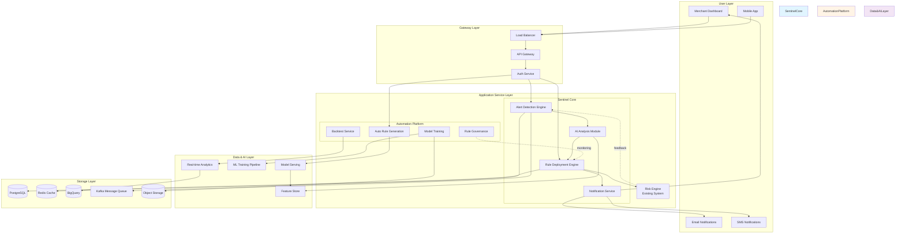

---

## Core Components Relationship

### Component Interaction & Dependencies

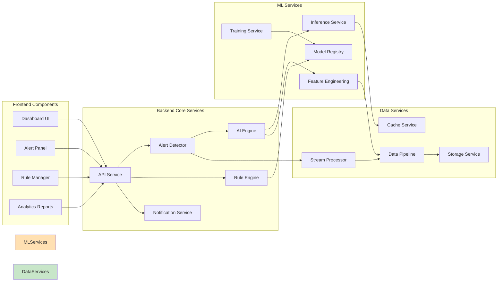

---

## Real-time Fraud Detection Flow

### End-to-End Detection Flow

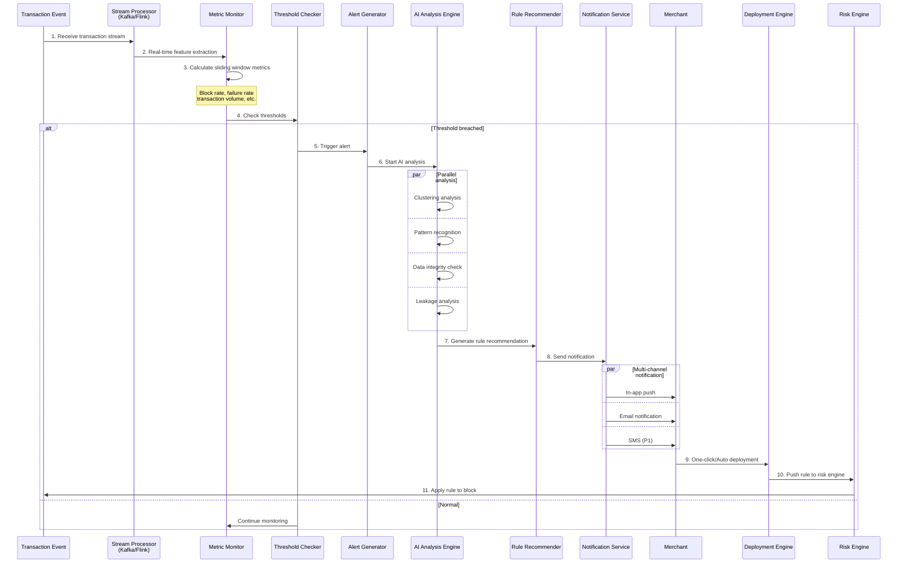

---

## AI Analysis Processing Flow

### AI Analysis Module Detailed Flow

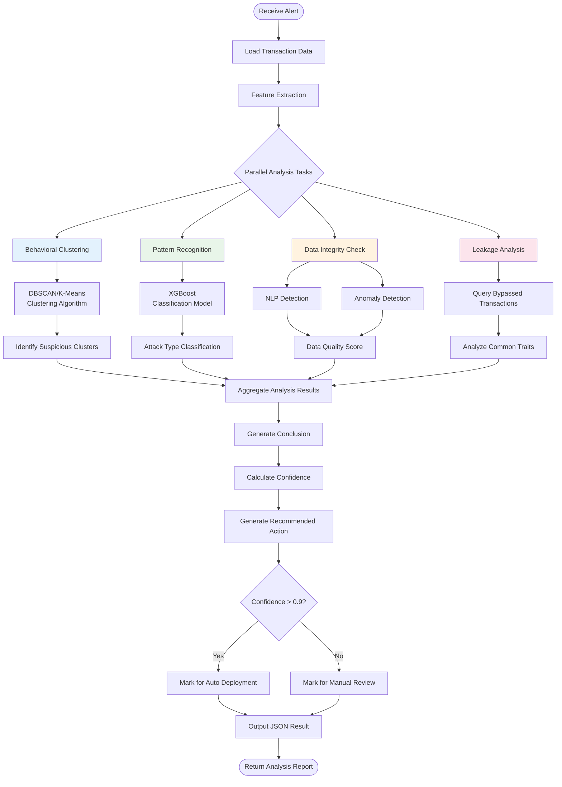

---

## Rule Deployment Flow

### One-Click & Auto Deployment Flow

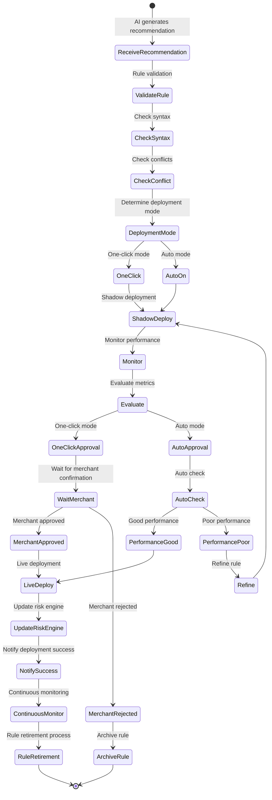

---

## Automation Platform Workflow

### Auto Rule Generation Flow

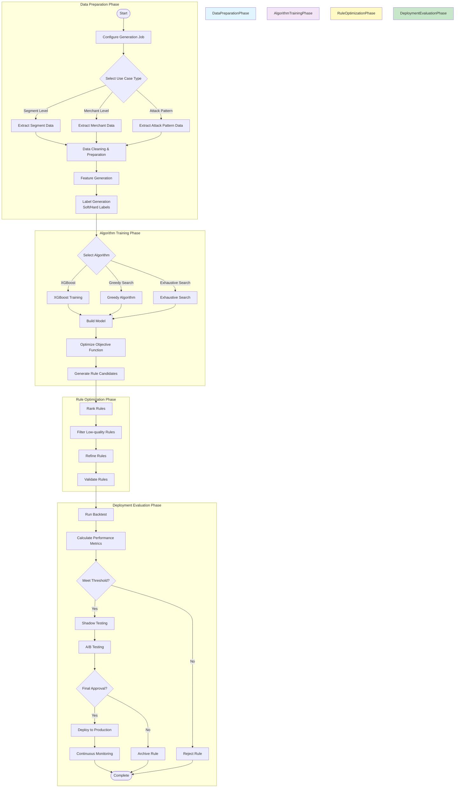

### Model Training Pipeline

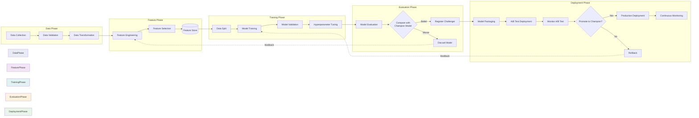

---

## Data Processing Pipeline

### Real-time Data Flow Architecture

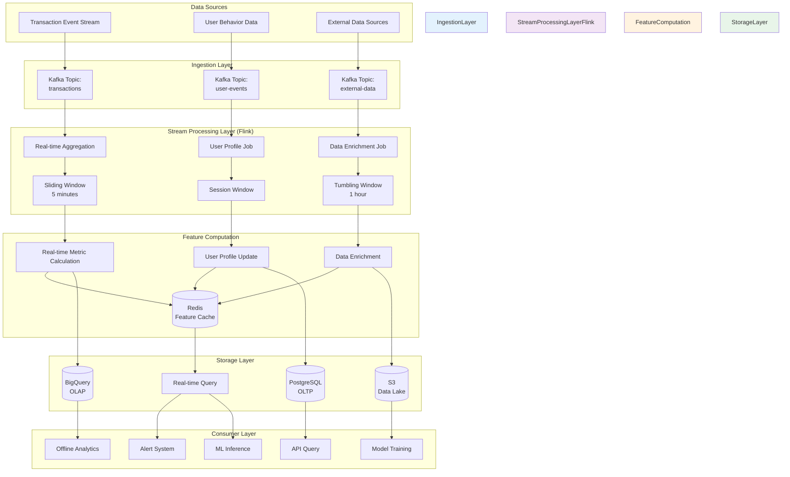

### Batch Processing Data Flow

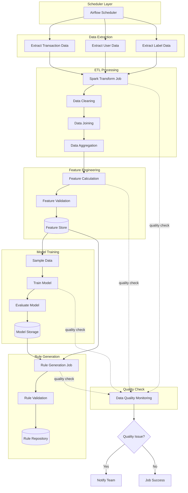

---

## Deployment Architecture

### Kubernetes Deployment Topology

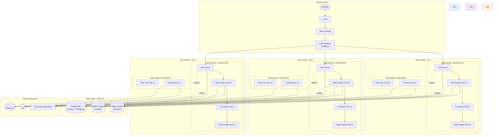

### Service Mesh Architecture

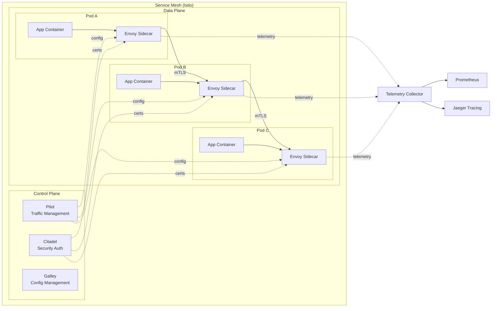

---

## User Interaction Flow

### Merchant Journey Using Sentinel

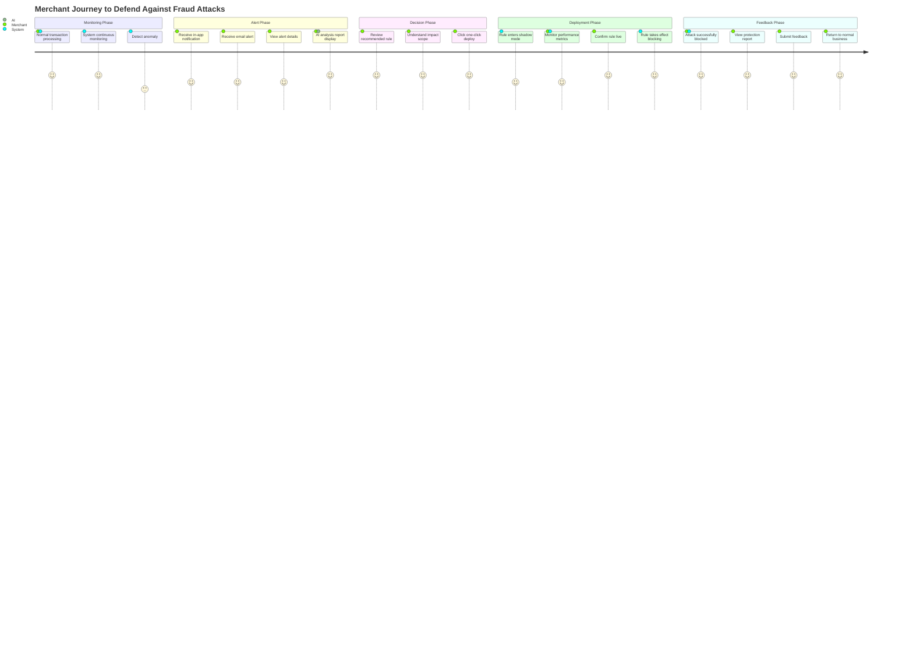

### User Operation Sequence Diagram

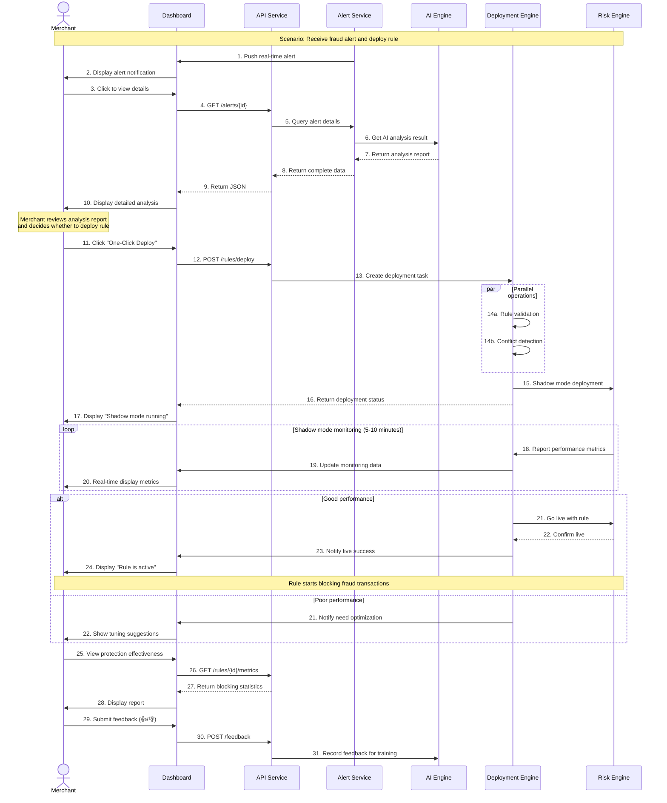

---

## Rule Lifecycle Management

### Complete Lifecycle from Creation to Retirement

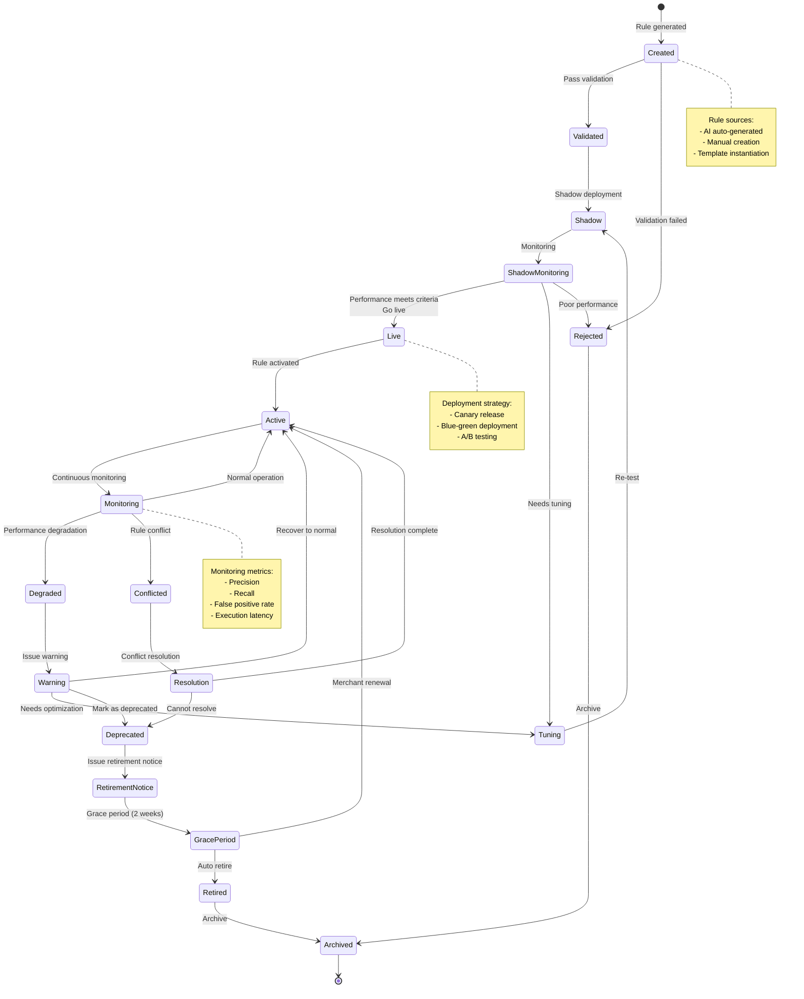

---

## Security Architecture

### Multi-layer Security Protection

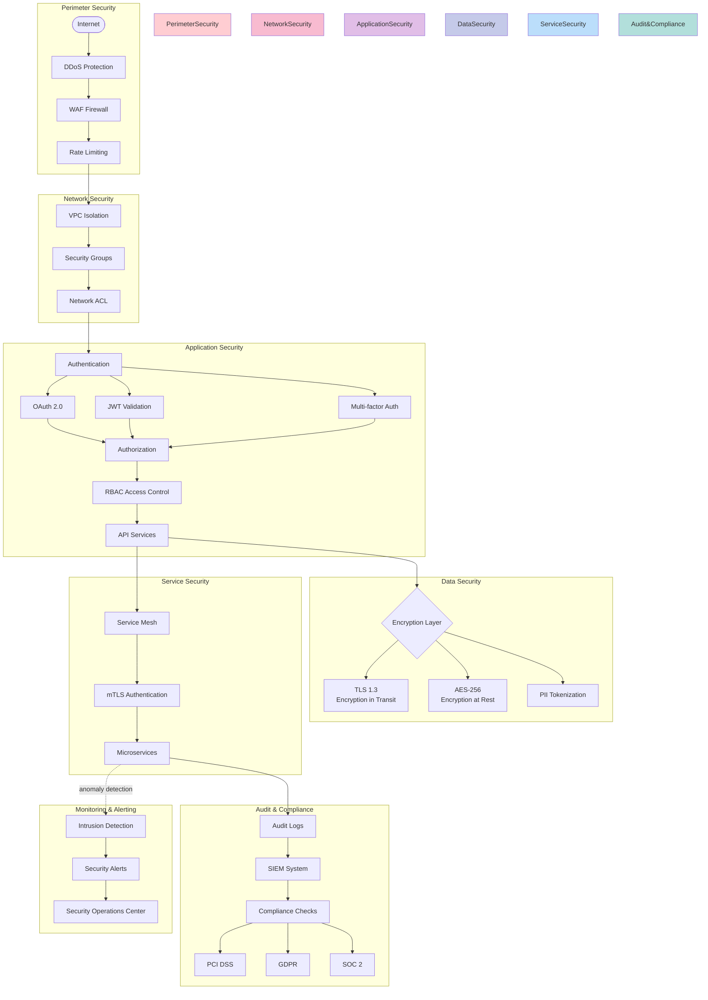

---

## Monitoring & Alerting System

### Observability Architecture

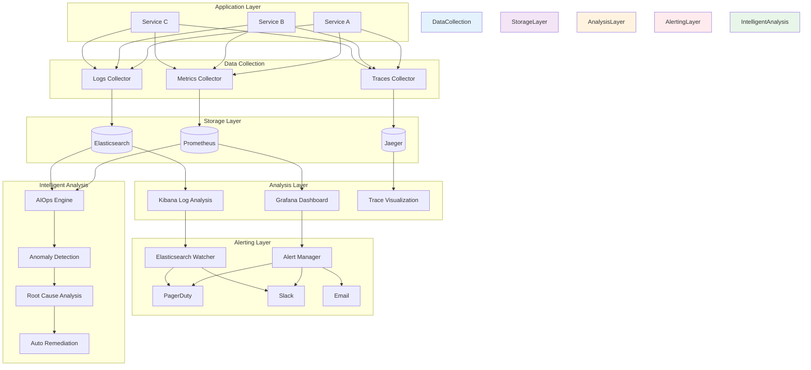

### Key Metrics Dashboard

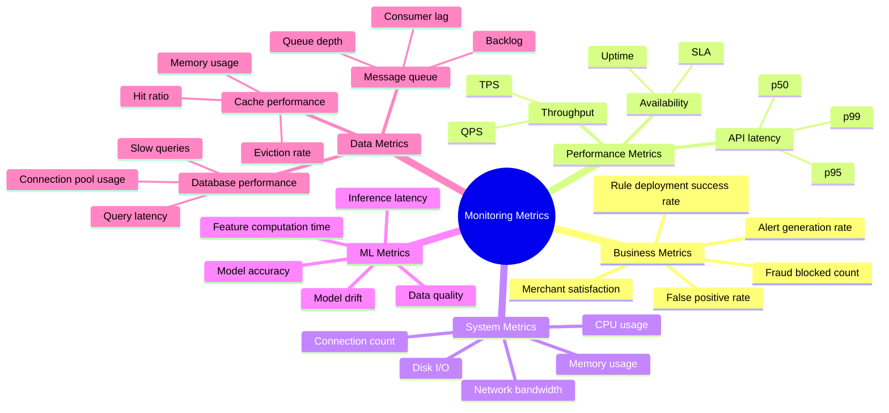

---

## Disaster Recovery & High Availability

### Failover Process

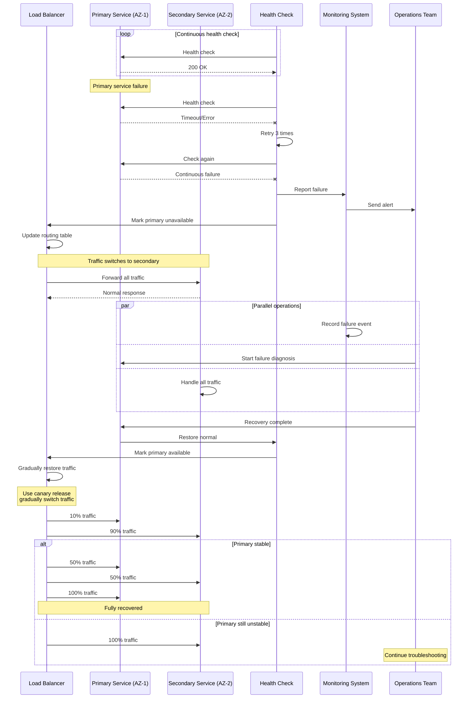

---

## Cost Optimization Strategy

### Resource Usage Optimization

```mermaid
graph TD
    subgraph "Compute Resource Optimization"
        AutoScale[Auto Scaling]
        SpotInstance[Spot Instances]
        RightSize[Instance Rightsizing]

        AutoScale --> HPA[HPA Horizontal Scaling]
        AutoScale --> VPA[VPA Vertical Scaling]
        AutoScale --> CronScale[Scheduled Scaling]
    end

    subgraph "Storage Optimization"
        DataLifecycle[Data Lifecycle]
        Compression[Data Compression]
        Dedup[Data Deduplication]

        DataLifecycle --> HotData[Hot Data: SSD]
        DataLifecycle --> WarmData[Warm Data: HDD]
        DataLifecycle --> ColdData[Cold Data: Archive]
    end

    subgraph "Network Optimization"
        CDN[CDN Acceleration]
        Caching[Smart Caching]
        DataTransfer[Data Transfer Optimization]
    end

    subgraph "ML Training Optimization"
        SpotTraining[Spot Instance Training]
        Quantization[Model Quantization]
        Pruning[Model Pruning]
        DistilledModel[Model Distillation]
    end

    subgraph "Monitoring & Optimization"
        CostMonitor[Cost Monitoring]
        CostAlert[Cost Alerts]
        CostReport[Cost Reports]

        CostMonitor --> Analyze[Cost Analysis]
        Analyze --> Optimize[Optimization Recommendations]
    end

    HPA & VPA & CronScale --> Analyze
    HotData & WarmData & ColdData --> Analyze
    SpotInstance --> Analyze
    SpotTraining --> Analyze

    Optimize --> Actions[Execute Optimization]

    style ComputeResourceOptimization fill:#e3f2fd
    style StorageOptimization fill:#f3e5f5
    style NetworkOptimization fill:#fff3e0
    style MLTrainingOptimization fill:#e8f5e9
    style Monitoring&Optimization fill:#fce4ec
```

---

## Summary

This document provides complete architecture and process visualization for the Airwallex Sentinel project, including:

- ✅ **System Architecture**: High-level architecture and component relationships
- ✅ **Business Flows**: Real-time detection, AI analysis, rule deployment
- ✅ **Technical Flows**: Data processing, model training, automation platform
- ✅ **Deployment Architecture**: Kubernetes, multi-AZ, service mesh
- ✅ **User Experience**: Merchant journey and interaction flows
- ✅ **Security & Compliance**: Multi-layer security protection system
- ✅ **Operations**: Monitoring, disaster recovery, cost optimization

These diagrams help the team better understand the system design, facilitate cross-team collaboration, and serve as reference documentation for development and operations.

---

**Document Maintenance:** Please update relevant diagrams when architecture changes
**Viewing Recommendation:** Use a Markdown reader that supports Mermaid to view this document
