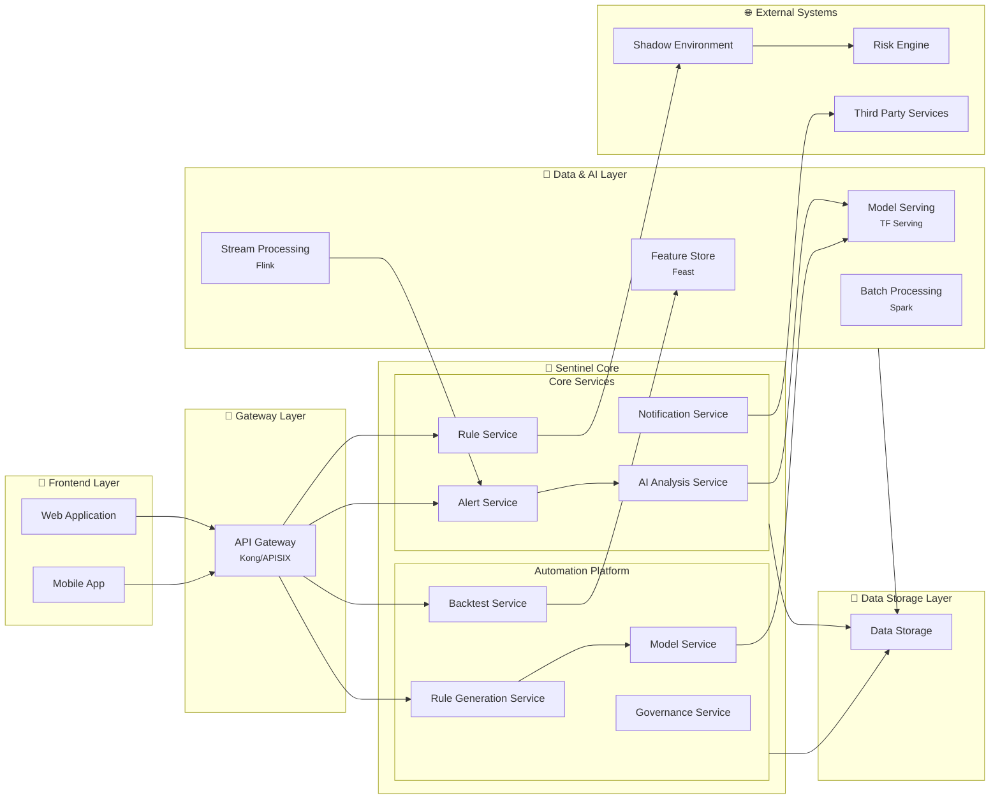

# Sentinel 系统架构设计白板

## 系统架构图



## 架构说明

### 📐 分层架构

#### 1️⃣ 前端层
- **Web 应用**：商户仪表板，提供完整的桌面端体验
- **移动端应用**：移动端界面，方便商户随时随地管理

#### 2️⃣ 核心业务模块

**⚠️ 警报检测模块**
- **指标监控器**：实时计算交易指标，使用滑动窗口进行统计分析
- **阈值检查器**：动态调整阈值，多维度检查异常
- **警报生成器**：分类警报优先级，收集相关数据并持久化

**🤖 AI 分析模块**
- **特征提取器**：提取实时和历史特征，进行归一化处理
- **模型推理引擎**：运行多种ML模型（分类、聚类、异常检测）
- **规则推荐器**：自动生成规则，计算置信度，评估影响范围

**🔧 规则部署模块**
- **规则验证器**：检查语法，检测冲突，预估影响
- **影子部署器**：Shadow模式部署，切分流量，监控性能
- **上线管理器**：灰度发布，自动上线，自动回滚

**📢 通知模块**
- 多渠道推送（邮件/短信/应用内）
- 消息模板引擎
- 发送状态追踪和去重

#### 3️⃣ 自动化平台

**🔬 规则生成模块**
- 数据准备 → 算法选择 → 规则训练 → 规则优化
- 支持多种算法：XGBoost、Greedy Search、Clustering

**🧠 模型训练模块**
- 特征工程 → 模型训练 → 模型评估 → 模型注册
- 包含超参数调优、交叉验证、A/B测试、版本管理

**🧪 测试与治理模块**
- **回测引擎**：使用历史数据验证规则效果
- **治理引擎**：监控规则性能，自动退役失效规则，管理冲突

#### 4️⃣ 数据处理层

- **实时流处理引擎（Flink）**：处理实时交易流，窗口聚合
- **批处理引擎（Spark）**：大规模数据处理，特征计算
- **特征存储（Feast）**：统一的特征管理平台

### 🔄 核心数据流

1. **警报检测流程**：
   ```
   交易流 → 实时流处理 → 指标监控 → 阈值检查 → 警报生成 → AI分析
   ```

2. **AI分析流程**：
   ```
   警报数据 → 特征提取 → 模型推理 → 规则推荐 → 通知商户
   ```

3. **规则部署流程**：
   ```
   推荐规则 → 规则验证 → 影子部署 → 性能监控 → 自动上线
   ```

4. **规则生成流程**：
   ```
   历史数据 → 数据准备 → 算法选择 → 规则训练 → 回测验证
   ```

5. **模型训练流程**：
   ```
   批处理数据 → 特征工程 → 模型训练 → 模型评估 → 模型注册 → 推理引擎
   ```

### ✨ 设计亮点

1. **模块高内聚低耦合**：每个模块职责清晰，通过标准接口交互
2. **AI驱动的自动化**：从检测、分析、规则生成到部署全流程自动化
3. **闭环优化**：治理引擎监控规则效果，反馈到规则优化器，形成持续改进
4. **双模式部署**：影子模式验证 + 灰度发布，确保规则质量
5. **实时+离线结合**：实时流处理快速响应，批处理深度分析

---

**创建时间**：2025-11-18
**用途**：系统架构设计讨论和迭代
