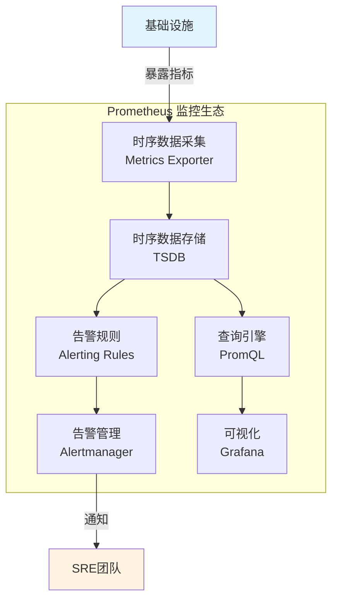
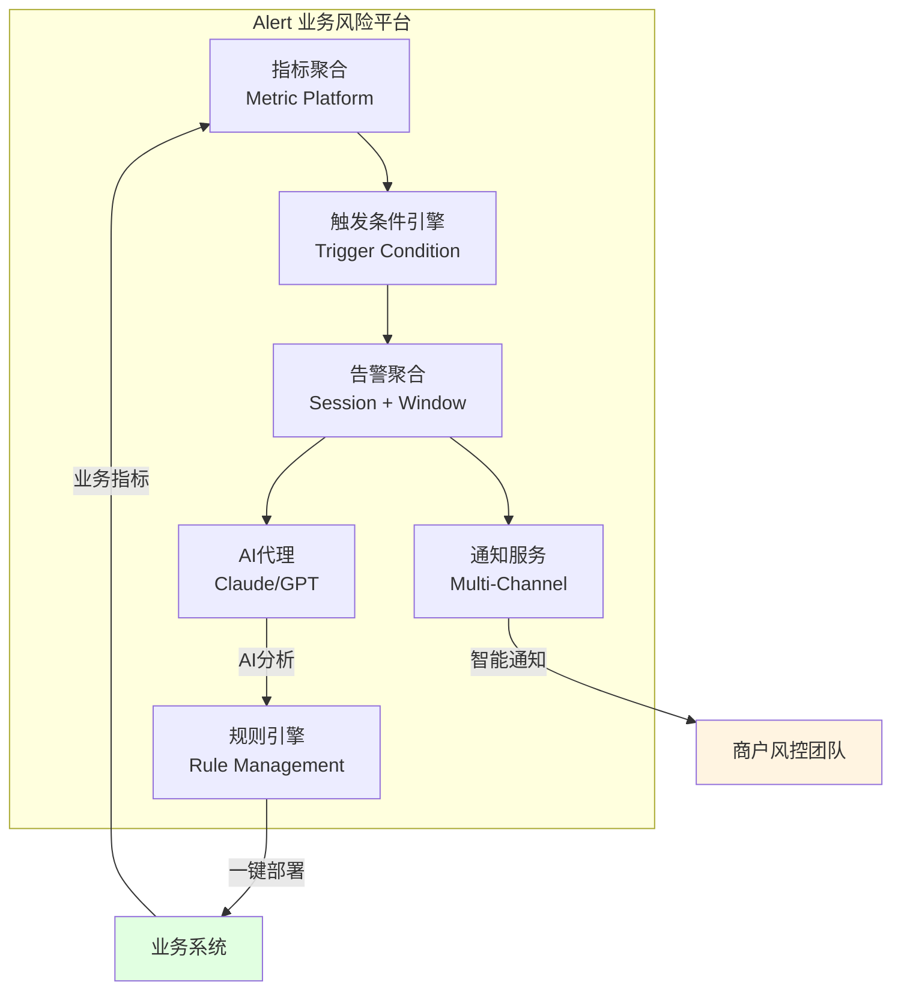
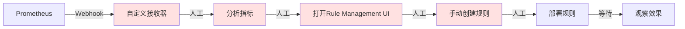
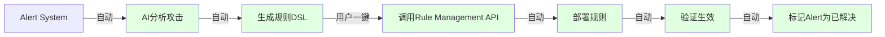
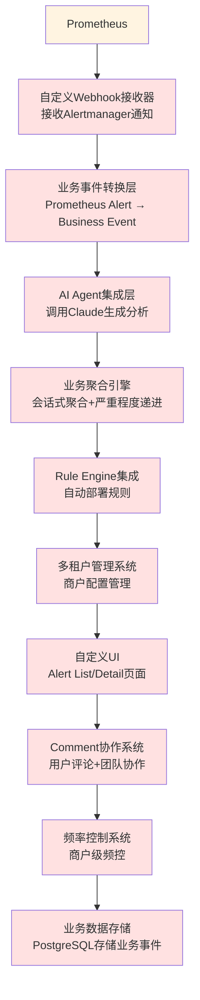
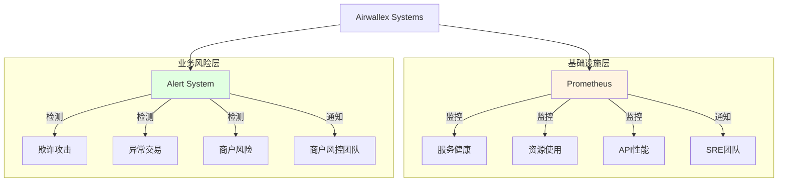
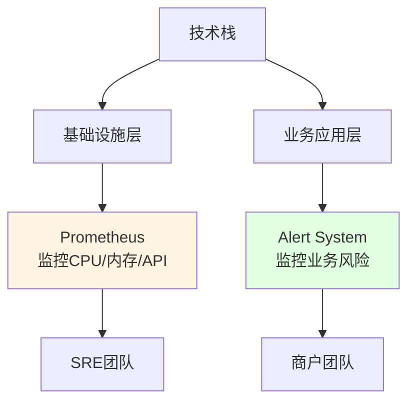

# Prometheus vs Airwallex Alert 系统技术对比分析

**文档目的**: 分析 Prometheus 监控系统与 Airwallex 自研 Alert 系统的技术差异，说明为什么自研方案更适合业务风险告警场景

**作者**: Boyi Wang
**日期**: 2025-11-26
**版本**: 1.0

---

## 1. 执行摘要

### 1.1 核心结论

Airwallex Alert 系统与 Prometheus 解决的是**两个不同层次的问题**：

- **Prometheus**: 通用基础设施监控告警工具（Infrastructure Layer）
- **Alert System**: 业务风险智能分析与响应平台（Business Layer）

**关键差异**:
- Prometheus: "CPU使用率超过80%" → 技术告警
- Alert System: "检测到卡测试攻击，建议部署规则XYZ" → 业务风险 + AI分析 + 自动化响应

### 1.2 推荐决策

**保留两个系统**，各司其职：
- ✅ **Prometheus**: 继续用于基础设施监控（服务健康、资源使用率、API性能等）
- ✅ **Alert System**: 专注于业务风险告警（欺诈攻击、异常交易、商户风险等）

---

## 2. 系统定位对比

### 2.1 Prometheus 系统定位



**核心特点**:
- 🎯 **目标用户**: SRE、DevOps团队
- 🎯 **监控对象**: 服务器、容器、中间件、API
- 🎯 **告警类型**: 技术指标超阈值
- 🎯 **使用场景**: 系统健康监控、容量规划、性能优化

### 2.2 Airwallex Alert 系统定位



**核心特点**:
- 🎯 **目标用户**: 商户风控团队、运营团队
- 🎯 **监控对象**: 业务交易、欺诈攻击、风险事件
- 🎯 **告警类型**: 业务风险 + AI分析 + 应对建议
- 🎯 **使用场景**: 欺诈检测、攻击防御、风险预警

---

## 3. 详细对比分析

### 3.1 告警内容对比

#### 场景：检测到卡测试攻击（block_rate从5%上升至45%）

**Prometheus 告警消息**:
```yaml
Alert: high_block_rate
Severity: warning
Labels:
  merchant_id: "merchant_123"
  alert_type: "threshold_exceeded"
Annotations:
  summary: "Block rate is too high"
  description: "block_rate (0.45) has exceeded threshold (0.30) for 10 minutes"
```

**用户收到的通知**:
```
⚠️ Alert: high_block_rate
Severity: warning
Block rate (0.45) > threshold (0.30)
Duration: 10 minutes
Merchant: merchant_123
```

**问题**:
- ❌ 用户不知道这意味着什么
- ❌ 没有业务上下文
- ❌ 需要人工分析指标
- ❌ 需要人工决策如何应对

---

**Airwallex Alert 系统消息**:

**用户收到的通知** (Slack):
```
🚨 疑似卡测试攻击检测 | P2 | 2025-11-26 10:30

📊 攻击分析:
我们检测到过去10分钟内来自多个IP地址的失败授权尝试显著激增。
拦截率从5%上升至45%（+800%），失败授权率达67%，表明可能存在
自动化的卡测试攻击。

攻击者正在尝试验证大量被盗卡号的有效性。

📈 关键指标:
• 总交易数: 1000
• 拦截交易: 450 (45%)
• 失败授权: 670 (67%)
• 时间窗口: 10分钟
• 触发次数: 1次

💡 建议操作:
部署推荐规则以拦截来自可疑IP范围的交易，并为新卡启用额外验证。

[一键部署规则] [查看详情] [添加备注] [忽略]
```

**优势**:
- ✅ AI自动分析攻击类型（卡测试）
- ✅ 提供业务上下文（失败授权率、攻击模式）
- ✅ 给出可操作建议
- ✅ 支持一键部署规则
- ✅ 人类可读的语言

---

### 3.2 告警聚合对比

#### 场景：一次卡测试攻击持续1小时，每5分钟触发一次告警

**Prometheus 行为**:
```
10:00 - Alert #1: block_rate > 0.3
10:05 - Alert #2: block_rate > 0.3  (重复)
10:10 - Alert #3: block_rate > 0.3  (重复)
10:15 - Alert #4: block_rate > 0.3  (重复)
...
10:55 - Alert #12: block_rate > 0.3 (重复)

结果: 12个独立告警，告警风暴
```

**用户体验**:
- ❌ 收到12条重复通知
- ❌ 不知道是1次攻击还是12次攻击
- ❌ 需要人工判断是否是同一事件

---

**Alert 系统行为**:
```
10:00 - Alert #001 创建 (P3, occurrence_count=1)
      ↓ 会话激活: session_status=ACTIVE
10:05 - Alert #001 更新 (P3, occurrence_count=2)
      ↓ 会话延续: 间隔<15分钟
10:10 - Alert #001 更新 (P2, occurrence_count=10) ← 自动升级
      ↓ 严重程度递进规则触发
10:15 - Alert #001 更新 (P2, occurrence_count=11)
...
10:55 - Alert #001 更新 (P1, occurrence_count=12)
      ↓ 持续1小时，升级至P1

结果: 1个Alert，自动聚合和升级
```

**用户体验**:
- ✅ 只收到1条初始通知 + 1条严重程度升级通知
- ✅ 清楚知道是同一次攻击
- ✅ 自动识别攻击加剧并升级优先级
- ✅ Alert Detail页面显示完整攻击历史

**聚合策略对比**:

| 维度 | Prometheus | Alert System |
|------|-----------|--------------|
| **聚合逻辑** | 简单去重（固定时间窗口） | 会话式聚合 + 滑动窗口 |
| **会话识别** | ❌ 不支持 | ✅ 15分钟超时自动识别 |
| **严重程度递进** | ❌ 不支持 | ✅ 根据次数和持续时间自动升级 |
| **攻击历史** | ❌ 每次触发是独立事件 | ✅ Comment记录每次触发的详情 |
| **通知频率** | 每次触发都通知（除非手动静默） | 智能通知策略（首次 + 升级） |

---

### 3.3 AI能力对比

**Prometheus**:
```
No AI capabilities
❌ 无AI集成
❌ 告警内容完全依赖手写模板
❌ 需要人工分析指标含义
```

**Alert System**:
```kotlin
// AI Agent 集成
class AIAgentService {
    fun generateAlertSummary(
        metrics: Map<String, Double>,
        merchantContext: MerchantContext,
        historicalAlerts: List<Alert>
    ): AlertContent {

        val prompt = buildPrompt(
            merchantName = merchantContext.name,
            metricsData = formatMetrics(metrics),
            historicalContext = formatHistory(historicalAlerts)
        )

        val response = claudeClient.call(prompt)

        return AlertContent(
            title = response.title,
            summary = response.summary,  // AI生成的攻击分析
            severity = response.severity,
            suggestedAction = response.suggestedAction  // AI建议的应对措施
        )
    }
}
```

**AI能力优势**:

| 能力 | 示例 |
|------|------|
| **攻击模式识别** | "这是一次自动化的卡测试攻击" |
| **趋势分析** | "拦截率从5%上升至45%（+800%）" |
| **风险评估** | "攻击者正在尝试验证大量被盗卡号的有效性" |
| **应对建议** | "建议部署规则以拦截来自可疑IP范围的交易" |
| **商户个性化** | 基于商户历史数据提供定制化分析 |

---

### 3.4 与业务系统集成对比

#### Prometheus集成能力



**问题**:
- ❌ 无法自动调用业务系统
- ❌ 需要大量人工操作
- ❌ 响应时间慢（人工参与）
- ❌ 无法形成闭环

---

#### Alert System集成能力



**优势**:
- ✅ 与Rule Management Service深度集成
- ✅ 一键部署规则（而非人工操作）
- ✅ 自动验证规则生效
- ✅ 完整的闭环：检测 → 分析 → 部署 → 验证

**集成示例**:

```kotlin
// Alert System 自动部署规则
class AlertActionService {
    fun deployRecommendedRule(alertId: UUID, userId: String) {
        val alert = alertRepository.findById(alertId)
        val ruleDSL = alert.suggestedAction.ruleDSL  // AI生成的规则

        // 调用 Rule Management Service
        val ruleId = ruleManagementClient.createRule(
            RuleCreateRequest(
                tenant = alert.context.tenant,
                namespace = alert.context.domain,
                type = "DSL",
                value = ruleDSL,
                status = "ACTIVE"
            )
        )

        // 记录操作历史
        alertCommentRepository.save(
            AlertComment(
                alertId = alertId,
                type = "RULE_DEPLOYED",
                content = "Rule $ruleId deployed by $userId",
                createdBy = userId
            )
        )

        // 自动标记为已解决
        alert.status = AlertStatus.RESOLVED
        alert.resolvedAt = Instant.now()
        alertRepository.save(alert)

        // 发送通知
        notificationService.send(
            "Rule deployed successfully for Alert #${alert.id}"
        )
    }
}
```

---

### 3.5 多租户与定制化对比

#### Prometheus 多租户能力

**配置示例** (prometheus.yml):
```yaml
# 全局配置，难以按商户定制
global:
  evaluation_interval: 15s

rule_files:
  - "alerts/*.yml"

# 所有商户共享相同的告警规则
groups:
  - name: high_block_rate
    rules:
      - alert: BlockRateHigh
        expr: block_rate > 0.3
        for: 10m
        annotations:
          summary: "Block rate is too high"
```

**问题**:
- ❌ 全局配置，无法按商户定制阈值
- ❌ 商户无法自助配置
- ❌ 需要修改配置文件并重启服务
- ❌ 无法支持商户级别的通知渠道配置

---

#### Alert System 多租户能力

**数据模型**:
```kotlin
data class AlertConfig(
    val accountId: UUID,           // 商户ID
    val alertType: String,         // 告警类型
    val enabled: Boolean,          // 是否启用

    // 自定义触发条件
    val triggerConditions: List<TriggerCondition> = listOf(
        TriggerCondition(
            metricName = "block_rate",
            operator = ">",
            threshold = 0.35,  // 商户A自定义为0.35
            timeWindow = "10min"
        )
    ),

    // 自定义通知渠道
    val channelPreferences: ChannelPreferences = ChannelPreferences(
        slack = SlackConfig(
            enabled = true,
            webhookUrl = "https://hooks.slack.com/services/merchant_a_webhook"
        ),
        sms = SmsConfig(
            enabled = true,
            phoneNumbers = listOf("+1234567890")
        ),
        webapp = WebappConfig(enabled = true)
    ),

    // 自定义频率控制
    val frequencyControl: FrequencyControl = FrequencyControl(
        maxAlertsPerHour = 3,      // 商户A限制每小时3次
        maxAlertsPerDay = 15,
        minIntervalMinutes = 20
    )
)
```

**商户自助配置 UI**:
```
┌─────────────────────────────────────────────────────┐
│ Alert Configuration - Merchant A                    │
├─────────────────────────────────────────────────────┤
│                                                      │
│ Alert Type: Card Testing                            │
│ Status: ✅ Enabled                                   │
│                                                      │
│ Trigger Conditions:                                  │
│ ┌─────────────────────────────────────────────────┐ │
│ │ block_rate > [0.35] within [10] minutes         │ │
│ │ AND                                              │ │
│ │ failed_auth_rate > [0.50] within [10] minutes   │ │
│ └─────────────────────────────────────────────────┘ │
│                                                      │
│ Notification Channels:                               │
│ ☑ Slack: https://hooks.slack.com/...               │
│ ☑ SMS: +1234567890                                  │
│ ☑ Webapp                                            │
│                                                      │
│ Frequency Control:                                   │
│ Max alerts per hour: [3]                            │
│ Min interval: [20] minutes                          │
│                                                      │
│            [Save Configuration]                      │
└─────────────────────────────────────────────────────┘
```

**优势对比**:

| 能力 | Prometheus | Alert System |
|------|-----------|--------------|
| **按商户定制阈值** | ❌ 全局配置 | ✅ 商户级配置 |
| **自助配置** | ❌ 需要技术团队修改文件 | ✅ Portal自助配置 |
| **通知渠道定制** | ❌ 全局Alertmanager配置 | ✅ 商户自定义Slack、SMS |
| **频率控制** | ❌ 全局静默规则 | ✅ 商户级频率策略 |
| **配置生效时间** | ❌ 需重启服务 | ✅ 实时生效 |

---

### 3.6 数据存储与查询对比

#### Prometheus 数据模型

```
时序数据点 (Time Series):
metric_name{label1="value1", label2="value2"} value timestamp

示例:
block_rate{merchant_id="merchant_123", region="AP"} 0.45 1700000000
```

**查询示例** (PromQL):
```promql
# 查询过去1小时的平均block_rate
avg_over_time(block_rate{merchant_id="merchant_123"}[1h])

# 查询block_rate > 0.3的时间点
block_rate{merchant_id="merchant_123"} > 0.3
```

**局限性**:
- ❌ 只存储数值型时序数据
- ❌ 无法存储业务事件上下文
- ❌ 无法查询"过去7天的P1卡测试攻击"
- ❌ 无法关联用户操作历史

---

#### Alert System 数据模型

```kotlin
// 完整的业务事件模型
data class Alert(
    val id: UUID,
    val accountId: UUID,
    val alertType: String,              // "CARD_TESTING"
    val currentSeverity: String,        // "P1"
    val title: String,                  // AI生成的标题
    val summary: String,                // AI生成的摘要
    val suggestedAction: SuggestedAction,  // AI建议的操作

    // 聚合信息
    val occurrenceCount: Int,           // 触发次数
    val sessionStatus: String,          // 会话状态
    val firstTriggeredAt: Instant,
    val lastTriggeredAt: Instant,

    // 指标数据
    val metricsData: Map<String, Double>,  // 触发时的指标快照

    // 关联数据
    val comments: List<AlertComment>,   // 用户评论
    val notifications: List<Notification>,  // 通知历史
    val actionsTaken: List<Action>      // 操作历史（部署的规则等）
)
```

**查询示例** (SQL):
```sql
-- 查询过去7天的P1卡测试攻击
SELECT * FROM alerts
WHERE alert_type = 'CARD_TESTING'
  AND current_severity = 'P1'
  AND created_at > NOW() - INTERVAL '7 days'
ORDER BY created_at DESC;

-- 查询特定商户的攻击趋势
SELECT
    DATE(created_at) as date,
    alert_type,
    COUNT(*) as alert_count,
    AVG(occurrence_count) as avg_occurrences
FROM alerts
WHERE account_id = 'merchant_123'
  AND created_at > NOW() - INTERVAL '30 days'
GROUP BY DATE(created_at), alert_type;

-- 查询已部署规则的告警
SELECT a.*, ac.content as rule_deployed
FROM alerts a
JOIN alert_comments ac ON a.id = ac.alert_id
WHERE ac.comment_type = 'RULE_DEPLOYED'
  AND a.status = 'RESOLVED';
```

**优势**:
- ✅ 存储完整的业务上下文
- ✅ 支持复杂的业务查询
- ✅ 关联用户操作历史
- ✅ 支持趋势分析和报表

---

### 3.7 扩展成本对比

#### 如果用Prometheus实现Alert系统的需求

**需要开发的自定义组件**:



**开发成本估算**:

| 组件 | 开发时间 | 维护成本/年 |
|------|---------|------------|
| Webhook接收器 | 1周 | 5人天 |
| 业务事件转换层 | 2周 | 10人天 |
| AI Agent集成 | 2周 | 8人天 |
| 业务聚合引擎 | 3周 | 15人天 |
| Rule Engine集成 | 2周 | 10人天 |
| 多租户管理 | 3周 | 20人天 |
| 自定义UI | 4周 | 15人天 |
| Comment系统 | 2周 | 8人天 |
| 频率控制 | 2周 | 8人天 |
| 业务数据存储 | 1周 | 5人天 |
| **总计** | **22周** | **104人天/年** |

**结论**: 实际上是在Prometheus之上**重新开发了一个完整的Alert系统**，只是把Prometheus当作底层的时序数据库使用。

---

#### 自研Alert系统成本

**开发成本**:
- Phase 1 (MVP): 4周
- Phase 2 (频控+多渠道): 2周
- Phase 3 (优化+扩展): 2周
- **总计**: 8周

**维护成本**: ~20人天/年

**成本对比**:
- 使用Prometheus + 自定义组件: 22周开发 + 104人天/年维护
- 自研Alert系统: 8周开发 + 20人天/年维护
- **节省**: 14周开发时间 + 84人天/年维护成本

---

## 4. 典型场景对比

### 场景1: 卡测试攻击检测与响应

#### Prometheus方案

**步骤1**: 配置告警规则
```yaml
# prometheus_rules.yml
- alert: CardTestingDetected
  expr: block_rate > 0.3 AND failed_auth_rate > 0.5
  for: 10m
  annotations:
    summary: "Potential card testing attack"
```

**步骤2**: 用户收到通知
```
Alert: CardTestingDetected
block_rate: 0.45
failed_auth_rate: 0.67
```

**步骤3**: 人工分析
- 用户打开Grafana查看图表
- 分析指标是否真的是攻击
- 判断攻击类型

**步骤4**: 人工创建规则
- 打开Rule Management UI
- 手动创建拦截规则
- 填写规则条件

**步骤5**: 人工部署
- 点击部署按钮
- 等待生效

**总耗时**: 15-30分钟（人工参与）

---

#### Alert System方案

**步骤1**: 系统自动检测
```kotlin
// 自动触发条件评估
triggerConditionEngine.evaluate(metrics) // 满足条件
```

**步骤2**: AI自动分析
```
AI生成的分析：
"检测到自动化的卡测试攻击。攻击者正在尝试验证大量被盗卡号..."
```

**步骤3**: 用户收到智能通知
```
🚨 疑似卡测试攻击 | P2
AI分析 + 建议操作
[一键部署规则]
```

**步骤4**: 用户一键部署
```kotlin
// 用户点击"一键部署规则"
alertActionService.deployRecommendedRule(alertId, userId)
```

**步骤5**: 自动验证和关闭
```
✅ 规则部署成功
✅ Alert自动标记为已解决
```

**总耗时**: 1-2分钟（几乎无人工参与）

---

### 场景2: 多次重复攻击的处理

#### Prometheus方案

**问题**: 同一攻击触发12次告警

```
10:00 - Alert #1
10:05 - Alert #2 (重复)
10:10 - Alert #3 (重复)
...
10:55 - Alert #12 (重复)
```

**用户体验**:
- ❌ 收到12条通知（告警疲劳）
- ❌ 需要手动静默后续告警
- ❌ 不知道攻击是否加剧
- ❌ 每次都需要重新分析

---

#### Alert System方案

**处理**: 智能聚合和升级

```
10:00 - Alert #001 创建 (P3, count=1)
      → 用户收到通知: "检测到卡测试攻击"

10:05-10:45 - Alert #001 自动更新 (count=2-9)
      → 无通知（会话聚合）

10:50 - Alert #001 升级 (P3→P2, count=10)
      → 用户收到通知: "攻击加剧，严重程度升级至P2"

10:55 - Alert #001 持续 (P2, count=12)
```

**用户体验**:
- ✅ 只收到2条有意义的通知
- ✅ 自动识别攻击加剧
- ✅ Detail页面显示完整历史
- ✅ 无需手动操作

---

## 5. 总拥有成本分析 (TCO)

### 5.1 方案A: 使用Prometheus

**初始成本**:
- Prometheus部署: 1周
- 自定义组件开发: 22周
- **总计**: 23周

**年度运营成本**:
- Prometheus维护: 10人天/年
- 自定义组件维护: 104人天/年
- **总计**: 114人天/年

**3年TCO**:
- 初始: 23周
- 运营: 114 × 3 = 342人天
- **总成本**: 23周 + 342人天

---

### 5.2 方案B: 自研Alert系统

**初始成本**:
- Alert系统开发: 8周
- **总计**: 8周

**年度运营成本**:
- 系统维护: 20人天/年
- **总计**: 20人天/年

**3年TCO**:
- 初始: 8周
- 运营: 20 × 3 = 60人天
- **总成本**: 8周 + 60人天

---

### 5.3 成本对比

| 成本项 | 方案A (Prometheus) | 方案B (自研) | 节省 |
|-------|-------------------|-------------|------|
| **初始开发** | 23周 | 8周 | 15周 (65%) |
| **年度维护** | 114人天 | 20人天 | 94人天 (82%) |
| **3年总成本** | 23周 + 342人天 | 8周 + 60人天 | 15周 + 282人天 |

**结论**: 自研方案在初始开发和长期维护上都**显著节省成本**。

---

## 6. 技术决策建议

### 6.1 推荐方案: 双系统并存



**职责划分**:

| 系统 | 监控对象 | 告警类型 | 目标用户 | 典型场景 |
|------|---------|---------|---------|---------|
| **Prometheus** | 基础设施 | 技术指标 | SRE/DevOps | • CPU/内存使用率<br/>• API响应时间<br/>• 错误率 |
| **Alert System** | 业务风险 | 业务事件 | 商户/运营 | • 卡测试攻击<br/>• 速率攻击<br/>• 账户接管 |

---

### 6.2 不推荐方案: 用Prometheus替代Alert系统

**原因**:

1. **需求不匹配**: Prometheus解决的是"监控问题"，Alert系统解决的是"业务风险问题"
2. **开发成本高**: 需要在Prometheus之上开发完整的业务层（22周）
3. **维护成本高**: 年度维护成本是自研方案的5.7倍（114 vs 20人天）
4. **技术债务**: 大量自定义组件与Prometheus耦合，升级困难
5. **功能受限**: Prometheus的数据模型无法存储复杂的业务事件

---

### 6.3 实施建议

**阶段1: 保持现状** (立即)
- ✅ 继续使用Prometheus监控基础设施
- ✅ 继续开发Alert系统用于业务风险

**阶段2: 明确边界** (1个月内)
- 制定监控分层策略文档
- 定义Prometheus和Alert系统的职责边界
- 培训团队理解两个系统的差异

**阶段3: 优化集成** (3个月内)
- Alert系统可以消费Prometheus的基础指标（如API延迟）
- 但告警逻辑和AI分析仍由Alert系统处理
- 形成"Prometheus采集 → Alert分析"的协作模式

---

## 7. 常见问题 (FAQ)

### Q1: 为什么不能用Prometheus + Alertmanager实现相同功能？

**A**: 技术上可以，但需要开发完整的业务层：

```
Prometheus/Alertmanager能力:
✅ 时序数据存储
✅ 阈值告警
✅ 基础通知

缺失的Alert系统核心能力:
❌ AI分析（需要自己集成LLM）
❌ 会话式聚合（需要自己开发）
❌ 严重程度递进（需要自己实现）
❌ Rule Engine集成（需要自己开发）
❌ 多租户配置（需要自己管理）
❌ 业务UI（需要自己开发）
❌ Comment协作（需要自己实现）
```

**结论**: 实际上是用Prometheus做底层存储，之上重新开发了一个Alert系统。

---

### Q2: Prometheus能否集成AI生成告警摘要？

**A**: 技术上可以通过Webhook集成，但：

```yaml
# Prometheus Alertmanager配置
receivers:
  - name: 'ai-webhook'
    webhook_configs:
      - url: 'https://custom-ai-service/generate-summary'
```

**问题**:
1. 需要自己开发AI服务
2. Prometheus只传递指标值，缺少业务上下文
3. 生成的摘要无法存储在Prometheus中
4. 仍然需要自己开发UI展示AI分析结果

**结论**: 这已经变成了"自研AI告警系统 + Prometheus作为数据源"，而非"使用Prometheus"。

---

### Q3: 用Grafana + Alerting功能是否可行？

**A**: Grafana适合可视化和简单告警，但：

**Grafana能力**:
- ✅ 强大的可视化
- ✅ 基础告警规则
- ✅ 多数据源支持

**Alert系统独有能力**:
- ❌ Grafana无AI集成
- ❌ Grafana无会话式聚合
- ❌ Grafana无Rule Engine集成
- ❌ Grafana无商户自助配置
- ❌ Grafana无一键部署规则

**结论**: Grafana是数据可视化工具，不是业务风险告警平台。

---

### Q4: 两个系统是否有重复建设？

**A**: 否，两者解决不同层次的问题：



**类比**: 就像系统同时需要：
- **系统日志** (Log4j) - 记录技术错误
- **审计日志** (Audit) - 记录业务操作

两者都是"日志"，但服务于不同目的，不是重复建设。

---

### Q5: 能否将Alert系统的数据导入Prometheus？

**A**: 可以，但意义不大：

```python
# 可以暴露Alert指标给Prometheus
# /metrics endpoint
alert_total{type="CARD_TESTING", severity="P1"} 5
alert_occurrence_count{alert_id="123"} 12
```

**问题**:
1. Prometheus只能存储数值指标，无法存储AI摘要、用户评论等
2. 时序数据模型无法表达业务事件的关联关系
3. 查询复杂业务问题仍需要访问Alert系统

**建议**: 保持Alert系统独立的业务数据存储，按需暴露少量聚合指标给Prometheus用于监控Alert系统本身的健康状态。

---

## 8. 总结

### 8.1 核心观点

1. **Prometheus和Alert系统解决不同层次的问题**
   - Prometheus: Infrastructure Monitoring (基础设施监控)
   - Alert System: Business Risk Intelligence (业务风险智能)

2. **用Prometheus实现Alert功能成本更高**
   - 需要22周开发自定义组件
   - 年度维护成本是自研方案的5.7倍

3. **Alert系统的核心价值在于业务智能**
   - AI驱动的攻击分析
   - 自动化的规则部署
   - 商户级定制化
   - 完整的业务闭环

### 8.2 推荐决策

✅ **保留Prometheus**: 用于基础设施和技术指标监控
✅ **自研Alert系统**: 用于业务风险智能告警
✅ **明确边界**: 两个系统各司其职，协同工作

### 8.3 成功案例参考

类似的双系统架构在业界广泛采用：

| 公司 | 基础设施监控 | 业务告警系统 |
|------|-------------|------------|
| **Stripe** | Prometheus | 自研Radar (欺诈检测) |
| **Uber** | Prometheus/M3 | 自研Business Monitoring |
| **Netflix** | Atlas | 自研Alerts Platform |

**结论**: 大型互联网公司普遍采用**分层监控策略**，基础设施和业务告警使用不同的专用系统。

---

**文档版本历史**:
- v1.0 (2025-11-26): 初始版本
