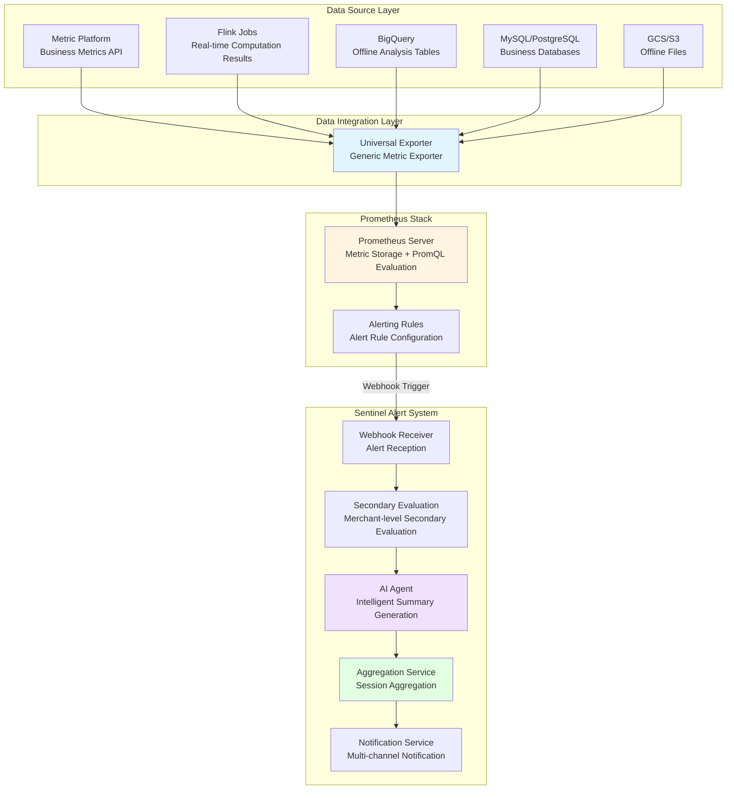
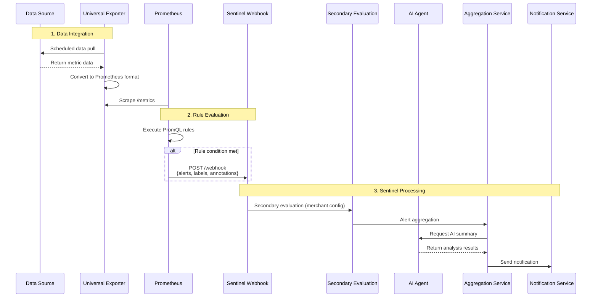

# Prometheus Integration Technical Research

**Document Purpose**: Research Prometheus as the data integration layer and trigger engine for Sentinel Alert System

**Author**: Boyi Wang
**Date**: November 26, 2025
**Version**: 2.0

---

## 1. Executive Summary

### 1.1 Decision Conclusion

Adopt **Prometheus as Trigger Engine**, responsible for data integration and alert triggering, working collaboratively with Sentinel Alert System.

**Architecture Positioning**:
- **Prometheus**: Data integration + Metric storage + PromQL rule evaluation + Alert triggering
- **Sentinel Alert System**: Secondary evaluation + AI analysis + Alert aggregation + Multi-channel notification + Rule deployment

### 1.2 Reasons for Choosing Prometheus

| Reason | Description |
|--------|-------------|
| **Multi-data source support** | Can integrate REST API, databases, files, message queues, and other data sources |
| **Powerful query capability** | PromQL supports complex conditional logic, time window aggregation, anomaly detection |
| **Mature and stable** | Widely used in industry, complete ecosystem |
| **Scalability** | Supports horizontal scaling, adapts to future data source growth |

---

## 2. Overall Architecture

### 2.1 System Architecture Diagram



### 2.2 Data Flow Sequence Diagram



---

## 3. Data Integration Solution

### 3.1 Core Concepts

Prometheus uses **Pull Mode**, actively pulling data rather than passively receiving pushes.

```
┌─────────────────────────────────────────────────────────────────────────┐
│                                                                          │
│   Prometheus actively accesses target's /metrics endpoint every N seconds│
│                                                                          │
│   Target must expose HTTP endpoint, returning Prometheus format data:    │
│                                                                          │
│   # HELP sentinel_block_rate Transaction block rate                      │
│   # TYPE sentinel_block_rate gauge                                       │
│   sentinel_block_rate{account_id="acc_123"} 0.45                        │
│                                                                          │
└─────────────────────────────────────────────────────────────────────────┘
```

### 3.2 Universal Exporter Design

Considering potential dozens to hundreds of data sources in the future, we design a **configuration-driven Universal Exporter** that manages all data sources through configuration files.

#### 3.2.1 Architecture Design

```
┌─────────────────────────────────────────────────────────────────────────┐
│                                                                          │
│                      Universal Metric Exporter                           │
│   ┌─────────────────────────────────────────────────────────────────┐   │
│   │                                                                  │   │
│   │   ┌─────────────────── Collector Factory ───────────────────┐   │   │
│   │   │                                                          │   │   │
│   │   │  ┌──────────┐ ┌──────────┐ ┌──────────┐ ┌──────────┐    │   │   │
│   │   │  │ REST API │ │ BigQuery │ │ Database │ │   GCS    │    │   │   │
│   │   │  │Collector │ │Collector │ │Collector │ │Collector │    │   │   │
│   │   │  └────┬─────┘ └────┬─────┘ └────┬─────┘ └────┬─────┘    │   │   │
│   │   │       │            │            │            │           │   │   │
│   │   └───────┼────────────┼────────────┼────────────┼───────────┘   │   │
│   │           │            │            │            │               │   │
│   │           ▼            ▼            ▼            ▼               │   │
│   │   ┌──────────────────────────────────────────────────────────┐  │   │
│   │   │              Prometheus Metrics Registry                  │  │   │
│   │   └──────────────────────────────────────────────────────────┘  │   │
│   │                              │                                   │   │
│   │                     GET /metrics (port 8000)                    │   │
│   └──────────────────────────────────────────────────────────────────┘   │
│                                  │                                       │
│                                  ▼                                       │
│                            Prometheus                                    │
│                                                                          │
└─────────────────────────────────────────────────────────────────────────┘
```

#### 3.2.2 Configuration File Design

```yaml
# exporter-config.yaml
exporter:
  port: 8000
  log_level: INFO

data_sources:
  # ============ REST API Type ============
  - name: metric_platform_fraud
    type: rest_api
    enabled: true
    endpoint: https://metric-platform.awx.im/api/v1/metrics/fraud
    auth:
      type: bearer_token
      token_env: METRIC_PLATFORM_TOKEN
    interval: 30s
    metrics:
      - source_field: block_rate
        prometheus_name: sentinel_block_rate
        type: gauge
        labels: [account_id, merchant_name, region]
      - source_field: failed_auth_rate
        prometheus_name: sentinel_failed_auth_rate
        type: gauge
        labels: [account_id, merchant_name]

  # ============ BigQuery Table ============
  - name: bigquery_daily_stats
    type: bigquery
    enabled: true
    project: risk-prod-xxx
    query: |
      SELECT
        account_id,
        merchant_name,
        block_rate,
        failed_auth_rate,
        total_transactions
      FROM `risk-prod.ads_pafraud.daily_merchant_stats`
      WHERE date = CURRENT_DATE()
    interval: 5m
    metrics:
      - source_field: block_rate
        prometheus_name: sentinel_daily_block_rate
        type: gauge
        labels: [account_id, merchant_name]

  # ============ MySQL/PostgreSQL Table ============
  - name: mysql_merchant_config
    type: database
    enabled: true
    connection:
      driver: mysql
      host_env: MYSQL_HOST
      port: 3306
      database: risk_db
      username_env: MYSQL_USER
      password_env: MYSQL_PASSWORD
    query: |
      SELECT
        account_id,
        alert_threshold,
        is_high_risk
      FROM merchant_risk_config
      WHERE updated_at > DATE_SUB(NOW(), INTERVAL 1 HOUR)
    interval: 5m
    metrics:
      - source_field: alert_threshold
        prometheus_name: sentinel_merchant_threshold
        type: gauge
        labels: [account_id]

  # ============ GCS/S3 Files ============
  - name: gcs_hourly_report
    type: gcs_file
    enabled: true
    bucket: awx-ml-platform-prod
    path_pattern: "metrics/hourly/{date}/report.json"
    format: json
    interval: 1h
    metrics:
      - source_field: hourly_block_rate
        prometheus_name: sentinel_hourly_block_rate
        type: gauge
        labels: [account_id, region]
```

#### 3.2.3 Supported Data Source Types

| Type | Use Case | Pull Method | Example |
|------|----------|-------------|---------|
| **rest_api** | Real-time API | Scheduled HTTP requests | Metric Platform |
| **bigquery** | Data warehouse/Offline analysis | Scheduled SQL query | Daily statistics table |
| **database** | Business database | Scheduled SQL query | MySQL config table |
| **gcs_file** | GCS offline files | Scheduled file read | Hourly reports |
| **s3_file** | S3 offline files | Scheduled file read | AWS data |
| **kafka** | Real-time streaming data | Continuous consumption | Real-time transaction metrics |

#### 3.2.4 Exporter Implementation Code

```python
# universal_exporter.py
import yaml
import time
import os
import requests
import threading
from prometheus_client import start_http_server, Gauge
from google.cloud import bigquery, storage
from typing import Dict, List, Any
from abc import ABC, abstractmethod

# ============ Collector Base Class ============
class BaseCollector(ABC):
    def __init__(self, config: dict):
        self.config = config
        self.name = config['name']

    @abstractmethod
    def collect(self) -> List[Dict[str, Any]]:
        pass

# ============ REST API Collector ============
class RestApiCollector(BaseCollector):
    def collect(self) -> List[Dict[str, Any]]:
        headers = self._build_headers()
        response = requests.get(
            self.config['endpoint'],
            headers=headers,
            timeout=30
        )
        return response.json().get('data', [])

    def _build_headers(self) -> dict:
        headers = {}
        auth = self.config.get('auth', {})
        if auth.get('type') == 'bearer_token':
            token = os.environ.get(auth['token_env'])
            headers['Authorization'] = f'Bearer {token}'
        return headers

# ============ BigQuery Collector ============
class BigQueryCollector(BaseCollector):
    def __init__(self, config: dict):
        super().__init__(config)
        self.client = bigquery.Client(project=config['project'])

    def collect(self) -> List[Dict[str, Any]]:
        query_job = self.client.query(self.config['query'])
        results = query_job.result()
        return [dict(row) for row in results]

# ============ Database Collector ============
class DatabaseCollector(BaseCollector):
    def collect(self) -> List[Dict[str, Any]]:
        import pymysql
        conn_config = self.config['connection']

        conn = pymysql.connect(
            host=os.environ.get(conn_config['host_env']),
            port=conn_config['port'],
            user=os.environ.get(conn_config['username_env']),
            password=os.environ.get(conn_config['password_env']),
            database=conn_config['database']
        )

        cursor = conn.cursor()
        cursor.execute(self.config['query'])
        columns = [desc[0] for desc in cursor.description]
        rows = cursor.fetchall()
        conn.close()

        return [dict(zip(columns, row)) for row in rows]

# ============ GCS Collector ============
class GcsCollector(BaseCollector):
    def __init__(self, config: dict):
        super().__init__(config)
        self.client = storage.Client()
        self.bucket = self.client.bucket(config['bucket'])

    def collect(self) -> List[Dict[str, Any]]:
        from datetime import datetime
        import json

        path = self.config['path_pattern'].format(
            date=datetime.now().strftime('%Y-%m-%d')
        )
        blob = self.bucket.blob(path)
        content = blob.download_as_text()
        return json.loads(content)

# ============ Collector Factory ============
class CollectorFactory:
    COLLECTORS = {
        'rest_api': RestApiCollector,
        'bigquery': BigQueryCollector,
        'database': DatabaseCollector,
        'gcs_file': GcsCollector,
    }

    @classmethod
    def create(cls, config: dict) -> BaseCollector:
        collector_type = config['type']
        return cls.COLLECTORS[collector_type](config)

# ============ Universal Exporter ============
class UniversalExporter:
    def __init__(self, config_path: str):
        with open(config_path, 'r') as f:
            self.config = yaml.safe_load(f)
        self.metrics: Dict[str, Gauge] = {}
        self._init_metrics()

    def _init_metrics(self):
        for source in self.config['data_sources']:
            if not source.get('enabled', True):
                continue
            for metric_config in source['metrics']:
                name = metric_config['prometheus_name']
                if name not in self.metrics:
                    self.metrics[name] = Gauge(
                        name,
                        f"Metric from {source['name']}",
                        metric_config.get('labels', [])
                    )

    def _update_metrics(self, source: dict):
        try:
            collector = CollectorFactory.create(source)
            data = collector.collect()

            for item in data:
                for metric_config in source['metrics']:
                    gauge = self.metrics[metric_config['prometheus_name']]
                    labels = {
                        label: str(item.get(label, ''))
                        for label in metric_config.get('labels', [])
                    }
                    value = item.get(metric_config['source_field'], 0)
                    gauge.labels(**labels).set(value)

            print(f"[{source['name']}] Updated {len(data)} records")
        except Exception as e:
            print(f"[{source['name']}] Error: {e}")

    def _run_source_loop(self, source: dict):
        interval = self._parse_interval(source.get('interval', '60s'))
        while True:
            self._update_metrics(source)
            time.sleep(interval)

    def _parse_interval(self, interval_str: str) -> int:
        if interval_str.endswith('s'):
            return int(interval_str[:-1])
        elif interval_str.endswith('m'):
            return int(interval_str[:-1]) * 60
        return 60

    def start(self):
        port = self.config['exporter']['port']
        start_http_server(port)
        print(f"Exporter started on :{port}/metrics")

        for source in self.config['data_sources']:
            if not source.get('enabled', True):
                continue
            thread = threading.Thread(
                target=self._run_source_loop,
                args=(source,),
                daemon=True
            )
            thread.start()
            print(f"Started collector: {source['name']}")

        while True:
            time.sleep(60)

if __name__ == '__main__':
    exporter = UniversalExporter('exporter-config.yaml')
    exporter.start()
```

---

## 4. Prometheus Alerting Rule Configuration

### 4.1 Rule File Structure

```yaml
# prometheus_rules/sentinel_alerts.yml
groups:
  - name: sentinel_fraud_alerts
    interval: 1m
    rules:
      # ========== Card Testing Attack Detection ==========
      - alert: CardTestingDetected
        expr: |
          sentinel_block_rate > 0.2
          AND sentinel_failed_auth_rate > 0.3
          AND sentinel_transaction_count > 100
        for: 5m
        labels:
          alert_type: CARD_TESTING
          severity: P3
        annotations:
          account_id: "{{ $labels.account_id }}"
          merchant_name: "{{ $labels.merchant_name }}"
          block_rate: "{{ printf \"%.2f\" $value }}"
          summary: "Potential card testing attack detected"

      - alert: CardTestingSevere
        expr: |
          sentinel_block_rate > 0.3
          AND sentinel_failed_auth_rate > 0.5
          AND sentinel_transaction_count > 200
        for: 5m
        labels:
          alert_type: CARD_TESTING
          severity: P2
        annotations:
          account_id: "{{ $labels.account_id }}"
          summary: "Severe card testing attack detected"

      - alert: CardTestingCritical
        expr: |
          sentinel_block_rate > 0.5
          AND sentinel_failed_auth_rate > 0.7
          AND sentinel_transaction_count > 500
        for: 3m
        labels:
          alert_type: CARD_TESTING
          severity: P1
        annotations:
          account_id: "{{ $labels.account_id }}"
          summary: "Critical card testing attack - immediate action required"

      # ========== Velocity Attack Detection ==========
      - alert: VelocityAttackDetected
        expr: |
          rate(sentinel_transaction_count[5m]) > 100
          AND sentinel_unique_card_count / sentinel_transaction_count < 0.1
        for: 3m
        labels:
          alert_type: VELOCITY_ATTACK
          severity: P2
        annotations:
          account_id: "{{ $labels.account_id }}"
          summary: "High velocity attack with low card diversity"

      # ========== Historical Baseline Anomaly Detection ==========
      - alert: BlockRateAnomaly
        expr: |
          (
            sentinel_block_rate
            - avg_over_time(sentinel_block_rate[7d])
          ) / stddev_over_time(sentinel_block_rate[7d]) > 3
        for: 10m
        labels:
          alert_type: ANOMALY_DETECTION
          severity: P3
        annotations:
          summary: "Block rate is 3+ standard deviations above 7-day average"

      # ========== Period-over-Period Change Detection ==========
      - alert: BlockRateSurge
        expr: |
          increase(sentinel_block_rate[1h])
          / (increase(sentinel_block_rate[1h] offset 1h) + 0.01) > 2
          AND sentinel_transaction_count > 100
        for: 15m
        labels:
          alert_type: BLOCK_SURGE
          severity: P3
        annotations:
          summary: "Block rate doubled compared to previous hour"
```

### 4.2 PromQL Capability Summary

| Capability | PromQL Example | Description |
|------------|----------------|-------------|
| **Simple threshold** | `block_rate > 0.3` | Basic conditional check |
| **Multi-condition combination** | `A > 0.3 AND B > 0.5` | Combine multiple metrics |
| **Time window aggregation** | `avg_over_time(metric[10m])` | 10-minute average |
| **Rate calculation** | `rate(counter[5m])` | Per-second change rate |
| **Period-over-period change** | `metric / metric offset 1h` | Compare with 1 hour ago |
| **Anomaly detection** | `(metric - avg) / stddev > 3` | Standard deviation detection |
| **Ratio calculation** | `a / b` | Ratio of two metrics |
| **TopK** | `topk(10, metric)` | Get top 10 |

---

## 5. Prometheus Configuration

### 5.1 prometheus.yml

```yaml
global:
  scrape_interval: 15s
  evaluation_interval: 1m

rule_files:
  - /etc/prometheus/rules/*.yml

scrape_configs:
  # Universal Exporter
  - job_name: 'sentinel-exporter'
    static_configs:
      - targets: ['universal-exporter:8000']
    scrape_interval: 1m

alerting:
  alertmanagers:
    - static_configs:
        - targets: ['alertmanager:9093']
```

### 5.2 alertmanager.yml

```yaml
global:
  resolve_timeout: 5m

route:
  receiver: 'sentinel-webhook'
  group_by: ['account_id', 'alert_type']
  group_wait: 30s
  group_interval: 5m
  repeat_interval: 1h

  routes:
    # P1 alerts sent immediately
    - match:
        severity: P1
      receiver: 'sentinel-webhook-urgent'
      group_wait: 0s
      group_interval: 1m

receivers:
  - name: 'sentinel-webhook'
    webhook_configs:
      - url: 'https://sentinel-api.awx.im/api/v1/alerts/prometheus/webhook'
        send_resolved: true

  - name: 'sentinel-webhook-urgent'
    webhook_configs:
      - url: 'https://sentinel-api.awx.im/api/v1/alerts/prometheus/webhook?priority=urgent'
        send_resolved: true

# High priority alerts suppress lower priority
inhibit_rules:
  - source_match:
      severity: 'P1'
    target_match:
      severity: 'P2'
    equal: ['account_id', 'alert_type']
```

---

## 6. Integration with Sentinel Alert System

### 6.1 Webhook Receiver

```kotlin
@RestController
@RequestMapping("/api/v1/alerts/prometheus")
class PrometheusWebhookController(
    private val alertService: AlertService,
    private val alertConfigRepository: AlertConfigRepository
) {
    @PostMapping("/webhook")
    fun receivePrometheusAlert(
        @RequestBody payload: AlertmanagerPayload,
        @RequestParam(required = false) priority: String?
    ): ResponseEntity<WebhookResponse> {

        val results = payload.alerts
            .filter { it.status == "firing" }
            .mapNotNull { alert -> processAlert(alert, priority) }

        return ResponseEntity.ok(WebhookResponse(
            received = payload.alerts.size,
            processed = results.size,
            alertIds = results.map { it.id.toString() }
        ))
    }

    private fun processAlert(prometheusAlert: AlertmanagerAlert, priority: String?): Alert? {
        val accountId = prometheusAlert.labels["account_id"] ?: return null
        val alertType = prometheusAlert.labels["alert_type"] ?: return null
        val metrics = extractMetrics(prometheusAlert.annotations)

        // Secondary evaluation: Check merchant-level config
        val merchantConfig = alertConfigRepository.findByAccountIdAndAlertType(
            UUID.fromString(accountId), alertType
        )

        if (merchantConfig != null && !shouldTrigger(metrics, merchantConfig)) {
            return null  // Merchant threshold not met, skip
        }

        // Create/Update Alert
        return alertService.createOrUpdateAlert(
            CreateAlertRequest(
                accountId = UUID.fromString(accountId),
                alertType = alertType,
                severity = if (priority == "urgent") "P1" else prometheusAlert.labels["severity"],
                metrics = metrics,
                metadata = AlertMetadata(source = "prometheus")
            )
        )
    }
}
```

### 6.2 Secondary Evaluation

Prometheus uses global rules and cannot customize thresholds per merchant. Merchant-level configuration is achieved through Sentinel's secondary evaluation:

```
Prometheus Rule: block_rate > 0.2  (Coarse filter, low threshold)
                        │
                        ▼
              Sentinel Secondary Evaluation
                        │
         ┌──────────────┼──────────────┐
         ▼              ▼              ▼
    Merchant A      Merchant B     Merchant C
  Threshold: 0.35  Threshold: 0.25 Threshold: 0.30
         │              │              │
    No Trigger ✗    Trigger ✓      Trigger ✓
```

---

## 7. Deployment Solution

### 7.1 K8s Deployment Configuration

```yaml
# prometheus-deployment.yaml
apiVersion: apps/v1
kind: Deployment
metadata:
  name: prometheus
  namespace: sentinel
spec:
  replicas: 1
  template:
    spec:
      containers:
        - name: prometheus
          image: prom/prometheus:v2.45.0
          args:
            - '--config.file=/etc/prometheus/prometheus.yml'
            - '--storage.tsdb.retention.time=15d'
          ports:
            - containerPort: 9090
          volumeMounts:
            - name: prometheus-config
              mountPath: /etc/prometheus
            - name: prometheus-rules
              mountPath: /etc/prometheus/rules
      volumes:
        - name: prometheus-config
          configMap:
            name: prometheus-config
        - name: prometheus-rules
          configMap:
            name: prometheus-rules
---
# exporter-deployment.yaml
apiVersion: apps/v1
kind: Deployment
metadata:
  name: universal-exporter
  namespace: sentinel
spec:
  replicas: 2
  template:
    spec:
      containers:
        - name: exporter
          image: sentinel/universal-exporter:latest
          ports:
            - containerPort: 8000
          volumeMounts:
            - name: exporter-config
              mountPath: /app/config
          env:
            - name: METRIC_PLATFORM_TOKEN
              valueFrom:
                secretKeyRef:
                  name: exporter-secrets
                  key: metric-platform-token
      volumes:
        - name: exporter-config
          configMap:
            name: exporter-config
```

### 7.2 Scalability Considerations

| Number of Data Sources | Solution |
|------------------------|----------|
| 1-10 | Single Exporter instance |
| 10-50 | Single Exporter + increased resources |
| 50-100+ | Multiple Exporter instances, grouped by business domain |

---

## 8. Operations Management

### 8.1 Adding New Data Sources

Just modify the configuration file, no code changes required:

```yaml
# Add to exporter-config.yaml
data_sources:
  # ... existing data sources ...

  # New data source
  - name: new_data_source
    type: rest_api
    enabled: true
    endpoint: https://new-service.awx.im/api/metrics
    interval: 60s
    metrics:
      - source_field: some_metric
        prometheus_name: sentinel_some_metric
        type: gauge
        labels: [account_id]
```

### 8.2 Monitoring Metrics

```yaml
# Monitor Exporter health
- name: exporter_scrape_success
  condition: up{job="sentinel-exporter"} == 0
  duration: 2m
  severity: critical

# Monitor data update latency
- name: exporter_data_stale
  condition: time() - sentinel_last_update_timestamp > 300
  duration: 5m
  severity: warning
```

---

## 9. Summary

### 9.1 Solution Advantages

| Advantage | Description |
|-----------|-------------|
| **Unified data integration** | One Exporter manages all data sources |
| **Configuration-driven** | Adding data sources only requires config changes, no code changes |
| **Powerful query capability** | PromQL supports complex conditional logic |
| **Mature and stable** | Complete Prometheus ecosystem |
| **Scalable** | Supports future data source growth |

### 9.2 Responsibility Division

| Component | Responsibility |
|-----------|----------------|
| **Universal Exporter** | Data collection, format conversion |
| **Prometheus** | Metric storage, rule evaluation, alert triggering |
| **Sentinel Alert System** | Secondary evaluation, AI analysis, alert aggregation, notification |

### 9.3 Next Steps

1. **Develop Universal Exporter** - Support REST API, BigQuery, Database types
2. **Configure Prometheus Rules** - Define card testing, velocity attack detection rules
3. **Implement Webhook Receiver** - Receive Prometheus alerts, integrate with Sentinel
4. **Deployment Testing** - Validate in Preprod environment

---

**Document Version History**:
- v1.0 (2025-11-26): Initial version - Prometheus vs Alert System comparison
- v2.0 (2025-11-26): Changed to Prometheus integration technical research document
