# Prometheus vs Airwallex Alert System Technical Comparison

**Document Purpose**: Analyze the technical differences between Prometheus monitoring system and Airwallex's self-developed Alert system, explaining why the self-developed solution is more suitable for business risk alerting scenarios

**Author**: Boyi Wang
**Date**: November 26, 2025
**Version**: 1.0

---

## 1. Executive Summary

### 1.1 Core Conclusion

Airwallex Alert System and Prometheus solve problems at **two different levels**:

- **Prometheus**: General-purpose infrastructure monitoring and alerting tool (Infrastructure Layer)
- **Alert System**: Business risk intelligence analysis and response platform (Business Layer)

**Key Differences**:
- Prometheus: "CPU usage exceeds 80%" → Technical alert
- Alert System: "Card testing attack detected, recommend deploying rule XYZ" → Business risk + AI analysis + automated response

### 1.2 Recommended Decision

**Keep both systems**, each serving its own purpose:
- ✅ **Prometheus**: Continue using for infrastructure monitoring (service health, resource utilization, API performance, etc.)
- ✅ **Alert System**: Focus on business risk alerting (fraud attacks, abnormal transactions, merchant risks, etc.)

---

## 2. System Positioning Comparison

### 2.1 Prometheus System Positioning


**Core Features**:
- 🎯 **Target Users**: SRE, DevOps teams
- 🎯 **Monitoring Objects**: Servers, containers, middleware, APIs
- 🎯 **Alert Types**: Technical metrics exceeding thresholds
- 🎯 **Use Cases**: System health monitoring, capacity planning, performance optimization

### 2.2 Airwallex Alert System Positioning


**Core Features**:
- 🎯 **Target Users**: Merchant risk control teams, operations teams
- 🎯 **Monitoring Objects**: Business transactions, fraud attacks, risk events
- 🎯 **Alert Types**: Business risks + AI analysis + recommended actions
- 🎯 **Use Cases**: Fraud detection, attack defense, risk early warning

---

## 3. Detailed Comparison Analysis

### 3.1 Alert Content Comparison

#### Scenario: Card testing attack detected (block_rate increased from 5% to 45%)

**Prometheus Alert Message**:
```yaml
Alert: high_block_rate
Severity: warning
Labels:
  merchant_id: "merchant_123"
  alert_type: "threshold_exceeded"
Annotations:
  summary: "Block rate is too high"
  description: "block_rate (0.45) has exceeded threshold (0.30) for 10 minutes"
```

**User Receives**:
```
⚠️ Alert: high_block_rate
Severity: warning
Block rate (0.45) > threshold (0.30)
Duration: 10 minutes
Merchant: merchant_123
```

**Problems**:
- ❌ User doesn't know what this means
- ❌ No business context
- ❌ Requires manual metric analysis
- ❌ Requires manual decision on how to respond

---

**Airwallex Alert System Message**:

**User Receives** (Slack):
```
🚨 Suspected Card Testing Attack Detected | P2 | 2025-11-26 10:30

📊 Attack Analysis:
We detected a significant spike in failed authorization attempts from
multiple IP addresses over the past 10 minutes. The block rate increased
from 5% to 45% (+800%), and failed authorization rate reached 67%,
indicating a potential automated card testing attack.

Attackers are attempting to validate a large number of stolen card numbers.

📈 Key Metrics:
• Total Transactions: 1000
• Blocked Transactions: 450 (45%)
• Failed Authorizations: 670 (67%)
• Time Window: 10 minutes
• Occurrence Count: 1

💡 Suggested Action:
Deploy the recommended rule to block transactions from suspicious IP ranges
and enable additional verification for new cards.

[One-Click Deploy Rule] [View Details] [Add Note] [Dismiss]
```

**Advantages**:
- ✅ AI automatically analyzes attack type (card testing)
- ✅ Provides business context (failed auth rate, attack patterns)
- ✅ Gives actionable recommendations
- ✅ Supports one-click rule deployment
- ✅ Human-readable language

---

### 3.2 Alert Aggregation Comparison

#### Scenario: A card testing attack lasts 1 hour, triggering alert every 5 minutes

**Prometheus Behavior**:
```
10:00 - Alert #1: block_rate > 0.3
10:05 - Alert #2: block_rate > 0.3  (duplicate)
10:10 - Alert #3: block_rate > 0.3  (duplicate)
10:15 - Alert #4: block_rate > 0.3  (duplicate)
...
10:55 - Alert #12: block_rate > 0.3 (duplicate)

Result: 12 independent alerts, alert storm
```

**User Experience**:
- ❌ Receives 12 duplicate notifications
- ❌ Doesn't know if it's 1 attack or 12 attacks
- ❌ Needs manual judgment if it's the same event

---

**Alert System Behavior**:
```
10:00 - Alert #001 Created (P3, occurrence_count=1)
      ↓ Session activated: session_status=ACTIVE
10:05 - Alert #001 Updated (P3, occurrence_count=2)
      ↓ Session continued: interval < 15 minutes
10:10 - Alert #001 Updated (P2, occurrence_count=10) ← Auto-escalated
      ↓ Severity escalation rule triggered
10:15 - Alert #001 Updated (P2, occurrence_count=11)
...
10:55 - Alert #001 Updated (P1, occurrence_count=12)
      ↓ Lasted 1 hour, escalated to P1

Result: 1 Alert, automatically aggregated and escalated
```

**User Experience**:
- ✅ Only receives 1 initial notification + 1 severity escalation notification
- ✅ Clearly knows it's the same attack
- ✅ Automatically identifies attack intensification and escalates priority
- ✅ Alert Detail page shows complete attack history

**Aggregation Strategy Comparison**:

| Dimension | Prometheus | Alert System |
|-----------|-----------|--------------|
| **Aggregation Logic** | Simple deduplication (fixed time window) | Session-based aggregation + sliding window |
| **Session Recognition** | ❌ Not supported | ✅ 15-minute timeout auto-recognition |
| **Severity Escalation** | ❌ Not supported | ✅ Auto-escalate based on count and duration |
| **Attack History** | ❌ Each trigger is independent event | ✅ Comments record details of each trigger |
| **Notification Frequency** | Notifies every trigger (unless manually silenced) | Smart notification strategy (initial + escalation) |

---

### 3.3 AI Capability Comparison

**Prometheus**:
```
No AI capabilities
❌ No AI integration
❌ Alert content completely depends on manually written templates
❌ Requires manual metric analysis
```

**Alert System**:
```kotlin
// AI Agent Integration
class AIAgentService {
    fun generateAlertSummary(
        metrics: Map<String, Double>,
        merchantContext: MerchantContext,
        historicalAlerts: List<Alert>
    ): AlertContent {

        val prompt = buildPrompt(
            merchantName = merchantContext.name,
            metricsData = formatMetrics(metrics),
            historicalContext = formatHistory(historicalAlerts)
        )

        val response = claudeClient.call(prompt)

        return AlertContent(
            title = response.title,
            summary = response.summary,  // AI-generated attack analysis
            severity = response.severity,
            suggestedAction = response.suggestedAction  // AI-recommended actions
        )
    }
}
```

**AI Capability Advantages**:

| Capability | Example |
|------------|---------|
| **Attack Pattern Recognition** | "This is an automated card testing attack" |
| **Trend Analysis** | "Block rate increased from 5% to 45% (+800%)" |
| **Risk Assessment** | "Attackers are attempting to validate large numbers of stolen cards" |
| **Action Recommendations** | "Recommend deploying rules to block transactions from suspicious IP ranges" |
| **Merchant Personalization** | Customized analysis based on merchant historical data |

---

### 3.4 Business System Integration Comparison

#### Prometheus Integration Capability


**Problems**:
- ❌ Cannot automatically call business systems
- ❌ Requires extensive manual operations
- ❌ Slow response time (manual involvement)
- ❌ Cannot form closed loop

---

#### Alert System Integration Capability


**Advantages**:
- ✅ Deep integration with Rule Management Service
- ✅ One-click rule deployment (instead of manual operations)
- ✅ Automatic rule effectiveness verification
- ✅ Complete closed loop: Detection → Analysis → Deployment → Verification

**Integration Example**:

```kotlin
// Alert System Auto-Deploy Rule
class AlertActionService {
    fun deployRecommendedRule(alertId: UUID, userId: String) {
        val alert = alertRepository.findById(alertId)
        val ruleDSL = alert.suggestedAction.ruleDSL  // AI-generated rule

        // Call Rule Management Service
        val ruleId = ruleManagementClient.createRule(
            RuleCreateRequest(
                tenant = alert.context.tenant,
                namespace = alert.context.domain,
                type = "DSL",
                value = ruleDSL,
                status = "ACTIVE"
            )
        )

        // Record action history
        alertCommentRepository.save(
            AlertComment(
                alertId = alertId,
                type = "RULE_DEPLOYED",
                content = "Rule $ruleId deployed by $userId",
                createdBy = userId
            )
        )

        // Auto-mark as resolved
        alert.status = AlertStatus.RESOLVED
        alert.resolvedAt = Instant.now()
        alertRepository.save(alert)

        // Send notification
        notificationService.send(
            "Rule deployed successfully for Alert #${alert.id}"
        )
    }
}
```

---

### 3.5 Multi-Tenancy and Customization Comparison

#### Prometheus Multi-Tenancy Capability

**Configuration Example** (prometheus.yml):
```yaml
# Global configuration, difficult to customize per merchant
global:
  evaluation_interval: 15s

rule_files:
  - "alerts/*.yml"

# All merchants share the same alerting rules
groups:
  - name: high_block_rate
    rules:
      - alert: BlockRateHigh
        expr: block_rate > 0.3
        for: 10m
        annotations:
          summary: "Block rate is too high"
```

**Problems**:
- ❌ Global configuration, cannot customize thresholds per merchant
- ❌ Merchants cannot self-configure
- ❌ Requires modifying configuration files and restarting service
- ❌ Cannot support merchant-level notification channel configuration

---

#### Alert System Multi-Tenancy Capability

**Data Model**:
```kotlin
data class AlertConfig(
    val accountId: UUID,           // Merchant ID
    val alertType: String,         // Alert type
    val enabled: Boolean,          // Enabled flag

    // Custom trigger conditions
    val triggerConditions: List<TriggerCondition> = listOf(
        TriggerCondition(
            metricName = "block_rate",
            operator = ">",
            threshold = 0.35,  // Merchant A customizes to 0.35
            timeWindow = "10min"
        )
    ),

    // Custom notification channels
    val channelPreferences: ChannelPreferences = ChannelPreferences(
        slack = SlackConfig(
            enabled = true,
            webhookUrl = "https://hooks.slack.com/services/merchant_a_webhook"
        ),
        sms = SmsConfig(
            enabled = true,
            phoneNumbers = listOf("+1234567890")
        ),
        webapp = WebappConfig(enabled = true)
    ),

    // Custom frequency control
    val frequencyControl: FrequencyControl = FrequencyControl(
        maxAlertsPerHour = 3,      // Merchant A limits to 3 per hour
        maxAlertsPerDay = 15,
        minIntervalMinutes = 20
    )
)
```

**Merchant Self-Service Configuration UI**:
```
┌─────────────────────────────────────────────────────┐
│ Alert Configuration - Merchant A                    │
├─────────────────────────────────────────────────────┤
│                                                      │
│ Alert Type: Card Testing                            │
│ Status: ✅ Enabled                                   │
│                                                      │
│ Trigger Conditions:                                  │
│ ┌─────────────────────────────────────────────────┐ │
│ │ block_rate > [0.35] within [10] minutes         │ │
│ │ AND                                              │ │
│ │ failed_auth_rate > [0.50] within [10] minutes   │ │
│ └─────────────────────────────────────────────────┘ │
│                                                      │
│ Notification Channels:                               │
│ ☑ Slack: https://hooks.slack.com/...               │
│ ☑ SMS: +1234567890                                  │
│ ☑ Webapp                                            │
│                                                      │
│ Frequency Control:                                   │
│ Max alerts per hour: [3]                            │
│ Min interval: [20] minutes                          │
│                                                      │
│            [Save Configuration]                      │
└─────────────────────────────────────────────────────┘
```

**Capability Comparison**:

| Capability | Prometheus | Alert System |
|------------|-----------|--------------|
| **Per-Merchant Custom Thresholds** | ❌ Global config | ✅ Merchant-level config |
| **Self-Service Configuration** | ❌ Requires tech team to modify files | ✅ Portal self-configuration |
| **Notification Channel Customization** | ❌ Global Alertmanager config | ✅ Merchant-custom Slack, SMS |
| **Frequency Control** | ❌ Global silencing rules | ✅ Merchant-level frequency policies |
| **Configuration Effective Time** | ❌ Requires service restart | ✅ Real-time effective |

---

### 3.6 Data Storage and Query Comparison

#### Prometheus Data Model

```
Time Series Data Points:
metric_name{label1="value1", label2="value2"} value timestamp

Example:
block_rate{merchant_id="merchant_123", region="AP"} 0.45 1700000000
```

**Query Example** (PromQL):
```promql
# Query average block_rate over past 1 hour
avg_over_time(block_rate{merchant_id="merchant_123"}[1h])

# Query time points where block_rate > 0.3
block_rate{merchant_id="merchant_123"} > 0.3
```

**Limitations**:
- ❌ Only stores numeric time series data
- ❌ Cannot store business event context
- ❌ Cannot query "P1 card testing attacks in past 7 days"
- ❌ Cannot correlate user operation history

---

#### Alert System Data Model

```kotlin
// Complete business event model
data class Alert(
    val id: UUID,
    val accountId: UUID,
    val alertType: String,              // "CARD_TESTING"
    val currentSeverity: String,        // "P1"
    val title: String,                  // AI-generated title
    val summary: String,                // AI-generated summary
    val suggestedAction: SuggestedAction,  // AI-recommended actions

    // Aggregation info
    val occurrenceCount: Int,           // Trigger count
    val sessionStatus: String,          // Session status
    val firstTriggeredAt: Instant,
    val lastTriggeredAt: Instant,

    // Metrics data
    val metricsData: Map<String, Double>,  // Metric snapshot at trigger time

    // Associated data
    val comments: List<AlertComment>,   // User comments
    val notifications: List<Notification>,  // Notification history
    val actionsTaken: List<Action>      // Actions taken (deployed rules, etc.)
)
```

**Query Example** (SQL):
```sql
-- Query P1 card testing attacks in past 7 days
SELECT * FROM alerts
WHERE alert_type = 'CARD_TESTING'
  AND current_severity = 'P1'
  AND created_at > NOW() - INTERVAL '7 days'
ORDER BY created_at DESC;

-- Query attack trends for specific merchant
SELECT
    DATE(created_at) as date,
    alert_type,
    COUNT(*) as alert_count,
    AVG(occurrence_count) as avg_occurrences
FROM alerts
WHERE account_id = 'merchant_123'
  AND created_at > NOW() - INTERVAL '30 days'
GROUP BY DATE(created_at), alert_type;

-- Query alerts with deployed rules
SELECT a.*, ac.content as rule_deployed
FROM alerts a
JOIN alert_comments ac ON a.id = ac.alert_id
WHERE ac.comment_type = 'RULE_DEPLOYED'
  AND a.status = 'RESOLVED';
```

**Advantages**:
- ✅ Stores complete business context
- ✅ Supports complex business queries
- ✅ Correlates user operation history
- ✅ Supports trend analysis and reporting

---

### 3.7 Extension Cost Comparison

#### If Using Prometheus to Implement Alert System Requirements

**Custom Components Needed**:

```mermaid
graph TB
    P[Prometheus]

    P --> C1[Custom Webhook Receiver<br/>Receive Alertmanager notifications]
    C1 --> C2[Business Event Conversion Layer<br/>Prometheus Alert → Business Event]
    C2 --> C3[AI Agent Integration Layer<br/>Call Claude for analysis]
    C3 --> C4[Business Aggregation Engine<br/>Session-based aggregation + severity escalation]
    C4 --> C5[Rule Engine Integration<br/>Auto-deploy rules]
    C5 --> C6[Multi-Tenancy Management System<br/>Merchant config management]
    C6 --> C7[Custom UI<br/>Alert List/Detail pages]
    C7 --> C8[Comment Collaboration System<br/>User comments + team collaboration]
    C8 --> C9[Frequency Control System<br/>Merchant-level freq control]
    C9 --> C10[Business Data Storage<br/>PostgreSQL for business events]

    style P fill:#fff4e1
    style C1 fill:#ffe1e1
    style C2 fill:#ffe1e1
    style C3 fill:#ffe1e1
    style C4 fill:#ffe1e1
    style C5 fill:#ffe1e1
    style C6 fill:#ffe1e1
    style C7 fill:#ffe1e1
    style C8 fill:#ffe1e1
    style C9 fill:#ffe1e1
    style C10 fill:#ffe1e1
```



**Development Cost Estimation**:

| Component | Development Time | Maintenance Cost/Year |
|-----------|------------------|----------------------|
| Webhook Receiver | 1 week | 5 person-days |
| Business Event Conversion | 2 weeks | 10 person-days |
| AI Agent Integration | 2 weeks | 8 person-days |
| Business Aggregation Engine | 3 weeks | 15 person-days |
| Rule Engine Integration | 2 weeks | 10 person-days |
| Multi-Tenancy Management | 3 weeks | 20 person-days |
| Custom UI | 4 weeks | 15 person-days |
| Comment System | 2 weeks | 8 person-days |
| Frequency Control | 2 weeks | 8 person-days |
| Business Data Storage | 1 week | 5 person-days |
| **Total** | **22 weeks** | **104 person-days/year** |

**Conclusion**: Essentially **redeveloping a complete Alert system** on top of Prometheus, just using Prometheus as the underlying time series database.

---

#### Self-Developed Alert System Cost

**Development Cost**:
- Phase 1 (MVP): 4 weeks
- Phase 2 (Freq Control + Multi-Channel): 2 weeks
- Phase 3 (Optimization + Extension): 2 weeks
- **Total**: 8 weeks

**Maintenance Cost**: ~20 person-days/year

**Cost Comparison**:
- Using Prometheus + custom components: 22 weeks development + 104 person-days/year maintenance
- Self-developed Alert system: 8 weeks development + 20 person-days/year maintenance
- **Savings**: 14 weeks development time + 84 person-days/year maintenance cost

---

## 4. Typical Scenario Comparison

### Scenario 1: Card Testing Attack Detection and Response

#### Prometheus Approach

**Step 1**: Configure alert rule
```yaml
# prometheus_rules.yml
- alert: CardTestingDetected
  expr: block_rate > 0.3 AND failed_auth_rate > 0.5
  for: 10m
  annotations:
    summary: "Potential card testing attack"
```

**Step 2**: User receives notification
```
Alert: CardTestingDetected
block_rate: 0.45
failed_auth_rate: 0.67
```

**Step 3**: Manual analysis
- User opens Grafana to view charts
- Analyzes whether metrics really indicate an attack
- Determines attack type

**Step 4**: Manual rule creation
- Opens Rule Management UI
- Manually creates blocking rule
- Fills in rule conditions

**Step 5**: Manual deployment
- Clicks deploy button
- Waits for it to take effect

**Total Time**: 15-30 minutes (manual involvement)

---

#### Alert System Approach

**Step 1**: System auto-detects
```kotlin
// Auto trigger condition evaluation
triggerConditionEngine.evaluate(metrics) // Conditions met
```

**Step 2**: AI auto-analyzes
```
AI-generated analysis:
"Detected automated card testing attack. Attackers are attempting to validate large numbers of stolen cards..."
```

**Step 3**: User receives smart notification
```
🚨 Suspected Card Testing Attack | P2
AI Analysis + Recommended Actions
[One-Click Deploy Rule]
```

**Step 4**: User one-click deployment
```kotlin
// User clicks "One-Click Deploy Rule"
alertActionService.deployRecommendedRule(alertId, userId)
```

**Step 5**: Auto-verify and close
```
✅ Rule deployed successfully
✅ Alert auto-marked as resolved
```

**Total Time**: 1-2 minutes (almost no manual involvement)

---

### Scenario 2: Handling Multiple Repeated Attacks

#### Prometheus Approach

**Problem**: Same attack triggers 12 alerts

```
10:00 - Alert #1
10:05 - Alert #2 (duplicate)
10:10 - Alert #3 (duplicate)
...
10:55 - Alert #12 (duplicate)
```

**User Experience**:
- ❌ Receives 12 notifications (alert fatigue)
- ❌ Needs to manually silence subsequent alerts
- ❌ Doesn't know if attack is intensifying
- ❌ Needs to re-analyze each time

---

#### Alert System Approach

**Handling**: Smart aggregation and escalation

```
10:00 - Alert #001 Created (P3, count=1)
      → User receives notification: "Card testing attack detected"

10:05-10:45 - Alert #001 Auto-updated (count=2-9)
      → No notification (session aggregation)

10:50 - Alert #001 Escalated (P3→P2, count=10)
      → User receives notification: "Attack intensified, severity escalated to P2"

10:55 - Alert #001 Continued (P2, count=12)
```

**User Experience**:
- ✅ Only receives 2 meaningful notifications
- ✅ Auto-identifies attack intensification
- ✅ Detail page shows complete history
- ✅ No manual operations needed

---

## 5. Total Cost of Ownership Analysis (TCO)

### 5.1 Option A: Using Prometheus

**Initial Cost**:
- Prometheus deployment: 1 week
- Custom component development: 22 weeks
- **Total**: 23 weeks

**Annual Operating Cost**:
- Prometheus maintenance: 10 person-days/year
- Custom component maintenance: 104 person-days/year
- **Total**: 114 person-days/year

**3-Year TCO**:
- Initial: 23 weeks
- Operating: 114 × 3 = 342 person-days
- **Total Cost**: 23 weeks + 342 person-days

---

### 5.2 Option B: Self-Developed Alert System

**Initial Cost**:
- Alert system development: 8 weeks
- **Total**: 8 weeks

**Annual Operating Cost**:
- System maintenance: 20 person-days/year
- **Total**: 20 person-days/year

**3-Year TCO**:
- Initial: 8 weeks
- Operating: 20 × 3 = 60 person-days
- **Total Cost**: 8 weeks + 60 person-days

---

### 5.3 Cost Comparison

| Cost Item | Option A (Prometheus) | Option B (Self-Developed) | Savings |
|-----------|----------------------|--------------------------|---------|
| **Initial Development** | 23 weeks | 8 weeks | 15 weeks (65%) |
| **Annual Maintenance** | 114 person-days | 20 person-days | 94 person-days (82%) |
| **3-Year Total Cost** | 23 weeks + 342 person-days | 8 weeks + 60 person-days | 15 weeks + 282 person-days |

**Conclusion**: Self-developed approach **significantly saves costs** in both initial development and long-term maintenance.

---

## 6. Technical Decision Recommendations

### 6.1 Recommended Approach: Dual System Coexistence


**Responsibility Division**:

| System | Monitoring Objects | Alert Types | Target Users | Typical Scenarios |
|--------|-------------------|-------------|--------------|-------------------|
| **Prometheus** | Infrastructure | Technical Metrics | SRE/DevOps | • CPU/Memory usage<br/>• API response time<br/>• Error rate |
| **Alert System** | Business Risks | Business Events | Merchants/Operations | • Card testing attacks<br/>• Velocity attacks<br/>• Account takeover |

---

### 6.2 Not Recommended: Using Prometheus to Replace Alert System

**Reasons**:

1. **Requirements Mismatch**: Prometheus solves "monitoring problems", Alert system solves "business risk problems"
2. **High Development Cost**: Requires 22 weeks to develop complete business layer on top of Prometheus
3. **High Maintenance Cost**: Annual maintenance cost is 5.7 times that of self-developed approach (114 vs 20 person-days)
4. **Technical Debt**: Large number of custom components coupled with Prometheus, difficult to upgrade
5. **Limited Functionality**: Prometheus data model cannot store complex business events

---

### 6.3 Implementation Recommendations

**Phase 1: Maintain Status Quo** (Immediate)
- ✅ Continue using Prometheus for infrastructure monitoring
- ✅ Continue developing Alert system for business risks

**Phase 2: Clarify Boundaries** (Within 1 month)
- Develop monitoring layering strategy document
- Define responsibility boundaries between Prometheus and Alert system
- Train team to understand differences between the two systems

**Phase 3: Optimize Integration** (Within 3 months)
- Alert system can consume basic metrics from Prometheus (such as API latency)
- But alert logic and AI analysis still handled by Alert system
- Form "Prometheus collection → Alert analysis" collaboration model

---

## 7. Frequently Asked Questions (FAQ)

### Q1: Why can't we use Prometheus + Alertmanager to achieve the same functionality?

**A**: Technically possible, but requires developing complete business layer:

```
Prometheus/Alertmanager capabilities:
✅ Time series data storage
✅ Threshold alerting
✅ Basic notifications

Missing Alert system core capabilities:
❌ AI analysis (need to integrate LLM yourself)
❌ Session-based aggregation (need to develop yourself)
❌ Severity escalation (need to implement yourself)
❌ Rule Engine integration (need to develop yourself)
❌ Multi-tenancy configuration (need to manage yourself)
❌ Business UI (need to develop yourself)
❌ Comment collaboration (need to implement yourself)
```

**Conclusion**: Essentially using Prometheus as underlying storage, redeveloping an Alert system on top.

---

### Q2: Can Prometheus integrate AI to generate alert summaries?

**A**: Technically possible through Webhook integration, but:

```yaml
# Prometheus Alertmanager config
receivers:
  - name: 'ai-webhook'
    webhook_configs:
      - url: 'https://custom-ai-service/generate-summary'
```

**Problems**:
1. Need to develop AI service yourself
2. Prometheus only passes metric values, lacks business context
3. Generated summaries cannot be stored in Prometheus
4. Still need to develop UI yourself to display AI analysis results

**Conclusion**: This has become "self-developed AI alert system + Prometheus as data source", not "using Prometheus".

---

### Q3: Is using Grafana + Alerting functionality feasible?

**A**: Grafana is suitable for visualization and simple alerting, but:

**Grafana Capabilities**:
- ✅ Powerful visualization
- ✅ Basic alerting rules
- ✅ Multi-datasource support

**Alert System Unique Capabilities**:
- ❌ Grafana has no AI integration
- ❌ Grafana has no session-based aggregation
- ❌ Grafana has no Rule Engine integration
- ❌ Grafana has no merchant self-service configuration
- ❌ Grafana has no one-click rule deployment

**Conclusion**: Grafana is a data visualization tool, not a business risk alerting platform.

---

### Q4: Are the two systems redundant?

**A**: No, they solve problems at different levels:


**Analogy**: Like the system simultaneously needs:
- **System Logs** (Log4j) - Record technical errors
- **Audit Logs** (Audit) - Record business operations

Both are "logs", but serve different purposes, not redundant.

---

### Q5: Can Alert system data be imported into Prometheus?

**A**: Yes, but limited value:

```python
# Can expose Alert metrics to Prometheus
# /metrics endpoint
alert_total{type="CARD_TESTING", severity="P1"} 5
alert_occurrence_count{alert_id="123"} 12
```

**Problems**:
1. Prometheus can only store numeric metrics, cannot store AI summaries, user comments, etc.
2. Time series data model cannot express relational correlations of business events
3. Querying complex business questions still requires accessing Alert system

**Recommendation**: Keep Alert system's independent business data storage, expose minimal aggregated metrics to Prometheus as needed for monitoring Alert system's own health.

---

## 8. Summary

### 8.1 Core Points

1. **Prometheus and Alert System solve problems at different levels**
   - Prometheus: Infrastructure Monitoring
   - Alert System: Business Risk Intelligence

2. **Using Prometheus to implement Alert functionality costs more**
   - Requires 22 weeks to develop custom components
   - Annual maintenance cost is 5.7 times that of self-developed approach

3. **Alert System's core value lies in business intelligence**
   - AI-driven attack analysis
   - Automated rule deployment
   - Merchant-level customization
   - Complete business closed loop

### 8.2 Recommended Decision

✅ **Keep Prometheus**: For infrastructure and technical metric monitoring
✅ **Self-Develop Alert System**: For business risk intelligent alerting
✅ **Clarify Boundaries**: Two systems each serve their purpose, working collaboratively

### 8.3 Success Case References

Similar dual-system architectures are widely adopted in the industry:

| Company | Infrastructure Monitoring | Business Alerting System |
|---------|-------------------------|-------------------------|
| **Stripe** | Prometheus | Self-developed Radar (fraud detection) |
| **Uber** | Prometheus/M3 | Self-developed Business Monitoring |
| **Netflix** | Atlas | Self-developed Alerts Platform |

**Conclusion**: Large internet companies generally adopt **layered monitoring strategies**, using different dedicated systems for infrastructure and business alerting.

---

**Document Version History**:
- v1.0 (2025-11-26): Initial version
