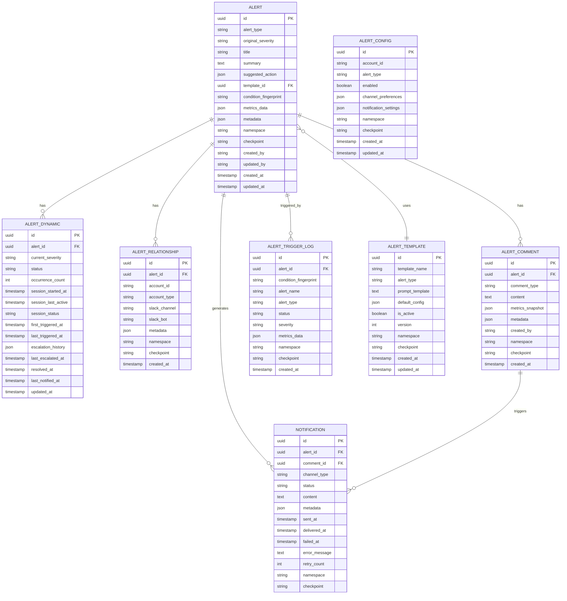

# Risk Sentinel 项目开发上下文

**最后更新**: 2025-12-10
**项目仓库**: https://gitlab.awx.im/awx-platform/ml-platform/risk-sentinel
**当前分支**: feature/AR-7572-build-project
**MR 链接**: https://gitlab.awx.im/awx-platform/ml-platform/risk-sentinel/-/merge_requests/1

---

## 1. 项目概述

### 1.1 系统简介

Risk Sentinel Alert System 是 Airwallex Sentinel 的核心模块之一，负责：
- 接收来自外部风险检测系统的 Metric 数据
- 通过 AI Agent 生成智能告警摘要
- 通过多渠道（Slack、Webapp、SMS）通知商户
- 支持灵活的频率控制和触发条件配置

### 1.2 核心功能

| 功能 | 描述 |
|------|------|
| 智能告警生成 | 基于外部 Metrics 通过 AI Agent 生成人类可读的告警摘要 |
| 多渠道通知 | 支持 Slack、Webapp、SMS 三种通知渠道 |
| 频率控制 | 支持商户和时间维度的频率限制配置 |
| 灵活触发条件 | 基于外部 Metrics 的可配置触发规则 |
| 告警管理 | 提供告警列表和详情页面供商户查看和管理 |

### 1.3 技术栈

- **语言**: Kotlin 1.9.23
- **框架**: Spring Boot 3.x
- **数据库**: PostgreSQL + Flyway
- **缓存**: Redis
- **消息队列**: Kafka
- **Web 服务器**: Jetty
- **构建工具**: Gradle 7.x (Kotlin DSL)
- **触发引擎**: Prometheus + Alertmanager

---

## 2. 项目结构

### 2.1 模块划分

```
risk-sentinel/
├── risk-sentinel-domain/        # 领域层（核心业务模型）
├── risk-sentinel-sdk/           # SDK 层（客户端、配置、数据模型）
├── risk-sentinel-persistence/   # 持久化层（Entity、Repository、Flyway）
└── risk-sentinel-start/         # 启动层（Controller、Service、Application）
```

### 2.2 参考项目

项目结构和代码规范参考 `risk-common-attribute-layer`：
- Entity 使用 Spring Data JDBC 注解
- Repository 继承 `CrudRepository`
- Flyway 脚本放在 `persistence` 模块

---

## 3. 数据模型

### 3.1 ER 图



### 3.2 表说明

| 表名 | 说明 |
|------|------|
| `alert_template` | AI Prompt 模板，用于生成告警摘要 |
| `alert` | 核心告警实体，存储 AI 生成的摘要内容 |
| `alert_dynamic` | 告警动态字段（状态、会话、升级），分离以提高写入性能 |
| `alert_relationship` | 告警与商户账户、通知渠道的关联 |
| `alert_comment` | 告警评论/事件记录（触发事件、用户备注、系统日志） |
| `alert_trigger_log` | Prometheus 触发原始日志，用于审计和分析 |
| `notification` | 通知记录，支持多渠道 |
| `alert_config` | 商户级别的告警配置和通知偏好 |

---

## 4. 开发进度

### 4.1 已完成

| 阶段 | 内容 | 完成日期 |
|------|------|----------|
| 项目骨架 | 多模块项目结构、CI/CD、Docker 配置 | 2025-11 |
| Flyway 迁移脚本 | `V1_0_0__create_tables.sql`（8 张表） | 2025-12-10 |
| Entity 类 | 8 个实体类 + 7 个枚举类 | 2025-12-10 |
| Repository 接口 | 8 个 Spring Data JDBC Repository | 2025-12-10 |

### 4.2 待开发（TDD 分步计划）

| 阶段 | 内容 | 优先级 | 状态 |
|------|------|--------|------|
| Phase 2 | Trigger Condition Engine（条件评估引擎） | P0 | 待开发 |
| Phase 4 | Alert Service 核心业务（创建、聚合、升级） | P0 | 待开发 |
| Phase 5 | Frequency Control 频控服务 | P1 | 待开发 |
| Phase 6 | AI Agent 服务（LLM 集成） | P1 | 待开发 |
| Phase 7 | Notification Service 通知服务 | P1 | 待开发 |
| Phase 8 | REST API 层 | P1 | 待开发 |
| Phase 9 | 集成与端到端测试 | P2 | 待开发 |

---

## 5. 关键设计决策

### 5.1 Trigger Engine 选择 Prometheus

**原因**：
- 多数据源支持（REST API、BigQuery、Kafka 等）
- PromQL 支持复杂条件逻辑、时间窗口聚合、异常检测
- 成熟稳定，生态完善
- 可水平扩展

**数据流**：
```
Prometheus 触发 → Alertmanager → Webhook → Sentinel Alert System
```

### 5.2 Alert 聚合策略

采用**混合聚合策略**：

1. **Session-based 聚合**：触发间隔 < 15 分钟视为同一攻击会话
2. **滑动窗口**：24 小时内相同 fingerprint 的 Alert 聚合
3. **严重级别升级**：
   - `occurrence_count >= 10` → P2
   - `occurrence_count >= 50` → P1
   - 持续时间 >= 2 小时 → P1

### 5.3 Alert 与 Alert_Dynamic 分离

将频繁更新的字段（status、occurrence_count、session_last_active 等）分离到 `alert_dynamic` 表，减少对 `alert` 主表的写入压力。

---

## 6. 文件清单

### 6.1 Flyway 迁移脚本

```
risk-sentinel-persistence/src/main/resources/db/migration/
└── V1_0_0__create_tables.sql
```

### 6.2 Entity 类

```
risk-sentinel-persistence/src/main/kotlin/com/airwallex/risk/sentinel/persistence/entity/
├── Severity.kt                 # P0, P1, P2, P3
├── AlertStatus.kt              # ACTIVE, RESOLVED, DISMISSED
├── SessionStatus.kt            # ACTIVE, EXPIRED, RESOLVED
├── CommentType.kt              # TRIGGER_EVENT, SEVERITY_ESCALATION, USER_NOTE, SYSTEM_LOG
├── ChannelType.kt              # SLACK, SMS, WEBAPP
├── NotificationStatus.kt       # PENDING, SENDING, SENT, DELIVERED, FAILED
├── TriggerStatus.kt            # FIRING, RESOLVED
├── AlertTemplateEntity.kt
├── AlertEntity.kt
├── AlertDynamicEntity.kt
├── AlertRelationshipEntity.kt
├── AlertCommentEntity.kt
├── AlertTriggerLogEntity.kt
├── NotificationEntity.kt
└── AlertConfigEntity.kt
```

### 6.3 Repository 接口

```
risk-sentinel-persistence/src/main/kotlin/com/airwallex/risk/sentinel/persistence/repo/
├── AlertTemplateRepository.kt
├── AlertRepository.kt
├── AlertDynamicRepository.kt
├── AlertRelationshipRepository.kt
├── AlertCommentRepository.kt
├── AlertTriggerLogRepository.kt
├── NotificationRepository.kt
└── AlertConfigRepository.kt
```

---

## 7. 相关文档

| 文档 | 路径 |
|------|------|
| 系统设计文档（英文） | `/Users/boyi.wang/Projects/AwxSentinel/AlertSystemDesign_EN.md` |
| 系统设计文档（中文） | `/Users/boyi.wang/Projects/AwxSentinel/AlertSystemDesign_CN.md` |
| Confluence 页面 | https://airwallex.atlassian.net/wiki/spaces/AR/pages/4594368769 |

---

## 8. 开发规范

### 8.1 代码风格

- 参考 `risk-common-attribute-layer` 项目
- Entity 使用 `data class` + Spring Data JDBC 注解
- Repository 继承 `CrudRepository<Entity, UUID>`
- 使用 `Instant` 而非 `Date` 作为时间类型

### 8.2 Flyway 命名规范

```
V{主版本}_{次版本}_{修订版本}__{描述}.sql

示例：
V1_0_0__create_tables.sql
V1_0_1__add_column_xxx.sql
```

### 8.3 Git 提交规范

```
feat: 功能描述

详细说明...

🤖 Generated with [Claude Code](https://claude.com/claude-code)

Co-Authored-By: Claude <noreply@anthropic.com>
```

---

## 9. 常用命令

```bash
# 进入项目目录
cd /Users/boyi.wang/Projects/risk-sentinel

# 编译项目
./gradlew compileKotlin

# 运行测试
./gradlew test

# 构建
./gradlew build

# 本地启动（需要先启动 PostgreSQL）
./gradlew :risk-sentinel-start:bootRun
```

---

## 10. 更新日志

| 日期 | 更新内容 |
|------|----------|
| 2025-12-10 | 创建文档；完成 Flyway 迁移脚本、Entity、Repository |
