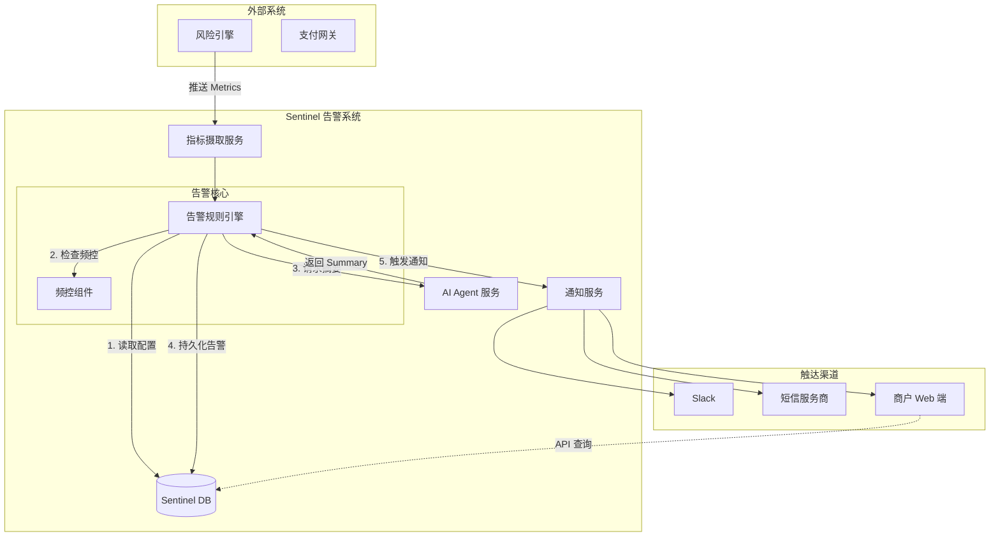
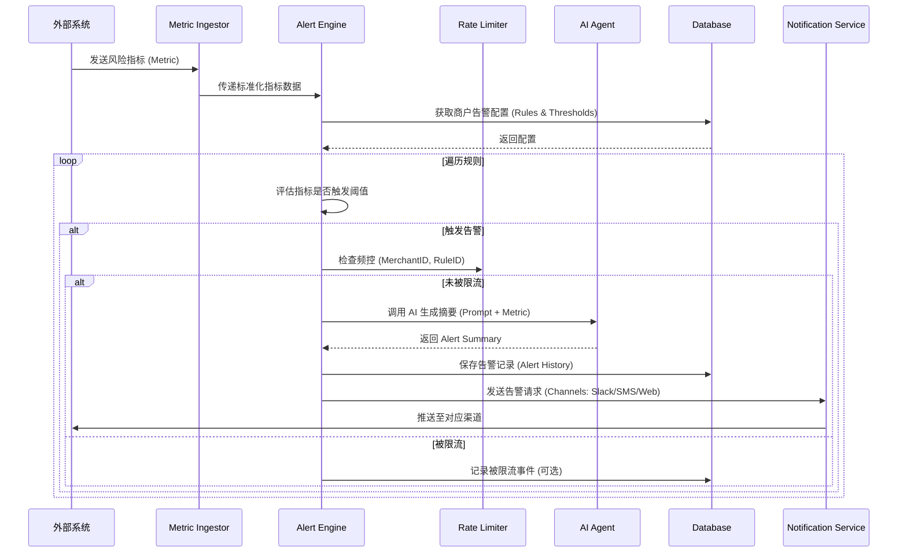
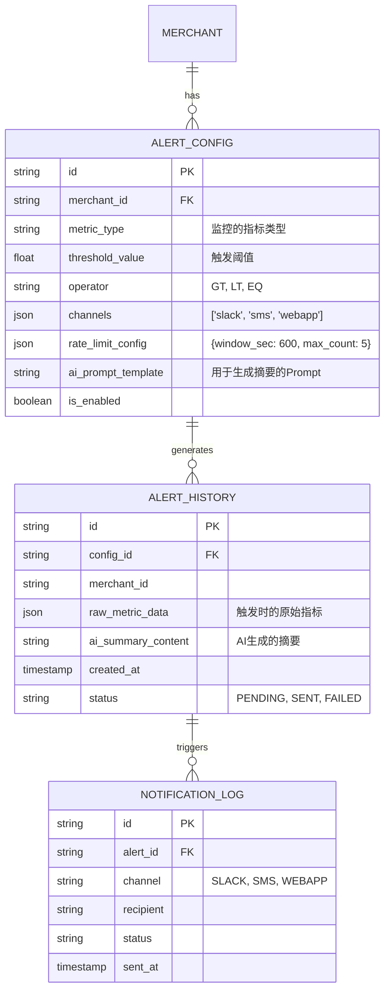

# Airwallex Sentinel 告警系统设计文档

## 1. 概述

本此设计主要针对 Airwallex Sentinel 系统中的 **告警 (Alert)** 模块。该模块旨在实时监控外部系统提供的风险指标 (Metrics)，在检测到异常（如攻击）时，利用 AI Agent 生成智能摘要，并通过多种渠道（Slack, WebApp, SMS）及时通知商户。

### 核心功能
1.  **指标监控与触发**：基于可配置的规则监控外部指标。
2.  **AI 智能摘要**：调用 AI Agent 对异常指标生成易读的攻击摘要。
3.  **频控策略**：支持商户维度和时间维度的告警频率控制。
4.  **多渠道触达**：支持 Slack, WebApp, SMS 等多种通知方式。
5.  **告警管理**：提供告警列表和详情页供查询和分析。

---

## 2. 系统架构设计

系统采用微服务架构思想，主要包含以下组件：
- **Metric Ingestor**: 负责接收外部系统的指标数据。
- **Alert Engine**: 核心告警引擎，负责规则匹配、频控检查。
- **AI Agent Service**: 负责调用大模型生成告警摘要。
- **Notification Service**: 负责对接不同渠道发送消息。
- **Sentinel Backend**: 提供前端 API 接口（配置管理、列表查询）。



---

## 3. 业务流程设计

### 3.1 告警处理全流程



### 3.2 频控策略流程

频控主要基于 **Token Bucket (令牌桶)** 或 **Sliding Window (滑动窗口)** 算法。
配置维度支持：
- **商户维度**：该商户所有告警在 N 分钟内最多 M 条。
- **规则/类型维度**：特定类型的告警（如卡测试）在 N 分钟内最多 M 条。

---

## 4. 实体关系设计 (ERD)

主要实体包括：
- **AlertConfig**: 定义告警触发条件、频控配置、通知渠道。
- **AlertHistory**: 记录实际发生的告警及其 AI 摘要。
- **NotificationLog**: 记录各渠道的发送状态。



---

## 5. API 接口设计

### 5.1 告警配置管理

#### 创建/更新告警配置
`POST /api/v1/sentinel/configs`

**Request Body:**
```json
{
  "merchant_id": "mer_12345",
  "metric_type": "auth_failure_rate",
  "operator": "GT",
  "threshold_value": 0.15,
  "channels": ["slack", "webapp"],
  "rate_limit": {
    "window_seconds": 3600,
    "max_count": 3
  },
  "ai_prompt_template": "Analyze the following metrics and summarize the attack pattern..."
}
```

#### 获取告警配置
`GET /api/v1/sentinel/configs?merchant_id={merchant_id}`

### 5.2 告警列表与详情

#### 获取告警列表
`GET /api/v1/sentinel/alerts`

**Query Parameters:**
- `merchant_id`: 商户 ID
- `start_time`: 开始时间
- `end_time`: 结束时间
- `page`: 页码
- `page_size`: 每页数量

**Response:**
```json
{
  "data": [
    {
      "id": "alert_999",
      "metric_type": "auth_failure_rate",
      "ai_summary_short": "High volume of card testing detected from IP subnet...",
      "created_at": "2025-09-05T10:00:00Z",
      "status": "SENT"
    }
  ],
  "total": 1
}
```

#### 获取告警详情
`GET /api/v1/sentinel/alerts/{alert_id}`

**Response:**
```json
{
  "id": "alert_999",
  "config_id": "cfg_555",
  "merchant_id": "mer_12345",
  "metric_data": {
    "current_rate": 0.25,
    "baseline_rate": 0.02,
    "top_ips": ["1.2.3.4", "5.6.7.8"]
  },
  "ai_summary_content": "Detected a Card Testing attack. Authorization failure rate spiked to 25% (normal 2%). Traffic concentrated on BIN 424242 from specific IP subnet.",
  "channels_notified": ["slack", "webapp"],
  "created_at": "2025-09-05T10:00:00Z"
}
```

---

## 6. 实现细节说明

### 6.1 AI Agent 调用策略
- **异步处理**：为了不阻塞告警流程，AI 生成摘要的过程应在独立线程池或通过消息队列异步处理。
- **Prompt 管理**：Prompt 应包含具体的指标上下文（Context）和角色定义（Role），以确保 AI 输出的专业性。
- **降级策略**：如果 AI 服务超时或不可用，系统应发送包含基础指标数据的默认告警模板，并在后续补充 AI 分析。

### 6.2 频控实现
- 使用 Redis 的 `INCR` 和 `EXPIRE` 实现简单的滑动窗口计数器。
- Key 设计示例：`sentinel:ratelimit:{merchant_id}:{rule_id}:{timestamp_window}`
- 每次触发告警前检查当前 Key 的计数是否超过阈值。

### 6.3 渠道集成
- **Slack**: 使用 Webhook URL 或 Slack Bot API 发送 Block Kit 格式的消息。
- **WebApp**: 通过 WebSocket 推送或前端轮询 API 获取未读告警。
- **SMS**: 集成内部 SMS 网关，注意控制短信长度和发送成本（短信渠道通常有更严格的频控）。

