# Airwallex Sentinel 技术设计文档

**版本：** 1.0
**日期：** 2025年11月14日
**状态：** 设计评审中

---

## 1. 需求/目标

### 1.1 产品愿景

Airwallex Sentinel 是一款 AI 驱动的欺诈攻击防御产品，通过自动化分析风险警报、即时测试和部署策略来防止攻击，并提供事件报告和建议的后续步骤，保护商户账户免受未来攻击。

**产品标语：** "Life is too short to worry about fraud attacks... read a book, enjoy the view... Airwallex Sentinel has got you covered."

### 1.2 核心目标

#### 业务目标
- **减少商户欺诈损失：** 通过更快、更精准的欺诈缓解，目标减少 30%-50% 的卡测试和其他攻击带来的财务影响
- **提高运营效率：** 为商户和内部风险运营团队自动化警报分析和响应工作流，目标减少 60% 的人工工作量
- **增强商户体验：** 提供安心感和简单、强大的工具来管理风险，无需专业的欺诈知识
- **建立市场领导地位：** 将 Airwallex 定位为 AI 驱动的自主欺诈防御领域的市场先行者

#### 技术目标
- **实时检测：** 警报检测延迟 < 1 秒，AI 分析时间 < 5 秒
- **高可用性：** 系统可用性 > 99.9%，支持多可用区部署
- **可扩展性：** 支持每天处理数百万笔交易，峰值 TPS 达到 50,000
- **自动化率：** 80% 的攻击场景支持自动部署规则

### 1.3 支持的攻击类型

| 攻击类别 | 检测方法 | 优先级 |
|---------|---------|--------|
| **卡测试 (Card Testing)** | 监控来自单一来源的大量小额失败交易，检测连续卡号模式 | P1 |
| **速率攻击 (Velocity Attacks)** | 实时跟踪交易频率和数量，对突然激增发出警报 | P1 |
| **账户接管 (Account Takeover)** | 使用行为生物识别和异常检测标记可疑登录 | P2 |
| **拒付欺诈 (Chargeback Fraud)** | 分析拒付数据识别重复模式 | P2 |

### 1.4 核心用户故事

1. **作为商户**，我希望在应用中收到潜在欺诈攻击的通知，以便我可以立即采取行动
2. **作为商户**，我希望看到欺诈攻击的简单、易于理解的摘要，包括攻击类型及其影响
3. **作为商户**，我希望有一个一键按钮来部署推荐的欺诈规则，以便我可以立即阻止攻击
4. **作为商户**，我希望系统能自动部署一些欺诈规则并立即阻止攻击，为我提供事件摘要
5. **作为风控运营人员**，我希望系统能自动生成和优化规则，减少手动规则编写工作

### 1.5 成功指标

- **商户采用率：** 活跃商户中启用 Sentinel 的百分比 > 60%
- **误报率降低：** 相比人工流程降低 30% 以上
- **缓解时间：** 从警报生成到规则部署的平均时间 < 5 分钟
- **欺诈损失减少：** 使用 Sentinel 的商户的拒付率和欺诈损失降低 30%-50%
- **运营效率：** 规则编写和维护的人力投入减少 60%

---

## 2. 页面功能

### 2.1 前端页面结构

```mermaid
graph TB
    subgraph "Sentinel 仪表板"
        Dashboard[主仪表板]

        subgraph "警报中心"
            AlertList[警报列表]
            AlertDetail[警报详情页]
            AlertAnalysis[AI 分析报告]
        end

        subgraph "规则管理"
            RuleList[规则列表]
            RuleCreate[创建规则]
            RuleDetail[规则详情]
            RulePerformance[规则性能]
        end

        subgraph "防护报告"
            Overview[防护概览]
            AttackHistory[攻击历史]
            BlockStats[拦截统计]
            TrendAnalysis[趋势分析]
        end

        subgraph "设置"
            Notification[通知设置]
            AutoConfig[自动化配置]
            Threshold[阈值配置]
        end
    end

    Dashboard --> AlertList
    Dashboard --> RuleList
    Dashboard --> Overview
    Dashboard --> Notification

    AlertList --> AlertDetail
    AlertDetail --> AlertAnalysis
    AlertDetail --> RuleCreate

    RuleList --> RuleDetail
    RuleDetail --> RulePerformance

    Overview --> AttackHistory
    Overview --> BlockStats
    Overview --> TrendAnalysis

    Notification --> AutoConfig
    AutoConfig --> Threshold

    style Dashboard fill:#e3f2fd
    style 警报中心 fill:#fff3e0
    style 规则管理 fill:#e8f5e9
    style 防护报告 fill:#f3e5f5
    style 设置 fill:#fce4ec
```

### 2.2 核心页面功能详情

```mermaid
graph TB
    subgraph Dashboard["📊 主仪表板"]
        D1["🚨 实时警报数量<br/>━━━━━━━━<br/>P1 警报 | P2 警报 | P3 警报"]
        D2["🛡️ 今日拦截统计"]
        D3["📋 活跃规则数量"]
        D4["⚡ 快捷操作入口"]
    end

    subgraph Alert["⚠️ 警报详情页"]
        A1["📌 警报基本信息<br/>━━━━━━━━<br/>• 优先级<br/>• 创建时间<br/>• 状态"]
        A2["🤖 AI 分析结果<br/>━━━━━━━━<br/>• 攻击类型识别<br/>• 置信度评分<br/>• 影响范围分析<br/>• 推荐操作"]
        A3["🚀 一键部署按钮"]
        A4["💬 反馈按钮<br/>━━━━━━━━<br/>👍 有用 | 👎 无用"]
    end

    subgraph Rules["🔧 规则管理页"]
        R1["📝 规则列表<br/>━━━━━━━━<br/>筛选器：状态/类型/时间<br/>排序选项<br/>批量操作"]
        R2["📄 规则详情<br/>━━━━━━━━<br/>• 规则条件<br/>• 执行动作"]
        R3["📈 性能指标<br/>━━━━━━━━<br/>• 精确率<br/>• 召回率<br/>• 误报率"]
        R4["🧪 影子测试结果"]
        R5["📜 部署历史"]
    end

    subgraph Reports["📊 防护报告"]
        P1["📉 攻击趋势图"]
        P2["✅ 拦截效果统计"]
        P3["💰 损失避免金额"]
        P4["🏆 规则贡献度排名"]
        P5["📥 导出报告"]
    end

    style Dashboard fill:#e3f2fd,stroke:#1976d2,stroke-width:3px,color:#000
    style Alert fill:#fff3e0,stroke:#f57c00,stroke-width:3px,color:#000
    style Rules fill:#e8f5e9,stroke:#388e3c,stroke-width:3px,color:#000
    style Reports fill:#f3e5f5,stroke:#7b1fa2,stroke-width:3px,color:#000

    style D1 fill:#bbdefb,stroke:#1976d2,stroke-width:2px,color:#000
    style D2 fill:#bbdefb,stroke:#1976d2,stroke-width:2px,color:#000
    style D3 fill:#bbdefb,stroke:#1976d2,stroke-width:2px,color:#000
    style D4 fill:#bbdefb,stroke:#1976d2,stroke-width:2px,color:#000

    style A1 fill:#ffe0b2,stroke:#f57c00,stroke-width:2px,color:#000
    style A2 fill:#ffe0b2,stroke:#f57c00,stroke-width:2px,color:#000
    style A3 fill:#ffe0b2,stroke:#f57c00,stroke-width:2px,color:#000
    style A4 fill:#ffe0b2,stroke:#f57c00,stroke-width:2px,color:#000

    style R1 fill:#c8e6c9,stroke:#388e3c,stroke-width:2px,color:#000
    style R2 fill:#c8e6c9,stroke:#388e3c,stroke-width:2px,color:#000
    style R3 fill:#c8e6c9,stroke:#388e3c,stroke-width:2px,color:#000
    style R4 fill:#c8e6c9,stroke:#388e3c,stroke-width:2px,color:#000
    style R5 fill:#c8e6c9,stroke:#388e3c,stroke-width:2px,color:#000

    style P1 fill:#e1bee7,stroke:#7b1fa2,stroke-width:2px,color:#000
    style P2 fill:#e1bee7,stroke:#7b1fa2,stroke-width:2px,color:#000
    style P3 fill:#e1bee7,stroke:#7b1fa2,stroke-width:2px,color:#000
    style P4 fill:#e1bee7,stroke:#7b1fa2,stroke-width:2px,color:#000
    style P5 fill:#e1bee7,stroke:#7b1fa2,stroke-width:2px,color:#000
```

### 2.3 关键用户界面流程

```mermaid
flowchart TD
    Start([商户登录]) --> Dashboard[查看主仪表板]

    Dashboard --> CheckAlert{有新警报?}

    CheckAlert -->|是| ViewAlert[点击查看警报]
    CheckAlert -->|否| ViewReports[查看防护报告]

    ViewAlert --> ReadAnalysis[阅读 AI 分析]
    ReadAnalysis --> DecideAction{决定采取行动?}

    DecideAction -->|是| ClickDeploy[点击一键部署]
    DecideAction -->|否| Dismiss[忽略警报]

    ClickDeploy --> ConfirmModal[确认部署模态框]
    ConfirmModal --> ReviewImpact[查看影响范围]
    ReviewImpact --> Confirm{确认部署?}

    Confirm -->|是| AutoBacktest[AI 自动运行回测]
    Confirm -->|否| Cancel[取消]

    AutoBacktest --> BacktestResult{回测结果<br/>性能达标?}

    BacktestResult -->|是| DeployRule[部署规则]
    BacktestResult -->|否| ShowWarning[显示回测警告]

    ShowWarning --> MerchantDecide{商户决定}
    MerchantDecide -->|继续部署| DeployRule
    MerchantDecide -->|取消| Cancel

    DeployRule --> ShadowMode[规则进入影子模式]
    ShadowMode --> MonitorShadow[监控影子性能]
    MonitorShadow --> CheckPerf{性能良好?}

    CheckPerf -->|是| GoLive[规则上线]
    CheckPerf -->|否| Tune[调优规则]

    GoLive --> ShowSuccess[显示成功提示]
    ShowSuccess --> ViewProtection[查看防护效果]

    Tune --> ShadowMode

    ViewProtection --> SubmitFeedback[提交反馈]
    SubmitFeedback --> End([完成])

    Dismiss --> End
    Cancel --> End
    ViewReports --> End

    style AutoBacktest fill:#f3e5f5,stroke:#7b1fa2,stroke-width:3px
    style BacktestResult fill:#fff3e0,stroke:#f57c00,stroke-width:2px
    style ShowWarning fill:#ffebee,stroke:#c62828,stroke-width:2px
    style Start fill:#c8e6c9
    style End fill:#ffcdd2
    style ClickDeploy fill:#fff59d
    style GoLive fill:#a5d6a7
```

---

## 3. 业务流程

### 3.1 核心业务流程总览

```mermaid
graph TB
    subgraph "实时监控"
        A1[交易流监控]
        A2[指标计算]
        A3[阈值检查]
    end

    subgraph "警报生成"
        B1[触发警报]
        B2[数据收集]
        B3[警报分类]
    end

    subgraph "AI 分析"
        C1[特征提取]
        C2[模式识别]
        C3[攻击分类]
        C4[规则推荐]
    end

    subgraph "商户决策"
        D1[通知商户]
        D2[展示分析]
        D3[等待操作]
    end

    subgraph "规则部署"
        E1[验证规则]
        E1a[自动回测]
        E2[影子部署]
        E3[性能评估]
        E4[上线部署]
    end

    subgraph "持续优化"
        F1[收集反馈]
        F2[性能监控]
        F3[规则优化]
        F4[模型训练]
    end

    A1 --> A2 --> A3
    A3 -->|阈值突破| B1
    B1 --> B2 --> B3
    B3 --> C1 --> C2 --> C3 --> C4
    C4 --> D1 --> D2 --> D3
    D3 -->|一键部署| E1
    D3 -->|自动部署| E1
    E1 --> E1a --> E2 --> E3 --> E4
    E4 --> F1
    D2 --> F1
    F1 --> F2 --> F3 --> F4
    F4 -.模型更新.-> C2

    style 实时监控 fill:#e3f2fd
    style 警报生成 fill:#fff3e0
    style AI分析 fill:#f3e5f5
    style 商户决策 fill:#e8f5e9
    style 规则部署 fill:#ffe0b2
    style 持续优化 fill:#d1c4e9
```

### 3.2 一键部署流程详细设计

```mermaid
sequenceDiagram
    autonumber
    actor Merchant as 商户
    participant UI as 前端界面
    participant API as API 网关
    participant Alert as 警报服务
    participant AI as AI 引擎
    participant Deploy as 部署引擎
    participant Shadow as 影子环境
    participant Risk as 风险引擎
    participant Notify as 通知服务

    Note over Merchant,Notify: 场景：商户收到警报并执行一键部署

    Alert->>UI: 推送新警报
    UI->>Merchant: 显示通知徽章

    Merchant->>UI: 点击查看警报
    UI->>API: GET /api/v1/alerts/{id}
    API->>Alert: 查询警报
    Alert->>AI: 获取 AI 分析结果
    AI-->>Alert: 返回分析报告
    Alert-->>API: 返回完整数据
    API-->>UI: 返回 JSON
    UI->>Merchant: 展示警报详情和 AI 分析

    Note over Merchant: 商户审阅<br/>AI 推荐规则

    Merchant->>UI: 点击"一键部署"
    UI->>Merchant: 显示确认对话框
    Merchant->>UI: 确认部署

    UI->>API: POST /api/v1/rules/deploy
    API->>Deploy: 创建部署任务

    par 并行验证
        Deploy->>Deploy: 语法验证
    and
        Deploy->>Deploy: 冲突检测
    and
        Deploy->>Deploy: 影响范围评估
    end

    Deploy->>Shadow: 部署到影子环境
    Deploy->>UI: 返回部署 ID
    UI->>Merchant: 显示"影子模式运行中"

    loop 每 30 秒更新一次 (持续 5-10 分钟)
        Shadow->>Deploy: 上报性能指标
        Deploy->>API: 推送更新
        API->>UI: WebSocket 推送
        UI->>Merchant: 更新监控图表
    end

    Deploy->>Deploy: 评估影子性能

    alt 性能达标
        Deploy->>Risk: 上线规则
        Risk-->>Deploy: 确认上线
        Deploy->>Notify: 发送成功通知
        Notify->>Merchant: 邮件/短信/应用内通知
        Deploy->>UI: 推送上线成功
        UI->>Merchant: 显示庆祝动画 + "Read a Book" 视图
    else 性能不佳
        Deploy->>Notify: 发送优化建议
        Notify->>Merchant: 通知需要调整
        Deploy->>UI: 推送优化建议
        UI->>Merchant: 显示调优建议
    end

    Merchant->>UI: 查看规则详情
    UI->>API: GET /api/v1/rules/{id}/metrics
    API-->>UI: 返回实时指标
    UI->>Merchant: 展示拦截统计

    Merchant->>UI: 提交反馈 (👍)
    UI->>API: POST /api/v1/feedback
    API->>AI: 记录正反馈
    AI->>AI: 更新训练数据集
```

### 3.3 自动部署流程（Auto-On 模式）

```mermaid
flowchart TD
    Start([检测到欺诈攻击]) --> CollectData[收集交易数据]
    CollectData --> AIAnalysis[AI 分析引擎]

    AIAnalysis --> ExtractFeatures[特征提取]
    ExtractFeatures --> RunModels[运行 ML 模型]

    RunModels --> ClassifyAttack[攻击类型分类]
    ClassifyAttack --> CalcConfidence[计算置信度]

    CalcConfidence --> CheckConfidence{置信度 >= 0.9<br/>且<br/>已知攻击模式?}

    CheckConfidence -->|是| AutoMode[进入自动模式]
    CheckConfidence -->|否| ManualMode[进入人工模式]

    AutoMode --> GenRule[生成规则]
    GenRule --> ValidateRule[验证规则]
    ValidateRule --> CheckConflict{规则冲突?}

    CheckConflict -->|是| ResolveConflict[解决冲突]
    CheckConflict -->|否| ShadowDeploy[影子部署]

    ResolveConflict --> ShadowDeploy

    ShadowDeploy --> MonitorShadow[监控 5 分钟]
    MonitorShadow --> EvalMetrics[评估指标]

    EvalMetrics --> CheckMetrics{精确率 > 95%<br/>且<br/>误报率 < 1%?}

    CheckMetrics -->|是| AutoLive[自动上线]
    CheckMetrics -->|否| NeedTuning{可调优?}

    NeedTuning -->|是| TuneRule[自动调优]
    NeedTuning -->|否| EscalateHuman[升级人工处理]

    TuneRule --> ShadowDeploy

    AutoLive --> UpdateRiskEngine[更新风险引擎]
    UpdateRiskEngine --> NotifyMerchant[通知商户]
    NotifyMerchant --> StartBlocking[开始拦截]

    StartBlocking --> MonitorLive[持续监控]
    MonitorLive --> CollectFeedback[收集反馈]
    CollectFeedback --> End([完成])

    ManualMode --> NotifyForReview[通知商户审核]
    NotifyForReview --> End

    EscalateHuman --> NotifyOps[通知运营团队]
    NotifyOps --> End

    style AutoMode fill:#a5d6a7
    style AutoLive fill:#66bb6a
    style ManualMode fill:#fff59d
    style EscalateHuman fill:#ffab91
```

### 3.4 规则自动生成与优化流程

```mermaid
stateDiagram-v2
    [*] --> DataCollection: 触发条件满足

    DataCollection --> FeatureEngineering: 数据准备完成
    note right of DataCollection
        触发条件：
        - 定期任务 (每日)
        - 性能下降
        - 新攻击模式
    end note

    FeatureEngineering --> AlgorithmSelection: 特征就绪

    AlgorithmSelection --> XGBoost: 分类任务
    AlgorithmSelection --> Greedy: 优化任务
    AlgorithmSelection --> Clustering: 聚类任务

    XGBoost --> RuleGeneration
    Greedy --> RuleGeneration
    Clustering --> RuleGeneration

    RuleGeneration --> Validation: 规则候选集

    Validation --> SyntaxCheck: 开始验证
    SyntaxCheck --> ConflictCheck: 语法通过
    ConflictCheck --> PerformanceTest: 无冲突

    PerformanceTest --> BacktestEval: 运行回测
    BacktestEval --> MetricsCheck: 计算指标

    MetricsCheck --> Approved: 指标达标
    MetricsCheck --> Rejected: 指标不达标
    MetricsCheck --> NeedsTuning: 接近达标

    NeedsTuning --> Optimization: 自动调优
    Optimization --> BacktestEval: 重新测试

    Approved --> ShadowDeployment: 批准部署
    ShadowDeployment --> ShadowMonitoring: 影子运行

    ShadowMonitoring --> LiveDeployment: 性能良好
    ShadowMonitoring --> Optimization: 需要调优

    LiveDeployment --> ProductionMonitoring: 上线
    ProductionMonitoring --> Active: 稳定运行

    Active --> PerformanceDegradation: 性能下降
    Active --> RuleRetirement: 规则过期

    PerformanceDegradation --> Optimization: 尝试优化

    RuleRetirement --> Deprecated: 标记废弃
    Deprecated --> [*]

    Rejected --> [*]

    note left of Approved
        达标条件：
        - 精确率 > 90%
        - 召回率 > 80%
        - 误报率 < 2%
    end note
```

---

## 4. 技术架构

### 4.1 整体技术架构

```mermaid
C4Context
    title Airwallex Sentinel 系统架构图 (C4 - Level 1)

    Person(merchant, "商户", "使用 Sentinel<br/>防御欺诈攻击")
    Person(ops, "风控运营", "管理规则和<br/>监控系统")

    System_Boundary(sentinel, "Airwallex Sentinel") {
        System(webapp, "Sentinel Web App", "React 前端应用<br/>商户仪表板")
        System(api, "API 网关", "FastAPI<br/>统一接口层")
        System(core, "Sentinel 核心", "欺诈检测<br/>AI 分析<br/>规则部署")
        System(automation, "自动化平台", "规则生成<br/>模型训练<br/>规则治理")
    }

    System_Ext(riskengine, "风险引擎", "现有系统<br/>规则执行")
    System_Ext(kafka, "Kafka", "交易事件流")
    System_Ext(bigquery, "BigQuery", "数据仓库")

    Rel(merchant, webapp, "使用", "HTTPS")
    Rel(ops, webapp, "使用", "HTTPS")

    Rel(webapp, api, "调用", "REST/WebSocket")
    Rel(api, core, "调用", "gRPC")
    Rel(api, automation, "调用", "gRPC")

    Rel(core, riskengine, "同步规则", "gRPC")
    Rel(core, kafka, "消费事件", "Kafka Protocol")

    Rel(automation, bigquery, "查询数据", "SQL")
    Rel(automation, riskengine, "更新规则", "gRPC")

    UpdateLayoutConfig($c4ShapeInRow="3", $c4BoundaryInRow="1")
```

### 4.2 核心服务架构

```mermaid
flowchart TB
    subgraph FrontendLayer["前端层"]
        direction LR
        WebApp["Web 应用<br/>&lt;br&gt;React + TypeScript"]
        Mobile["移动端<br/>&lt;br&gt;React Native"]
        SentinelCore["Sentinel核心服务"]
        DataWarehouse["数据与AI层"]
    end

    subgraph GatewayLayer["接入层"]
        direction LR
        CDN["CDN / CloudFlare"]
        LoadBalancer["负载均衡<br/>&lt;br&gt;4层"]
        APIGateway["API 网关<br/>&lt;br&gt;Kong / APISIX"]
    end

    subgraph AppServiceLayer["应用服务层"]
        direction LR

        subgraph BaseServices["基础服务"]
            AuthSvc["认证服务<br/>&lt;br&gt;Go"]
            ConfigSvc["配置服务<br/>&lt;br&gt;Go"]
        end
    end

    subgraph SentinelCoreLayer["Sentinel 核心服务"]
        direction LR

        subgraph CoreServices["核心服务"]
            AlertSvc["警报服务<br/>&lt;br&gt;Go"]
            PredictSvc["预测服务<br/>&lt;br&gt;Python/Fast<br/>API"]
            AISvc["AI 分析服务<br/>&lt;br&gt;Python/Fast<br/>API"]
        end
    end

    subgraph AutomationLayer["自动化平台服务"]
        direction LR
        RuleGenSvc["规则生成服务<br/>&lt;br&gt;Python"]
        ModelSvc["模型服务<br/>&lt;br&gt;Python"]
        BacktestSvc["回测服务<br/>&lt;br&gt;Python/Sp<br/>ark"]
        GovernSvc["治理服务<br/>&lt;br&gt;Pytho<br/>n"]
    end

    subgraph ExternalLayer["外部系统"]
        direction LR
        RiskEngine["风险引擎"]
        MailSvc["邮件服务"]
        SmsSvc["短信服务"]
    end

    subgraph DataAILayer["数据与 AI 层"]
        direction LR
        StreamProc["流处理<br/>&lt;br&gt;Flin<br/>k"]
        BatchProc["批处理<br/>&lt;br&gt;Spa<br/>rk"]
        ModelServing["模型服务<br/>&lt;br&gt;TF<br/>Serving"]
        FeatureStore["特征存储<br/>&lt;br&gt;Feast"]
    end

    subgraph StorageLayer["数据存储层"]
        direction LR
        PostgreSQL["PostgreSQL<br/>&lt;br&gt;OLTP"]
        Redis["Redis<br/>&lt;br&gt;缓<br/>存"]
        Kafka["Kafka&lt;br&gt;&lt;br&gt;消息队<br/>列"]
        BigQuery["BigQuery&lt;br&gt;<br/>&lt;br&gt;OLAP"]
        S3["S3&lt;br&gt;对<br/>象存储"]
    end

    FrontendLayer --> GatewayLayer

    CDN --> LoadBalancer
    LoadBalancer --> APIGateway

    APIGateway --> AuthSvc
    APIGateway --> ConfigSvc

    AuthSvc -.认证.-> AlertSvc
    AuthSvc -.认证.-> PredictSvc
    ConfigSvc -.配置.-> AlertSvc
    ConfigSvc -.配置.-> PredictSvc

    APIGateway --> AlertSvc
    APIGateway --> PredictSvc
    APIGateway --> AISvc

    AlertSvc --> RuleGenSvc
    PredictSvc --> RuleGenSvc
    AISvc --> RuleGenSvc

    AlertSvc --> ModelSvc
    PredictSvc --> ModelSvc
    AISvc --> ModelSvc

    RuleGenSvc --> BacktestSvc
    ModelSvc --> BacktestSvc

    CoreServices --> RiskEngine
    CoreServices --> MailSvc
    CoreServices --> SmsSvc

    AutomationLayer --> StreamProc
    AutomationLayer --> BatchProc
    AutomationLayer --> ModelServing
    AutomationLayer --> FeatureStore

    SentinelCoreLayer --> PostgreSQL
    SentinelCoreLayer --> Redis
    SentinelCoreLayer --> Kafka

    DataAILayer --> BigQuery
    DataAILayer --> S3
    DataAILayer --> FeatureStore

    StreamProc --> Kafka
    BatchProc --> BigQuery
    ModelServing --> FeatureStore

    style FrontendLayer fill:#e3f2fd,stroke:#1976d2,stroke-width:2px
    style GatewayLayer fill:#f3e5f5,stroke:#7b1fa2,stroke-width:2px
    style AppServiceLayer fill:#fff9c4,stroke:#f9a825,stroke-width:2px
    style BaseServices fill:#fff59d,stroke:#f9a825,stroke-width:1px
    style SentinelCoreLayer fill:#e8f5e9,stroke:#388e3c,stroke-width:3px
    style CoreServices fill:#c8e6c9,stroke:#388e3c,stroke-width:2px
    style AutomationLayer fill:#fff3e0,stroke:#f57c00,stroke-width:2px
    style ExternalLayer fill:#efebe9,stroke:#5d4037,stroke-width:2px
    style DataAILayer fill:#e0f2f1,stroke:#00796b,stroke-width:2px
    style StorageLayer fill:#fce4ec,stroke:#c2185b,stroke-width:2px
```

### 4.3 数据流架构

```mermaid
flowchart LR
    subgraph "数据源"
        TxnStream[交易事件流]
        UserEvents[用户行为事件]
        ExtData[外部数据]
    end

    subgraph "实时层"
        Kafka[Kafka<br/>消息队列]
        Flink[Flink<br/>流处理]
        Redis[Redis<br/>实时缓存]
    end

    subgraph "离线层"
        BQ[BigQuery<br/>数据仓库]
        Spark[Spark<br/>批处理]
        S3[S3<br/>数据湖]
    end

    subgraph "特征层"
        FeatureCalc[特征计算]
        FeatureStore[特征存储<br/>Feast]
    end

    subgraph "应用层"
        AlertEngine[警报引擎]
        AIEngine[AI 引擎]
        RuleEngine[规则引擎]
        Training[模型训练]
    end

    TxnStream --> Kafka
    UserEvents --> Kafka
    ExtData --> Kafka

    Kafka --> Flink
    Flink --> FeatureCalc
    Flink --> Redis

    Kafka --> BQ
    BQ --> Spark
    Spark --> FeatureCalc
    Spark --> S3

    FeatureCalc --> FeatureStore

    FeatureStore --> AlertEngine
    FeatureStore --> AIEngine
    FeatureStore --> Training

    Redis --> AlertEngine
    Redis --> AIEngine

    BQ --> Training
    S3 --> Training

    style 实时层 fill:#e3f2fd
    style 离线层 fill:#fff3e0
    style 特征层 fill:#f3e5f5
    style 应用层 fill:#e8f5e9
```

### 4.4 部署架构

```mermaid
graph TB
    subgraph "区域 1 - 主区域"
        subgraph "K8s 集群 1"
            NS1_1[Namespace: sentinel-prod<br/>API Pods x3<br/>Alert Pods x2<br/>AI Pods x2]
            NS1_2[Namespace: automation<br/>RuleGen Pods x2<br/>Training Pods x2]
        end

        subgraph "数据库集群 1"
            PG1[PostgreSQL Primary]
            Redis1[Redis Master x3]
        end
    end

    subgraph "区域 2 - 备用区域"
        subgraph "K8s 集群 2"
            NS2_1[Namespace: sentinel-prod<br/>API Pods x3<br/>Alert Pods x2<br/>AI Pods x2]
            NS2_2[Namespace: automation<br/>RuleGen Pods x2<br/>Training Pods x2]
        end

        subgraph "数据库集群 2"
            PG2[PostgreSQL Replica]
            Redis2[Redis Replica x3]
        end
    end

    subgraph "共享服务层"
        ALB[Application Load Balancer]
        Kafka_Cluster[Kafka Cluster<br/>3 Brokers]
        BQ[BigQuery]
        S3[S3 / GCS]
    end

    Internet([互联网]) --> ALB

    ALB --> NS1_1
    ALB --> NS2_1

    NS1_1 --> PG1
    NS1_1 --> Redis1
    NS1_1 --> Kafka_Cluster

    NS2_1 --> PG2
    NS2_1 --> Redis2
    NS2_1 --> Kafka_Cluster

    NS1_2 --> BQ
    NS1_2 --> S3
    NS2_2 --> BQ
    NS2_2 --> S3

    PG1 -.复制.-> PG2
    Redis1 -.复制.-> Redis2

    style 区域1-主区域 fill:#e3f2fd
    style 区域2-备用区域 fill:#fff3e0
    style 共享服务层 fill:#f3e5f5
```

---

## 5. 子模块划分

### 5.1 模块总览

```mermaid
graph TB
    subgraph "前端模块"
        FE1[Dashboard 模块]
        FE2[Alert 模块]
        FE3[Rule 模块]
        FE4[Report 模块]
        FE5[Settings 模块]
    end

    subgraph "后端核心模块"
        BE1[API 网关模块]
        BE2[认证授权模块]
        BE3[警报检测模块]
        BE4[AI 分析模块]
        BE5[规则部署模块]
        BE6[通知模块]
    end

    subgraph "自动化模块"
        AUTO1[规则生成模块]
        AUTO2[模型训练模块]
        AUTO3[回测模块]
        AUTO4[规则治理模块]
        AUTO5[监控优化模块]
    end

    subgraph "数据模块"
        DATA1[特征工程模块]
        DATA2[流处理模块]
        DATA3[批处理模块]
        DATA4[数据存储模块]
    end

    subgraph "基础设施模块"
        INFRA1[配置中心]
        INFRA2[服务发现]
        INFRA3[监控告警]
        INFRA4[日志收集]
    end

    FE1 & FE2 & FE3 & FE4 & FE5 --> BE1
    BE1 --> BE2
    BE2 --> BE3 & BE5
    BE3 --> BE4
    BE4 --> BE5
    BE5 --> BE6

    BE3 & BE4 --> DATA2
    AUTO1 & AUTO2 & AUTO3 --> DATA3
    DATA2 & DATA3 --> DATA1
    DATA1 --> DATA4

    BE3 & BE4 & BE5 --> INFRA1
    BE1 & BE3 & BE4 & BE5 --> INFRA2
    BE1 & BE3 & BE4 & BE5 --> INFRA3
    BE1 & BE3 & BE4 & BE5 --> INFRA4

    style 前端模块 fill:#e3f2fd
    style 后端核心模块 fill:#fff3e0
    style 自动化模块 fill:#f3e5f5
    style 数据模块 fill:#e8f5e9
    style 基础设施模块 fill:#fce4ec
```

### 5.2 核心模块详细划分

```mermaid
mindmap
  root((Sentinel 模块))
    前端模块
      Dashboard 模块
        实时数据展示
        图表组件
        快捷操作
      Alert 模块
        警报列表
        警报详情
        AI 分析展示
        一键部署 UI
      Rule 模块
        规则列表
        规则详情
        性能监控
        配置管理
      Report 模块
        攻击历史
        拦截统计
        趋势分析
        报表导出
      Settings 模块
        通知配置
        自动化设置
        阈值管理

    后端核心模块
      API 网关模块
        路由管理
        协议转换
        流量控制
        API 聚合

      警报检测模块
        指标监控器
          实时指标计算
          滑动窗口统计
        阈值检查器
          动态阈值
          多维度检查
        警报生成器
          警报分类
          优先级判定
          数据收集

      AI 分析模块
        特征提取器
          实时特征
          历史特征
        模型推理引擎
          分类模型
          聚类模型
          异常检测
        规则推荐器
          规则生成
          置信度计算
          影响评估

      规则部署模块
        规则验证器
          语法检查
          冲突检测
        影子部署器
          流量切分
          性能监控
        上线管理器
          灰度发布
          自动回滚

      通知模块
        消息路由
        模板引擎
        多渠道发送
        发送状态追踪

    自动化模块
      规则生成模块
        数据准备器
        算法选择器
        规则训练器
        规则优化器

      模型训练模块
        特征工程
        模型训练
        模型评估
        模型注册

      回测模块
        历史数据加载
        规则模拟
        性能计算
        报告生成

      规则治理模块
        性能监控
        自动退役
        冲突管理
        版本控制

      监控优化模块
        指标收集
        异常检测
        自动调优
        报告生成

    数据模块
      特征工程模块
        特征计算
        特征存储
        特征服务

      流处理模块
        事件消费
        实时聚合
        窗口计算

      批处理模块
        数据抽取
        数据转换
        数据加载

      数据存储模块
        OLTP 存储
        OLAP 存储
        缓存管理
        对象存储
```

### 5.3 模块依赖关系

```mermaid
graph LR
    subgraph "Layer 1: 基础层"
        L1_1[配置中心]
        L1_2[服务发现]
        L1_3[认证服务]
    end

    subgraph "Layer 2: 数据层"
        L2_1[数据存储]
        L2_2[缓存服务]
        L2_3[消息队列]
    end

    subgraph "Layer 3: 数据处理层"
        L3_1[流处理]
        L3_2[批处理]
        L3_3[特征工程]
    end

    subgraph "Layer 4: 核心业务层"
        L4_1[警报检测]
        L4_2[AI 分析]
        L4_3[规则部署]
        L4_4[通知服务]
    end

    subgraph "Layer 5: 自动化层"
        L5_1[规则生成]
        L5_2[模型训练]
        L5_3[规则治理]
    end

    subgraph "Layer 6: 接口层"
        L6_1[API 网关]
    end

    subgraph "Layer 7: 展示层"
        L7_1[Web 前端]
    end

    L1_1 & L1_2 & L1_3 --> L2_1 & L2_2 & L2_3
    L2_1 & L2_2 & L2_3 --> L3_1 & L3_2 & L3_3
    L3_1 & L3_2 & L3_3 --> L4_1 & L4_2 & L4_3 & L4_4
    L4_1 & L4_2 & L4_3 --> L5_1 & L5_2 & L5_3
    L4_1 & L4_2 & L4_3 & L4_4 & L5_1 & L5_2 & L5_3 --> L6_1
    L6_1 --> L7_1

    style Layer1:基础层 fill:#fce4ec
    style Layer2:数据层 fill:#e8f5e9
    style Layer3:数据处理层 fill:#fff3e0
    style Layer4:核心业务层 fill:#e3f2fd
    style Layer5:自动化层 fill:#f3e5f5
    style Layer6:接口层 fill:#d1c4e9
    style Layer7:展示层 fill:#c8e6c9
```

---

## 6. 子模块交互 & 流程

### 6.1 实时警报检测流程（模块交互）

```mermaid
sequenceDiagram
    participant Kafka as Kafka<br/>消息队列
    participant Stream as 流处理模块<br/>Flink
    participant Monitor as 指标监控器<br/>警报检测模块
    participant Threshold as 阈值检查器<br/>警报检测模块
    participant Generator as 警报生成器<br/>警报检测模块
    participant Feature as 特征提取器<br/>AI 分析模块
    participant Model as 模型推理引擎<br/>AI 分析模块
    participant Recommender as 规则推荐器<br/>AI 分析模块
    participant Notifier as 通知模块
    participant DB as PostgreSQL
    participant Cache as Redis

    Kafka->>Stream: 1. 接收交易事件流
    Stream->>Stream: 2. 窗口聚合
    Stream->>Monitor: 3. 计算实时指标

    Monitor->>Cache: 4. 缓存指标数据
    Monitor->>Threshold: 5. 发送指标

    Threshold->>Threshold: 6. 检查阈值

    alt 阈值突破
        Threshold->>Generator: 7. 触发警报生成
        Generator->>DB: 8. 查询历史数据
        DB-->>Generator: 9. 返回历史数据

        Generator->>Generator: 10. 分类警报（P1/P2/P3）
        Generator->>DB: 11. 保存警报

        Generator->>Feature: 12. 请求 AI 分析
        Feature->>DB: 13. 加载交易明细
        DB-->>Feature: 14. 返回交易数据

        Feature->>Feature: 15. 提取特征
        Feature->>Model: 16. 调用模型推理

        par 并行推理
            Model->>Model: 攻击分类
        and
            Model->>Model: 聚类分析
        and
            Model->>Model: 异常检测
        end

        Model->>Recommender: 17. 推理结果
        Recommender->>Recommender: 18. 生成规则推荐
        Recommender->>Recommender: 19. 计算置信度

        Recommender->>DB: 20. 保存分析结果
        Recommender->>Generator: 21. 返回分析报告

        Generator->>Notifier: 22. 发送通知请求

        par 多渠道通知
            Notifier->>Notifier: 应用内推送
        and
            Notifier->>Notifier: 邮件通知
        and
            Notifier->>Notifier: 短信通知（P1）
        end

        Notifier->>DB: 23. 记录通知状态
    else 正常
        Threshold->>Monitor: 继续监控
    end
```

### 6.2 规则部署流程（模块交互）

```mermaid
sequenceDiagram
    participant UI as Web 前端
    participant Gateway as API 网关
    participant Auth as 认证模块
    participant RuleAPI as 规则部署模块<br/>API 层
    participant Validator as 规则验证器
    participant Shadow as 影子部署器
    participant Monitor as 性能监控器
    participant LiveDeploy as 上线管理器
    participant RiskEngine as 风险引擎
    participant Notifier as 通知模块
    participant DB as PostgreSQL
    participant Cache as Redis

    UI->>Gateway: 1. POST /rules/deploy
    Gateway->>Auth: 2. 验证 Token
    Auth-->>Gateway: 3. Token 有效

    Gateway->>RuleAPI: 4. 转发请求
    RuleAPI->>DB: 5. 查询规则定义
    DB-->>RuleAPI: 6. 返回规则

    RuleAPI->>Validator: 7. 验证规则

    par 并行验证
        Validator->>Validator: 语法检查
    and
        Validator->>DB: 查询现有规则
        DB-->>Validator: 返回规则列表
        Validator->>Validator: 冲突检测
    and
        Validator->>Validator: 影响评估
    end

    Validator-->>RuleAPI: 8. 验证通过

    RuleAPI->>Shadow: 9. 部署到影子环境
    Shadow->>RiskEngine: 10. 推送影子规则
    RiskEngine-->>Shadow: 11. 确认部署

    Shadow->>Cache: 12. 缓存影子状态
    Shadow->>DB: 13. 记录部署

    Shadow-->>UI: 14. 返回部署 ID (WebSocket)

    loop 监控 5-10 分钟
        RiskEngine->>Monitor: 15. 上报性能指标
        Monitor->>Monitor: 16. 计算指标
        Monitor->>Cache: 17. 更新缓存
        Monitor-->>UI: 18. 推送指标 (WebSocket)
    end

    Monitor->>Monitor: 19. 评估性能

    alt 性能达标
        Monitor->>LiveDeploy: 20. 请求上线
        LiveDeploy->>RiskEngine: 21. 上线规则
        RiskEngine-->>LiveDeploy: 22. 确认上线

        LiveDeploy->>DB: 23. 更新状态为 LIVE
        LiveDeploy->>Cache: 24. 更新缓存

        LiveDeploy->>Notifier: 25. 发送成功通知
        Notifier-->>UI: 26. 推送成功消息

    else 性能不佳
        Monitor->>Notifier: 20. 发送优化建议
        Notifier-->>UI: 21. 推送优化建议
    end
```

### 6.3 规则自动生成流程（模块交互）

```mermaid
flowchart TD
    Start([定时任务触发<br/>或手动触发]) --> Scheduler[调度器<br/>Airflow]

    Scheduler --> DataPrep[数据准备器<br/>规则生成模块]

    DataPrep --> QueryBQ[查询 BigQuery]
    QueryBQ --> ExtractData[提取训练数据]
    ExtractData --> LabelData[标注数据]

    LabelData --> FeatureEng[特征工程模块]
    FeatureEng --> CalcFeatures[计算特征]
    CalcFeatures --> SaveFeatures[保存到特征库]

    SaveFeatures --> AlgoSelect[算法选择器<br/>规则生成模块]
    AlgoSelect --> ChooseAlgo{选择算法}

    ChooseAlgo -->|分类任务| XGBoost[XGBoost 训练]
    ChooseAlgo -->|优化任务| Greedy[贪心搜索]
    ChooseAlgo -->|聚类任务| Clustering[聚类算法]

    XGBoost --> RuleGen[规则训练器]
    Greedy --> RuleGen
    Clustering --> RuleGen

    RuleGen --> GenCandidates[生成规则候选集]
    GenCandidates --> RuleOpt[规则优化器]

    RuleOpt --> RankRules[规则排序]
    RankRules --> FilterRules[过滤低质量规则]
    FilterRules --> SaveRules[保存到数据库]

    SaveRules --> BacktestMod[回测模块]
    BacktestMod --> LoadHistory[加载历史数据]
    LoadHistory --> SimulateRule[模拟规则执行]
    SimulateRule --> CalcMetrics[计算性能指标]

    CalcMetrics --> CheckQuality{质量检查}

    CheckQuality -->|通过| Approved[标记为已批准]
    CheckQuality -->|不通过| Rejected[标记为已拒绝]
    CheckQuality -->|需调优| NeedTune[自动调优]

    NeedTune --> RuleOpt

    Approved --> NotifyOps[通知运营团队]
    NotifyOps --> ManualReview[人工审核]

    ManualReview --> ShadowDeploy[影子部署]
    ShadowDeploy --> End([完成])

    Rejected --> LogResult[记录结果]
    LogResult --> End

    style DataPrep fill:#e3f2fd
    style FeatureEng fill:#fff3e0
    style RuleGen fill:#f3e5f5
    style BacktestMod fill:#e8f5e9
```

### 6.4 模型训练与更新流程（模块交互）

```mermaid
sequenceDiagram
    participant Scheduler as Airflow<br/>调度器
    participant DataMod as 批处理模块<br/>Spark
    participant FeatureMod as 特征工程模块
    participant TrainMod as 模型训练模块
    participant EvalMod as 模型评估器
    participant Registry as 模型注册表
    participant Serving as 模型服务
    participant AIMod as AI 分析模块
    participant DB as PostgreSQL
    participant BQ as BigQuery
    participant S3 as S3 对象存储

    Note over Scheduler: 每日凌晨 2:00 触发

    Scheduler->>DataMod: 1. 启动数据准备任务
    DataMod->>BQ: 2. 查询过去 30 天交易数据
    BQ-->>DataMod: 3. 返回数据

    DataMod->>DataMod: 4. 数据清洗和转换
    DataMod->>S3: 5. 保存到数据湖

    DataMod->>FeatureMod: 6. 触发特征计算
    FeatureMod->>S3: 7. 读取原始数据
    FeatureMod->>FeatureMod: 8. 特征工程
    FeatureMod->>DB: 9. 保存特征定义
    FeatureMod->>S3: 10. 保存特征数据

    FeatureMod->>TrainMod: 11. 触发模型训练
    TrainMod->>S3: 12. 加载特征数据
    TrainMod->>TrainMod: 13. 数据分割

    loop 超参数调优
        TrainMod->>TrainMod: 14. 训练模型
        TrainMod->>EvalMod: 15. 评估模型
        EvalMod->>EvalMod: 16. 计算指标
        EvalMod-->>TrainMod: 17. 返回评估结果
    end

    TrainMod->>EvalMod: 18. 最佳模型评估
    EvalMod->>DB: 19. 查询冠军模型性能
    DB-->>EvalMod: 20. 返回冠军模型指标

    EvalMod->>EvalMod: 21. 对比性能

    alt 新模型更好
        EvalMod->>Registry: 22. 注册挑战者模型
        Registry->>S3: 23. 保存模型文件
        Registry->>DB: 24. 保存模型元数据

        Registry->>Serving: 25. 部署到 A/B 测试
        Serving->>Serving: 26. 加载模型

        Note over Serving,AIMod: A/B 测试 7 天

        loop 每天检查
            Serving->>DB: 27. 记录推理结果
            Registry->>DB: 28. 查询 A/B 测试指标
            DB-->>Registry: 29. 返回指标
        end

        alt 挑战者胜出
            Registry->>Serving: 30. 提升为冠军模型
            Serving->>AIMod: 31. 更新生产模型
            Registry->>DB: 32. 更新模型状态
            Registry->>Scheduler: 33. 发送成功通知
        else 冠军保持
            Registry->>Serving: 30. 回滚挑战者
            Registry->>DB: 31. 标记为失败
        end

    else 新模型不如冠军
        EvalMod->>DB: 22. 记录训练失败
        EvalMod->>Scheduler: 23. 发送失败通知
    end
```

### 6.5 完整端到端流程整合

```mermaid
graph TB
    subgraph "阶段 1: 实时监控"
        S1_1[交易流接入]
        S1_2[实时指标计算]
        S1_3[阈值检查]
        S1_4[警报触发]
    end

    subgraph "阶段 2: 智能分析"
        S2_1[数据收集]
        S2_2[特征提取]
        S2_3[AI 模型推理]
        S2_4[攻击分类]
        S2_5[规则推荐]
    end

    subgraph "阶段 3: 商户决策"
        S3_1[多渠道通知]
        S3_2[展示分析报告]
        S3_3[商户操作]
    end

    subgraph "阶段 4: 规则部署"
        S4_1[规则验证]
        S4_2[影子部署]
        S4_3[性能监控]
        S4_4[自动上线]
    end

    subgraph "阶段 5: 效果监控"
        S5_1[拦截统计]
        S5_2[性能跟踪]
        S5_3[反馈收集]
    end

    subgraph "阶段 6: 持续优化"
        S6_1[数据标注]
        S6_2[模型重训练]
        S6_3[规则优化]
        S6_4[系统迭代]
    end

    S1_1 --> S1_2 --> S1_3 --> S1_4
    S1_4 --> S2_1 --> S2_2 --> S2_3 --> S2_4 --> S2_5
    S2_5 --> S3_1 --> S3_2 --> S3_3
    S3_3 --> S4_1 --> S4_2 --> S4_3 --> S4_4
    S4_4 --> S5_1 --> S5_2 --> S5_3
    S5_3 --> S6_1 --> S6_2 --> S6_3 --> S6_4

    S6_4 -.反馈循环.-> S2_3
    S5_2 -.性能下降.-> S6_3

    style 阶段1:实时监控 fill:#e3f2fd
    style 阶段2:智能分析 fill:#fff3e0
    style 阶段3:商户决策 fill:#e8f5e9
    style 阶段4:规则部署 fill:#f3e5f5
    style 阶段5:效果监控 fill:#ffe0b2
    style 阶段6:持续优化 fill:#d1c4e9
```

---

## 附录

### A. 技术栈总结

| 层级 | 技术选型 | 说明 |
|------|---------|------|
| **前端** | React 18 + TypeScript + Material-UI | 现代化 UI 框架 |
| **API 网关** | Kong / APISIX | 高性能 API 网关 |
| **后端服务** | Python (FastAPI) + Go | Python 用于 AI/ML，Go 用于高性能服务 |
| **实时处理** | Apache Kafka + Flink | 流处理平台 |
| **批处理** | Apache Spark + Airflow | 大数据处理 |
| **ML 框架** | XGBoost, scikit-learn, TensorFlow | 机器学习 |
| **模型服务** | TensorFlow Serving / Seldon | 模型推理 |
| **特征存储** | Feast | 特征管理 |
| **OLTP** | PostgreSQL 15+ | 事务数据库 |
| **OLAP** | Google BigQuery | 分析数据库 |
| **缓存** | Redis Cluster | 分布式缓存 |
| **对象存储** | AWS S3 / GCS | 文件存储 |
| **容器编排** | Kubernetes | 容器管理 |
| **监控** | Prometheus + Grafana | 监控告警 |
| **日志** | ELK Stack | 日志分析 |
| **追踪** | Jaeger | 分布式追踪 |

### B. 关键指标定义

| 指标 | 定义 | 目标值 |
|------|------|--------|
| **警报检测延迟** | 从交易发生到警报生成的时间 | < 1 秒 |
| **AI 分析时间** | AI 分析完成所需时间 | < 5 秒 |
| **规则部署时间** | 从点击部署到规则生效的时间 | < 30 秒 |
| **系统可用性** | 系统正常运行时间百分比 | > 99.9% |
| **精确率** | 真正例 / (真正例 + 假正例) | > 95% |
| **召回率** | 真正例 / (真正例 + 假负例) | > 85% |
| **误报率** | 假正例 / (假正例 + 真负例) | < 1% |

### C. 实施计划

| 阶段 | 时间 | 主要交付物 |
|------|------|-----------|
| **Phase 1 - MVP** | 2025 Q4 | 基础警报检测 + 一键部署 + 卡测试检测 |
| **Phase 2 - 自动化** | 2026 Q1 | 规则自动生成 + 自动退役 + 回测功能 |
| **Phase 3 - 高级功能** | 2026 Q2 | Auto-On 模式 + 多攻击向量 + 高级分析 |
| **Phase 4 - 优化扩展** | 2026 Q3 | 多区域部署 + 策略自动化 + AI 特征生成 |

---

**文档状态：** 待评审
**创建日期：** 2025-11-14
**最后更新：** 2025-11-14
**维护者：** 技术架构团队
