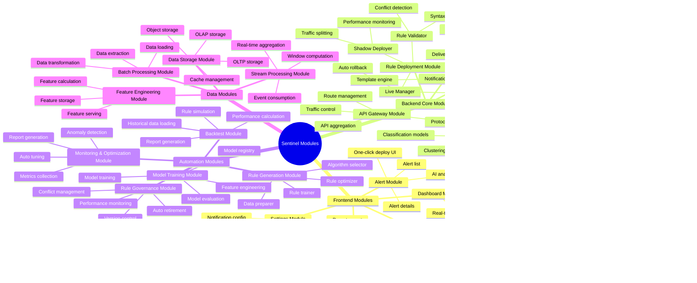

# Airwallex Sentinel Technical Design Document

**Version:** 1.0
**Date:** November 14, 2025
**Status:** Under Design Review

---

## 1. Requirements / Objectives

### 1.1 Product Vision

Airwallex Sentinel is an AI-powered fraud attack prevention product that automatically analyzes risk alerts, immediately tests and deploys strategies to prevent attacks, and provides incident reports with recommended next steps to protect merchants' accounts from future attacks.

**Tagline:** "Life is too short to worry about fraud attacks... read a book, enjoy the view... Airwallex Sentinel has got you covered."

### 1.2 Core Objectives

#### Business Objectives
- **Reduce Merchant Fraud Loss:** Through faster, more precise fraud mitigation, target 30%-50% reduction in financial impact from card testing and other attacks
- **Improve Operational Efficiency:** Automate alert analysis and response workflow for merchants and internal Risk Operations team, target 60% reduction in manual effort
- **Enhance Merchant Experience:** Provide peace of mind and simple, powerful tools to manage risk without requiring specialized fraud knowledge
- **Establish Market Leadership:** Position Airwallex as a first-to-market innovator in AI-powered, autonomous fraud prevention

#### Technical Objectives
- **Real-time Detection:** Alert detection latency < 1 second, AI analysis time < 5 seconds
- **High Availability:** System availability > 99.9%, support multi-AZ deployment
- **Scalability:** Support millions of transactions per day, peak TPS reaching 50,000
- **Automation Rate:** 80% of attack scenarios support auto-deployment rules

### 1.3 Supported Attack Types

| Attack Category | Detection Method | Priority |
|----------------|------------------|----------|
| **Card Testing** | Monitor high volumes of small, failed transactions from a single source, detect sequential card number patterns | P1 |
| **Velocity Attacks** | Track transaction frequency and volume in real-time, alert on sudden surges | P1 |
| **Account Takeover** | Use behavioral biometrics and anomaly detection to flag suspicious logins | P2 |
| **Chargeback Fraud** | Analyze chargeback data to identify recurring patterns | P2 |

### 1.4 Core User Stories

1. **As a merchant**, I want to be notified in the app of a potential fraud attack so that I can take immediate action
2. **As a merchant**, I want to see a simple, easy-to-understand summary of the fraud attack, including the type of attack and its impact
3. **As a merchant**, I want a one-click button to deploy the recommended fraud rule so that I can instantly stop the attack
4. **As a merchant**, I want the system to auto-deploy fraud rules and instantly stop the attack, providing me with an incident summary
5. **As a risk operations personnel**, I want the system to automatically generate and optimize rules, reducing manual rule writing work

### 1.5 Success Metrics

- **Merchant Adoption Rate:** % of active merchants with Sentinel enabled > 60%
- **False Positive Rate Reduction:** Compared to manual process, reduce by > 30%
- **Mitigation Time:** Average time from alert generation to rule deployment < 5 minutes
- **Fraud Loss Reduction:** Chargeback rate and fraud loss for merchants using Sentinel reduced by 30%-50%
- **Operational Efficiency:** Human effort in rule writing and maintenance reduced by 60%

---

## 2. Page Functionality

### 2.1 Frontend Page Structure

### 2.2 Core Page Functionality Details

```mermaid
graph TB
    subgraph Dashboard["📊 Main Dashboard"]
        D1["🚨 Real-time Alert Count
      P1 Alerts | P2 Alerts | P3 Alerts"]
        D2["🛡️ Today's Block Statistics"]
        D3["📋 Active Rules Count"]
        D4["⚡ Quick Action Shortcuts"]
    end

    subgraph Alert["⚠️ Alert Detail Page"]
        A1["📌 Alert Basic Info 
• Priority
• Created Time
• Status"]
        A2["🤖 AI Analysis Results
• Attack Type Identification
• Confidence Score
• Impact Analysis
• Recommended Action"]
        A3["🚀 One-Click Deploy Button"]
        A4["💬 Feedback Buttons
👍 Helpful | 👎 Not Helpful"]
    end

    subgraph Rules["🔧 Rule Management Page"]
        R1["📝 Rule List
• Filters: Status/Type/Time
• Sort Options
• Bulk Actions"]
        R2["📄 Rule Detail
• Rule Conditions
• Execution Actions"]
        R3["📈 Performance Metrics
• Precision
• Recall
• False Positive Rate"]
        R4["🧪 Test Results<br/>• Shadow Test Result<br/>• Back Test Result"]
        R5["📜 Deployment History"]
    end

    subgraph Reports["📊 Protection Reports"]
        P1["📉 Attack Trend Chart"]
        P2["✅ Block Effectiveness Stats"]
        P3["💰 Loss Avoidance Amount"]
        P4["🏆 Rule Contribution Ranking"]
        P5["📥 Export Reports"]
    end

    style Dashboard fill:#e3f2fd,stroke:#1976d2,stroke-width:3px,color:#000
    style Alert fill:#fff3e0,stroke:#f57c00,stroke-width:3px,color:#000
    style Rules fill:#e8f5e9,stroke:#388e3c,stroke-width:3px,color:#000
    style Reports fill:#f3e5f5,stroke:#7b1fa2,stroke-width:3px,color:#000

    style D1 fill:#bbdefb,stroke:#1976d2,stroke-width:2px,color:#000
    style D2 fill:#bbdefb,stroke:#1976d2,stroke-width:2px,color:#000
    style D3 fill:#bbdefb,stroke:#1976d2,stroke-width:2px,color:#000
    style D4 fill:#bbdefb,stroke:#1976d2,stroke-width:2px,color:#000

    style A1 fill:#ffe0b2,stroke:#f57c00,stroke-width:2px,color:#000
    style A2 fill:#ffe0b2,stroke:#f57c00,stroke-width:2px,color:#000
    style A3 fill:#ffe0b2,stroke:#f57c00,stroke-width:2px,color:#000
    style A4 fill:#ffe0b2,stroke:#f57c00,stroke-width:2px,color:#000

    style R1 fill:#c8e6c9,stroke:#388e3c,stroke-width:2px,color:#000
    style R2 fill:#c8e6c9,stroke:#388e3c,stroke-width:2px,color:#000
    style R3 fill:#c8e6c9,stroke:#388e3c,stroke-width:2px,color:#000
    style R4 fill:#c8e6c9,stroke:#388e3c,stroke-width:2px,color:#000
    style R5 fill:#c8e6c9,stroke:#388e3c,stroke-width:2px,color:#000

    style P1 fill:#e1bee7,stroke:#7b1fa2,stroke-width:2px,color:#000
    style P2 fill:#e1bee7,stroke:#7b1fa2,stroke-width:2px,color:#000
    style P3 fill:#e1bee7,stroke:#7b1fa2,stroke-width:2px,color:#000
    style P4 fill:#e1bee7,stroke:#7b1fa2,stroke-width:2px,color:#000
    style P5 fill:#e1bee7,stroke:#7b1fa2,stroke-width:2px,color:#000
```

### 2.3 Key User Interface Flow

---

## 3. Business Flow

### 3.1 Core Business Flow Overview

### 3.2 One-Click Deployment Flow Detailed Design

```mermaid
sequenceDiagram
    autonumber
    actor Merchant as Merchant
    participant UI as Frontend UI
    participant API as API Gateway
    participant Alert as Alert Service
    participant AI as AI Engine
    participant Deploy as Deployment Engine
    participant Shadow as Shadow Environment
    participant Risk as Risk Engine
    participant Notify as Notification Service

    Note over Merchant,Notify: Scenario: Merchant receives alert and executes one-click deployment

    Alert->>UI: Push new alert
    UI->>Merchant: Display notification badge

    Merchant->>UI: Click to view alert
    UI->>API: GET /api/v1/alerts/{id}
    API->>Alert: Query alert
    Alert->>AI: Get AI analysis result
    AI-->>Alert: Return analysis report
    Alert-->>API: Return complete data
    API-->>UI: Return JSON
    UI->>Merchant: Show alert detail and AI analysis

    Note over Merchant: Merchant reviews<br/>AI recommended rule

    Merchant->>UI: Click "One-Click Deploy"
    UI->>Merchant: Show confirmation dialog
    Merchant->>UI: Confirm deployment

    UI->>API: POST /api/v1/rules/deploy
    API->>Deploy: Create deployment task

    par Parallel Validation
        Deploy->>Deploy: Syntax validation
    and
        Deploy->>Deploy: Conflict detection
    and
        Deploy->>Deploy: Impact assessment
    end

    Deploy->>Shadow: Deploy to shadow environment
    Deploy->>UI: Return deployment ID
    UI->>Merchant: Display "Shadow mode running"

    loop Update every 30 seconds (5-10 minutes duration)
        Shadow->>Deploy: Report performance metrics
        Deploy->>API: Push update
        API->>UI: WebSocket push
        UI->>Merchant: Update monitoring charts
    end

    Deploy->>Deploy: Evaluate shadow performance

    alt Performance meets criteria
        Deploy->>Risk: Go live with rule
        Risk-->>Deploy: Confirm live
        Deploy->>Notify: Send success notification
        Notify->>Merchant: Email/SMS/In-app notification
        Deploy->>UI: Push live success
        UI->>Merchant: Show celebration animation + "Read a Book" view
    else Poor performance
        Deploy->>Notify: Send optimization suggestion
        Notify->>Merchant: Notify needs adjustment
        Deploy->>UI: Push optimization suggestion
        UI->>Merchant: Show tuning suggestions
    end

    Merchant->>UI: View rule detail
    UI->>API: GET /api/v1/rules/{id}/metrics
    API-->>UI: Return real-time metrics
    UI->>Merchant: Show block statistics

    Merchant->>UI: Submit feedback (👍)
    UI->>API: POST /api/v1/feedback
    API->>AI: Record positive feedback
    AI->>AI: Update training dataset
```

### 3.3 Auto-Deployment Flow (Auto-On Mode)

### 3.4 Auto Rule Generation and Optimization Flow

---

## 4. Technical Architecture

### 4.1 Overall Technical Architecture

### 4.2 Core Service Architecture

### 4.3 Data Flow Architecture

### 4.4 Deployment Architecture

---

## 5. Module Division

### 5.1 Module Overview

### 5.2 Core Module Detailed Division

### 5.3 Module Dependency Relationships

---

## 6. Module Interaction & Flow

### 6.1 Real-time Alert Detection Flow (Module Interaction)

### 6.2 Rule Deployment Flow (Module Interaction)

### 6.3 Auto Rule Generation Flow (Module Interaction)

### 6.4 Model Training and Update Flow (Module Interaction)

### 6.5 Complete End-to-End Flow Integration

---

## Appendix

### A. Technology Stack Summary

| Layer | Technology Selection | Description |
|-------|---------------------|-------------|
| **Frontend** | React 18 + TypeScript + Material-UI | Modern UI framework |
| **API Gateway** | Kong / APISIX | High-performance API gateway |
| **Backend Services** | Python (FastAPI) + Go | Python for AI/ML, Go for high-performance services |
| **Real-time Processing** | Apache Kafka + Flink | Stream processing platform |
| **Batch Processing** | Apache Spark + Airflow | Big data processing |
| **ML Framework** | XGBoost, scikit-learn, TensorFlow | Machine learning |
| **Model Serving** | TensorFlow Serving / Seldon | Model inference |
| **Feature Store** | Feast | Feature management |
| **OLTP** | PostgreSQL 15+ | Transactional database |
| **OLAP** | Google BigQuery | Analytical database |
| **Cache** | Redis Cluster | Distributed cache |
| **Object Storage** | AWS S3 / GCS | File storage |
| **Container Orchestration** | Kubernetes | Container management |
| **Monitoring** | Prometheus + Grafana | Monitoring and alerting |
| **Logging** | ELK Stack | Log analysis |
| **Tracing** | Jaeger | Distributed tracing |

### B. Key Metrics Definition

| Metric | Definition | Target |
|--------|-----------|--------|
| **Alert Detection Latency** | Time from transaction to alert generation | < 1 second |
| **AI Analysis Time** | Time required for AI analysis completion | < 5 seconds |
| **Rule Deployment Time** | Time from click deploy to rule active | < 30 seconds |
| **System Availability** | System uptime percentage | > 99.9% |
| **Precision** | True Positives / (True Positives + False Positives) | > 95% |
| **Recall** | True Positives / (True Positives + False Negatives) | > 85% |
| **False Positive Rate** | False Positives / (False Positives + True Negatives) | < 1% |

### C. Implementation Plan

| Phase | Timeline | Main Deliverables |
|-------|----------|-------------------|
| **Phase 1 - MVP** | 2025 Q4 | Basic alert detection + One-click deploy + Card testing detection |
| **Phase 2 - Automation** | 2026 Q1 | Auto rule generation + Auto retirement + Backtest functionality |
| **Phase 3 - Advanced Features** | 2026 Q2 | Auto-On mode + Multi-attack vectors + Advanced analytics |
| **Phase 4 - Optimization & Scale** | 2026 Q3 | Multi-region deployment + Strategy automation + AI feature generation |

---

**Document Status:** Pending Review
**Created Date:** 2025-11-14
**Last Updated:** 2025-11-14
**Maintainer:** Technical Architecture Team
