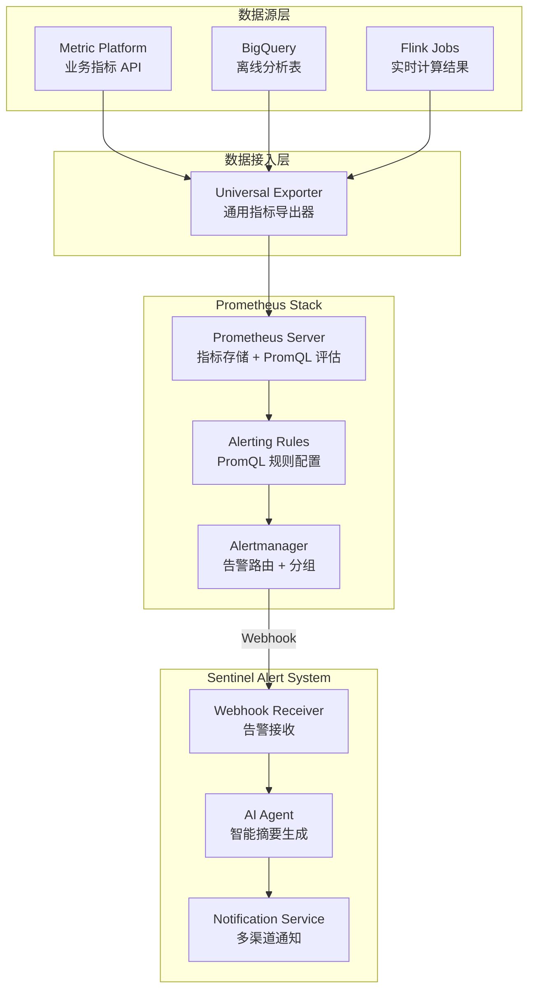

# Sentinel Trigger Engine 技术选型方案

## 1. 背景与目标

### 1.1 项目背景

Sentinel 告警系统需要一个 **Trigger Engine（触发引擎）** 模块，用于：
- 接入外部数据源（BigQuery、Metric Platform 等）
- 基于规则评估数据，检测异常
- 触发告警事件，交由后续 AI 分析和通知模块处理

### 1.2 本期需求

- 接入 BigQuery 数据源，监控风险指标
- 基于阈值规则触发告警

### 1.3 未来扩展需求

- **Agent 对话添加告警规则**：通过 AI Agent 自然语言交互，动态创建/修改告警规则
- **Alert 推送增加图片**：在告警消息中附带图表/可视化内容

---

## 2. 候选方案概述

| 方案 | 组件名称 | 简介 |
|------|----------|------|
| **A** | Anomaly Detector (risk-alert-pipeline) | 内部现有的异常检测框架，基于 Python + YAML 配置驱动 |
| **P** | Prometheus | 开源监控告警系统，业界标准方案 |
| **R** | Rule Engine | 公司内部规则引擎，用于风控订单拦截 |

---

## 3. 方案详细分析

### 3.1 方案 A：Anomaly Detector (risk-alert-pipeline)

#### 3.1.1 系统架构

```
┌─────────────────────────────────────────────────────────────────────────┐
│                      Risk Alert Pipeline                                │
│   ┌─────────────────────────────────────────────────────────────────┐   │
│   │                      Data Source Layer                          │   │
│   │  ┌──────────┐ ┌──────────┐ ┌──────────┐ ┌──────────┐           │   │
│   │  │ BigQuery │ │  Splunk  │ │   CSV    │ │ REST API │           │   │
│   │  └────┬─────┘ └────┬─────┘ └────┬─────┘ └────┬─────┘           │   │
│   │       └────────────┴────────────┴────────────┘                  │   │
│   │                        │                                        │   │
│   │                        ▼                                        │   │
│   │   ┌──────────────────────────────────────────────────────────┐  │   │
│   │   │              Evaluator Pipeline                          │  │   │
│   │   │  ┌─────────────┐ ┌─────────────┐ ┌─────────────────────┐ │  │   │
│   │   │  │ ZScoreModel │ │ Threshold   │ │ RuleThresholdEval   │ │  │   │
│   │   │  │             │ │ Evaluator   │ │                     │ │  │   │
│   │   │  └─────────────┘ └─────────────┘ └─────────────────────┘ │  │   │
│   │   └──────────────────────────────────────────────────────────┘  │   │
│   │                        │                                        │   │
│   │                        ▼                                        │   │
│   │   ┌──────────────────────────────────────────────────────────┐  │   │
│   │   │              Notification Agent                          │  │   │
│   │   │  ┌─────────┐ ┌──────────┐ ┌──────────┐                   │  │   │
│   │   │  │  Slack  │ │ OpsGenie │ │  Custom  │                   │  │   │
│   │   │  └─────────┘ └──────────┘ └──────────┘                   │  │   │
│   │   └──────────────────────────────────────────────────────────┘  │   │
│   └─────────────────────────────────────────────────────────────────┘   │
└─────────────────────────────────────────────────────────────────────────┘
```

#### 3.1.2 核心能力

| 能力 | 描述 |
|------|------|
| **数据源支持** | BigQuery、Splunk、CSV、REST API |
| **评估模型** | ZScoreModel（异常检测）、ThresholdEvaluator（阈值）、RuleThresholdEvaluator（规则阈值） |
| **规则配置** | YAML 配置驱动，支持 SQL + Python 表达式 |
| **通知渠道** | Slack、OpsGenie |
| **部署方式** | K8s CronJob，按配置文件独立调度 |

#### 3.1.3 配置示例

```yaml
name: Significant change in block rate by BIN daily
cron: "0 7 * * *"
source:
  bq:
    bq_project:
      preprod: data-bq-lite-xxx
      prod: risk-prod-xxx
    sql: |
      SELECT
        merchant_config_acquirer_country,
        extract(date from attempt_create_time) as attempt_create_date,
        count(case when fraud_result_result ='BLOCK' then 1 end) as current_block_cnt,
        count(1) as total_cnt,
        safe_divide(count(case when fraud_result_result ='BLOCK' then 1 end),count(1)) as block_rate
      FROM `risk-prod.dwd_pafraud.fraud_master_table_rename`
      WHERE Date(attempt_create_time) > DATE_SUB(CURRENT_DATE(), INTERVAL 30 DAY)
      group by 1,2
    rate_field: 'block_rate'
    group_field: merchant_config_acquirer_country
    dt_field: attempt_create_date
evaluator:
  ZScoreModel:
    sensitivity: 2
    severity: ""
  ThresholdEvaluator:
    P3:
      (df.block_rate > 0.02)
notification:
  prod:
    alert_channel: "risk-rt-fraud-alert:C04CQCSDVFE"
    opsgenie_team:
      - TM
```

#### 3.1.4 成本评估

| 成本类型 | 评估 | 说明 |
|----------|------|------|
| **开发成本** | 🟢 极低 (1-2 PD) | 现有框架成熟，只需编写 YAML 配置文件 |
| **部署成本** | 🟢 极低 | 现有 CI/CD 流程，自动生成 K8s CronJob |
| **运维成本** | 🟢 可忽略 | 无状态服务，按需调度，无需独立运维 |
| **学习成本** | 🟢 低 | 团队已熟悉，有完整文档和示例 |

#### 3.1.5 未来扩展评估

| 扩展需求 | 可行性 | 说明 |
|----------|--------|------|
| **AI 生成告警规则** | ⚠️ 中等难度 | 需要开发 AI → YAML 转换逻辑，可热生效（重新部署 CronJob），AI 生成 SQL |
| **告警图片推送** | ❌ 不支持 | 当前框架不支持图表生成，需额外开发可视化模块 |

---

### 3.2 方案 P：Prometheus

#### 3.2.1 系统架构



#### 3.2.2 核心能力

| 能力 | 描述 |
|------|------|
| **数据源支持** | 通过 Universal Exporter 支持多种数据源 |
| **查询语言** | PromQL，支持复杂时序计算、聚合、异常检测 |
| **告警规则** | YAML 配置，支持热加载 |
| **可视化** | 原生 Grafana 集成，支持 Dashboard |
| **部署方式** | 独立服务，需要持久化存储 |

#### 3.2.3 PromQL 能力示例

```yaml
groups:
  - name: sentinel_fraud_alerts
    rules:
      # 简单阈值
      - alert: HighBlockRate
        expr: sentinel_block_rate > 0.3

      # 多条件组合
      - alert: CardTestingDetected
        expr: |
          sentinel_block_rate > 0.2
          AND sentinel_failed_auth_rate > 0.3
          AND sentinel_transaction_count > 100

      # 基于历史基线的异常检测 (Z-Score)
      - alert: BlockRateAnomaly
        expr: |
          (sentinel_block_rate - avg_over_time(sentinel_block_rate[7d]))
          / stddev_over_time(sentinel_block_rate[7d]) > 3

      # 环比变化检测
      - alert: BlockRateSurge
        expr: |
          increase(sentinel_block_rate[1h])
          / (increase(sentinel_block_rate[1h] offset 1h) + 0.01) > 2
```

#### 3.2.4 成本评估

| 成本类型 | 评估 | 说明 |
|----------|------|------|
| **开发成本** | 🟡 中等 | 需开发 Universal Exporter、配置 Prometheus 规则、实现 Webhook 接收端 |
| **部署成本** | 🟡 中等 | 需部署 Prometheus + Alertmanager + Exporter，配置持久化存储 |
| **运维成本** | 🟡 正常 | 需要监控服务健康、磁盘使用、规则有效性 |
| **学习成本** | 🟡 中等 | PromQL 语法学习曲线，但团队可快速上手 |

#### 3.2.5 未来扩展评估

| 扩展需求 | 可行性 | 说明 |
|----------|--------|------|
| **AI 生成告警规则** | ⚠️ 待验证 | 理论上可行（AI 生成 PromQL），Prometheus 支持规则热加载，需验证 API |
| **告警图片推送** | ✅ 支持 | Grafana Dashboard 原生支持图表截图，可通过 API 获取并附加到告警 |

---

### 3.3 方案 R：Rule Engine

#### 3.3.1 系统概述

Rule Engine 是公司内部的风控规则引擎，主要用于**实时交易拦截**场景。

#### 3.3.2 架构特点

| 特点 | 说明 |
|------|------|
| **设计目标** | 实时交易拦截，毫秒级响应 |
| **规则类型** | 订单拦截规则 (Block/Allow/Verify) |
| **执行方式** | 同步调用，嵌入交易链路 |

#### 3.3.3 用于 Alert 的挑战

| 挑战 | 说明 |
|------|------|
| **概念冲突** | 业务定位是"订单拦截规则"，与"告警规则"是不同概念，混用会造成理解混乱 |
| **Action 开发** | 需要开发新的 Action 类型（告警触发），现有 Action 都是拦截相关 |
| **侵入性** | 需要修改 Rule Engine 核心逻辑，影响现有业务 |
| **数据源** | 主要面向实时交易数据，接入离线数据源（如 BigQuery）需要额外适配 |

#### 3.3.4 成本评估

| 成本类型 | 评估 | 说明 |
|----------|------|------|
| **开发成本** | 🟠 较高 (≥0.5 week) | 需开发 Alert Action、数据源适配、与现有规则隔离 |
| **部署成本** | 🟡 中等 | 需要审核流程，确保不影响现有拦截规则 |
| **运维成本** | 🟢 可忽略 | 复用现有 Rule Engine 运维体系 |
| **风险成本** | 🟠 较高 | 可能影响核心拦截业务的稳定性 |

#### 3.3.5 未来扩展评估

| 扩展需求 | 可行性 | 说明 |
|----------|--------|------|
| **AI 生成告警规则** | ❌ 困难 | 规则语法复杂，与拦截规则混用增加复杂度 |
| **告警图片推送** | ❌ 不支持 | 非 Rule Engine 职责范围 |

---

## 4. 综合对比矩阵

### 4.1 功能对比

| 功能维度 | Anomaly Detector | Prometheus | Rule Engine |
|----------|------------------|------------|-------------|
| **本期需求满足** | ✅ 完全满足 | ✅ 完全满足 | ✅ 完全满足 |
| **BigQuery 数据源** | ✅ 原生支持 | ⚠️ 需 Exporter | ⚠️ 需适配 |
| **阈值规则** | ✅ 支持 | ✅ 支持 | ✅ 支持 |
| **异常检测 (Z-Score)** | ✅ 内置 | ✅ PromQL 实现 | ⚠️ 需开发 |
| **AI 生成规则** | ⚠️ 中等难度 | ⚠️ 待验证 | ❌ 困难 |
| **图片推送** | ❌ 不支持 | ✅ Grafana 支持 | ❌ 不支持 |
| **热加载规则** | ⚠️ 需重新部署 | ✅ 原生支持 | ✅ 支持 |

### 4.2 成本对比

| 成本维度 | Anomaly Detector | Prometheus | Rule Engine |
|----------|------------------|------------|-------------|
| **开发成本** | 🟢 1-2 PD | 🟡 0.5-1 week | 🟠 ≥0.5 week |
| **部署成本** | 🟢 极低 | 🟡 中等 | 🟡 中等 |
| **运维成本** | 🟢 可忽略 | 🟡 正常 | 🟢 可忽略 |
| **学习成本** | 🟢 低 | 🟡 中等 | 🟡 中等 |
| **风险成本** | 🟢 低 | 🟢 低 | 🟠 较高 |

### 4.3 时间成本评估

> **项目上线 ETA：12 月底**

| 方案 | 预估工时 | 能否按时上线 | 备注 |
|------|----------|--------------|------|
| **Anomaly Detector** | 1-2 PD | ✅ 完全可以 | 最快路径 |
| **Prometheus** | +0.5 week | ⚠️ 可以但紧张 | 可独立并行探索 |
| **Rule Engine** | ≥0.5 week | ⚠️ 风险较高 | 影响评估 + 测试成本 |

### 4.4 可用性与稳定性

| 方案 | 评估 | 说明 |
|------|------|------|
| **Anomaly Detector** | 🟢 高 | 生产验证，团队熟悉 |
| **Prometheus** | 🟢 高 | 业界成熟方案，需独立运维 |
| **Rule Engine** | 🟢 高 | 成熟系统，但需避免影响核心业务 |

---

## 5. 决策建议

### 5.1 推荐方案

采用 **渐进式演进策略**：

```
Phase 1 (12月底上线)          Phase 2 (二期迭代)
      │                              │
      ▼                              ▼
┌─────────────────┐          ┌─────────────────┐
│ Anomaly Detector│   ──→    │   Prometheus    │
│   快速接入      │          │   完整能力      │
└─────────────────┘          └─────────────────┘
      │                              │
      ▼                              ▼
 ✅ 满足本期需求              ✅ AI 生成规则
 ✅ 低风险快速上线            ✅ 图片推送
 ✅ 团队熟悉                  ✅ 规则热加载
```

### 5.2 一期方案（12 月底上线）

**主方案：Anomaly Detector**

- 利用现有 risk-alert-pipeline 框架快速接入
- 编写 YAML 配置文件，1-2 PD 即可完成
- 复用现有 CI/CD 和运维体系

**并行任务：Prometheus 探索**

- 独立部署 Prometheus + Grafana 环境
- 配置同等的告警规则，进行对照观察
- 验证图片配置功能

### 5.3 二期方案

**评估切换时机**：

在实现 AI 写告警 Rule 功能时，根据一期 Prometheus 运行情况评估：
- 如果 Prometheus 运行稳定，切换至 Prometheus 作为 Trigger Engine
- 利用 Grafana 实现图表推送功能
- 利用 PromQL 热加载实现 AI 规则生成

### 5.4 Rule Engine 排除原因

| 原因 | 说明 |
|------|------|
| **概念冲突** | 订单拦截 vs 告警触发，业务定位不同 |
| **开发成本高** | 需要开发新 Action，适配数据源 |
| **风险高** | 可能影响核心拦截业务 |
| **扩展性差** | 难以支持 AI 生成规则、图片推送等需求 |

---

## 6. 附录

### 6.1 方案对比速查表

```
                        Anomaly Detector    Prometheus    Rule Engine
本期需求                      ✅                ✅             ✅
BigQuery 支持                 ✅ 原生            ⚠️ Exporter    ⚠️ 适配
AI 生成规则                   ⚠️ 中等            ⚠️ 待验证       ❌ 困难
图片推送                      ❌                ✅             ❌
规则热加载                    ⚠️ 重部署          ✅             ✅
开发成本                      低                中             高
运维成本                      低                中             低
上线风险                      低                中             高
推荐优先级                    ⭐⭐⭐             ⭐⭐            ⭐
```

### 6.2 参考文档

- [Sentinel Alert System Design](./Sentinel_Alert_System_Design.md)
- [Prometheus 接入方案调研](./PrometheusVsAlertSystem_CN.md)
- [Anomaly Detector User Manual](https://airwallex.atlassian.net/wiki/spaces/AR/pages/3210052480)
- [risk-alert-pipeline Evaluator Guide](../risk-alert-pipeline/doc/evaluator_user_guide.md)

---

*文档创建时间：2024-12*
*作者：Boyi Wang*
