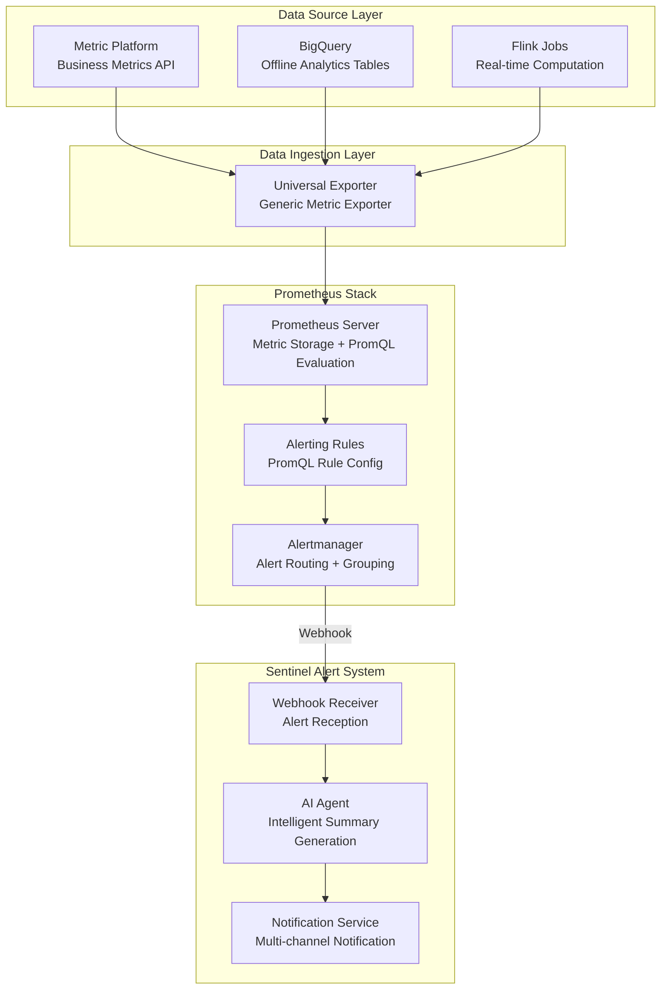

# Sentinel Trigger Engine Technology Selection

## 1. Background & Objectives

### 1.1 Project Background

The Sentinel alert system requires a **Trigger Engine** module to:
- Ingest external data sources (BigQuery, Metric Platform, etc.)
- Evaluate data against rules and detect anomalies
- Trigger alert events for downstream AI analysis and notification modules

### 1.2 Current Phase Requirements

- Integrate BigQuery data source for risk metric monitoring
- Trigger alerts based on threshold rules

### 1.3 Future Extension Requirements

- **Agent-based Alert Rule Creation**: Create/modify alert rules through natural language interaction with AI Agent
- **Image Attachment in Alerts**: Include charts/visualizations in alert messages

---

## 2. Candidate Solutions Overview

| Solution | Component Name | Description |
|----------|----------------|-------------|
| **A** | Anomaly Detector (risk-alert-pipeline) | Internal anomaly detection framework, Python + YAML configuration driven |
| **P** | Prometheus | Open-source monitoring and alerting system, industry standard |
| **R** | Rule Engine | Internal rule engine for fraud transaction blocking |

---

## 3. Detailed Solution Analysis

### 3.1 Solution A: Anomaly Detector (risk-alert-pipeline)

#### 3.1.1 System Architecture

```
┌─────────────────────────────────────────────────────────────────────────┐
│                      Risk Alert Pipeline                                │
│   ┌─────────────────────────────────────────────────────────────────┐   │
│   │                      Data Source Layer                          │   │
│   │  ┌──────────┐ ┌──────────┐ ┌──────────┐ ┌──────────┐           │   │
│   │  │ BigQuery │ │  Splunk  │ │   CSV    │ │ REST API │           │   │
│   │  └────┬─────┘ └────┬─────┘ └────┬─────┘ └────┬─────┘           │   │
│   │       └────────────┴────────────┴────────────┘                  │   │
│   │                        │                                        │   │
│   │                        ▼                                        │   │
│   │   ┌──────────────────────────────────────────────────────────┐  │   │
│   │   │              Evaluator Pipeline                          │  │   │
│   │   │  ┌─────────────┐ ┌─────────────┐ ┌─────────────────────┐ │  │   │
│   │   │  │ ZScoreModel │ │ Threshold   │ │ RuleThresholdEval   │ │  │   │
│   │   │  │             │ │ Evaluator   │ │                     │ │  │   │
│   │   │  └─────────────┘ └─────────────┘ └─────────────────────┘ │  │   │
│   │   └──────────────────────────────────────────────────────────┘  │   │
│   │                        │                                        │   │
│   │                        ▼                                        │   │
│   │   ┌──────────────────────────────────────────────────────────┐  │   │
│   │   │              Notification Agent                          │  │   │
│   │   │  ┌─────────┐ ┌──────────┐ ┌──────────┐                   │  │   │
│   │   │  │  Slack  │ │ OpsGenie │ │  Custom  │                   │  │   │
│   │   │  └─────────┘ └──────────┘ └──────────┘                   │  │   │
│   │   └──────────────────────────────────────────────────────────┘  │   │
│   └─────────────────────────────────────────────────────────────────┘   │
└─────────────────────────────────────────────────────────────────────────┘
```

#### 3.1.2 Core Capabilities

| Capability | Description |
|------------|-------------|
| **Data Sources** | BigQuery, Splunk, CSV, REST API |
| **Evaluation Models** | ZScoreModel (anomaly detection), ThresholdEvaluator (threshold), RuleThresholdEvaluator (rule-based threshold) |
| **Rule Configuration** | YAML-driven, supports SQL + Python expressions |
| **Notification Channels** | Slack, OpsGenie |
| **Deployment** | K8s CronJob, independently scheduled per config file |

#### 3.1.3 Configuration Example

```yaml
name: Significant change in block rate by BIN daily
cron: "0 7 * * *"
source:
  bq:
    bq_project:
      preprod: data-bq-lite-xxx
      prod: risk-prod-xxx
    sql: |
      SELECT
        merchant_config_acquirer_country,
        extract(date from attempt_create_time) as attempt_create_date,
        count(case when fraud_result_result ='BLOCK' then 1 end) as current_block_cnt,
        count(1) as total_cnt,
        safe_divide(count(case when fraud_result_result ='BLOCK' then 1 end),count(1)) as block_rate
      FROM `risk-prod.dwd_pafraud.fraud_master_table_rename`
      WHERE Date(attempt_create_time) > DATE_SUB(CURRENT_DATE(), INTERVAL 30 DAY)
      group by 1,2
    rate_field: 'block_rate'
    group_field: merchant_config_acquirer_country
    dt_field: attempt_create_date
evaluator:
  ZScoreModel:
    sensitivity: 2
    severity: ""
  ThresholdEvaluator:
    P3:
      (df.block_rate > 0.02)
notification:
  prod:
    alert_channel: "risk-rt-fraud-alert:C04CQCSDVFE"
    opsgenie_team:
      - TM
```

#### 3.1.4 Cost Assessment

| Cost Type | Rating | Notes |
|-----------|--------|-------|
| **Development Cost** | 🟢 Very Low (1-2 PD) | Mature framework, only YAML config required |
| **Deployment Cost** | 🟢 Very Low | Existing CI/CD pipeline, auto-generates K8s CronJob |
| **Maintenance Cost** | 🟢 Negligible | Stateless service, on-demand scheduling, no dedicated ops |
| **Learning Curve** | 🟢 Low | Team already familiar, complete documentation and examples |

#### 3.1.5 Future Extension Assessment

| Extension Requirement | Feasibility | Notes |
|-----------------------|-------------|-------|
| **AI-Generated Alert Rules** | ⚠️ Moderate | Requires AI → YAML conversion logic, hot-reload via CronJob redeployment, AI generates SQL |
| **Image Attachment in Alerts** | ❌ Not Supported | Current framework doesn't support chart generation, requires additional visualization module |

---

### 3.2 Solution P: Prometheus

#### 3.2.1 System Architecture



#### 3.2.2 Core Capabilities

| Capability | Description |
|------------|-------------|
| **Data Sources** | Supports multiple data sources via Universal Exporter |
| **Query Language** | PromQL, supports complex time-series computation, aggregation, anomaly detection |
| **Alert Rules** | YAML configuration, supports hot-reload |
| **Visualization** | Native Grafana integration, supports Dashboard |
| **Deployment** | Standalone service, requires persistent storage |

#### 3.2.3 PromQL Capability Examples

```yaml
groups:
  - name: sentinel_fraud_alerts
    rules:
      # Simple threshold
      - alert: HighBlockRate
        expr: sentinel_block_rate > 0.3

      # Multi-condition combination
      - alert: CardTestingDetected
        expr: |
          sentinel_block_rate > 0.2
          AND sentinel_failed_auth_rate > 0.3
          AND sentinel_transaction_count > 100

      # Historical baseline anomaly detection (Z-Score)
      - alert: BlockRateAnomaly
        expr: |
          (sentinel_block_rate - avg_over_time(sentinel_block_rate[7d]))
          / stddev_over_time(sentinel_block_rate[7d]) > 3

      # Period-over-period change detection
      - alert: BlockRateSurge
        expr: |
          increase(sentinel_block_rate[1h])
          / (increase(sentinel_block_rate[1h] offset 1h) + 0.01) > 2
```

#### 3.2.4 Cost Assessment

| Cost Type | Rating | Notes |
|-----------|--------|-------|
| **Development Cost** | 🟡 Moderate | Requires Universal Exporter development, Prometheus rule config, Webhook receiver implementation |
| **Deployment Cost** | 🟡 Moderate | Requires Prometheus + Alertmanager + Exporter deployment, persistent storage config |
| **Maintenance Cost** | 🟡 Normal | Requires service health monitoring, disk usage, rule validity checks |
| **Learning Curve** | 🟡 Moderate | PromQL syntax learning curve, but team can ramp up quickly |

#### 3.2.5 Future Extension Assessment

| Extension Requirement | Feasibility | Notes |
|-----------------------|-------------|-------|
| **AI-Generated Alert Rules** | ⚠️ To Be Verified | Theoretically feasible (AI generates PromQL), Prometheus supports hot-reload, API verification needed |
| **Image Attachment in Alerts** | ✅ Supported | Grafana Dashboard natively supports chart screenshots, retrievable via API for alert attachment |

---

### 3.3 Solution R: Rule Engine

#### 3.3.1 System Overview

Rule Engine is an internal fraud control rule engine, primarily used for **real-time transaction blocking** scenarios.

#### 3.3.2 Architecture Characteristics

| Characteristic | Description |
|----------------|-------------|
| **Design Goal** | Real-time transaction blocking, millisecond-level response |
| **Rule Types** | Order blocking rules (Block/Allow/Verify) |
| **Execution Mode** | Synchronous invocation, embedded in transaction flow |

#### 3.3.3 Challenges for Alert Use Case

| Challenge | Description |
|-----------|-------------|
| **Conceptual Conflict** | Business positioning is "order blocking rules", different from "alert rules", mixing causes confusion |
| **Action Development** | Requires new Action type development (alert triggering), existing Actions are all blocking-related |
| **Invasiveness** | Requires Rule Engine core logic modification, impacts existing business |
| **Data Sources** | Primarily oriented toward real-time transaction data, offline data sources (e.g., BigQuery) require additional adaptation |

#### 3.3.4 Cost Assessment

| Cost Type | Rating | Notes |
|-----------|--------|-------|
| **Development Cost** | 🟠 High (≥0.5 week) | Requires Alert Action development, data source adaptation, isolation from existing rules |
| **Deployment Cost** | 🟡 Moderate | Requires review process to ensure no impact on existing blocking rules |
| **Maintenance Cost** | 🟢 Negligible | Reuses existing Rule Engine ops infrastructure |
| **Risk Cost** | 🟠 High | May impact core blocking business stability |

#### 3.3.5 Future Extension Assessment

| Extension Requirement | Feasibility | Notes |
|-----------------------|-------------|-------|
| **AI-Generated Alert Rules** | ❌ Difficult | Complex rule syntax, mixing with blocking rules increases complexity |
| **Image Attachment in Alerts** | ❌ Not Supported | Outside Rule Engine scope |

---

## 4. Comprehensive Comparison Matrix

### 4.1 Feature Comparison

| Feature Dimension | Anomaly Detector | Prometheus | Rule Engine |
|-------------------|------------------|------------|-------------|
| **Current Requirements** | ✅ Fully Meets | ✅ Fully Meets | ✅ Fully Meets |
| **BigQuery Data Source** | ✅ Native Support | ⚠️ Requires Exporter | ⚠️ Requires Adaptation |
| **Threshold Rules** | ✅ Supported | ✅ Supported | ✅ Supported |
| **Anomaly Detection (Z-Score)** | ✅ Built-in | ✅ PromQL Implementation | ⚠️ Requires Development |
| **AI-Generated Rules** | ⚠️ Moderate Difficulty | ⚠️ To Be Verified | ❌ Difficult |
| **Image Attachment** | ❌ Not Supported | ✅ Grafana Supported | ❌ Not Supported |
| **Hot-Reload Rules** | ⚠️ Requires Redeployment | ✅ Native Support | ✅ Supported |

### 4.2 Cost Comparison

| Cost Dimension | Anomaly Detector | Prometheus | Rule Engine |
|----------------|------------------|------------|-------------|
| **Development Cost** | 🟢 1-2 PD | 🟡 0.5-1 week | 🟠 ≥0.5 week |
| **Deployment Cost** | 🟢 Very Low | 🟡 Moderate | 🟡 Moderate |
| **Maintenance Cost** | 🟢 Negligible | 🟡 Normal | 🟢 Negligible |
| **Learning Curve** | 🟢 Low | 🟡 Moderate | 🟡 Moderate |
| **Risk Cost** | 🟢 Low | 🟢 Low | 🟠 High |

### 4.3 Timeline Assessment

> **Project Launch ETA: End of December**

| Solution | Estimated Effort | On-Time Launch | Notes |
|----------|------------------|----------------|-------|
| **Anomaly Detector** | 1-2 PD | ✅ Definitely | Fastest path |
| **Prometheus** | +0.5 week | ⚠️ Possible but Tight | Can explore in parallel |
| **Rule Engine** | ≥0.5 week | ⚠️ High Risk | Impact assessment + testing cost |

### 4.4 Availability & Stability

| Solution | Rating | Notes |
|----------|--------|-------|
| **Anomaly Detector** | 🟢 High | Production-proven, team familiar |
| **Prometheus** | 🟢 High | Industry-mature solution, requires dedicated ops |
| **Rule Engine** | 🟢 High | Mature system, but must avoid core business impact |

---

## 5. Decision Recommendations

### 5.1 Recommended Approach

Adopt a **Progressive Evolution Strategy**:

```
Phase 1 (End of December)          Phase 2 (Future Iteration)
      │                                    │
      ▼                                    ▼
┌─────────────────┐              ┌─────────────────┐
│ Anomaly Detector│    ──→       │   Prometheus    │
│   Quick Start   │              │  Full Capability│
└─────────────────┘              └─────────────────┘
      │                                    │
      ▼                                    ▼
 ✅ Meets Current Needs            ✅ AI-Generated Rules
 ✅ Low-Risk Quick Launch          ✅ Image Attachment
 ✅ Team Familiar                  ✅ Hot-Reload Rules
```

### 5.2 Phase 1 Plan (End of December Launch)

**Primary Solution: Anomaly Detector**

- Leverage existing risk-alert-pipeline framework for quick integration
- Write YAML config files, completable in 1-2 PD
- Reuse existing CI/CD and ops infrastructure

**Parallel Task: Prometheus Exploration**

- Deploy Prometheus + Grafana environment independently
- Configure equivalent alert rules for comparative observation
- Validate image attachment functionality

### 5.3 Phase 2 Plan

**Migration Timing Assessment**:

When implementing AI-generated alert rules, evaluate based on Phase 1 Prometheus performance:
- If Prometheus runs stably, migrate to Prometheus as Trigger Engine
- Leverage Grafana for chart attachment functionality
- Utilize PromQL hot-reload for AI rule generation

### 5.4 Rule Engine Exclusion Rationale

| Reason | Description |
|--------|-------------|
| **Conceptual Conflict** | Order blocking vs. alert triggering, different business positioning |
| **High Development Cost** | Requires new Action development, data source adaptation |
| **High Risk** | May impact core blocking business |
| **Poor Extensibility** | Difficult to support AI-generated rules, image attachment requirements |

---

## 6. Appendix

### 6.1 Quick Reference Comparison Table

```
                        Anomaly Detector    Prometheus    Rule Engine
Current Requirements          ✅                ✅             ✅
BigQuery Support              ✅ Native         ⚠️ Exporter    ⚠️ Adapt
AI-Generated Rules            ⚠️ Moderate       ⚠️ TBD         ❌ Difficult
Image Attachment              ❌                ✅             ❌
Hot-Reload Rules              ⚠️ Redeploy       ✅             ✅
Development Cost              Low               Medium         High
Maintenance Cost              Low               Medium         Low
Launch Risk                   Low               Medium         High
Priority Ranking              ⭐⭐⭐             ⭐⭐            ⭐
```

### 6.2 Reference Documents

- [Sentinel Alert System Design](./Sentinel_Alert_System_Design.md)
- [Prometheus Integration Research](./PrometheusVsAlertSystem_EN.md)
- [Anomaly Detector User Manual](https://airwallex.atlassian.net/wiki/spaces/AR/pages/3210052480)
- [risk-alert-pipeline Evaluator Guide](../risk-alert-pipeline/doc/evaluator_user_guide.md)

---

*Document Created: December 2024*
*Author: Boyi Wang*
